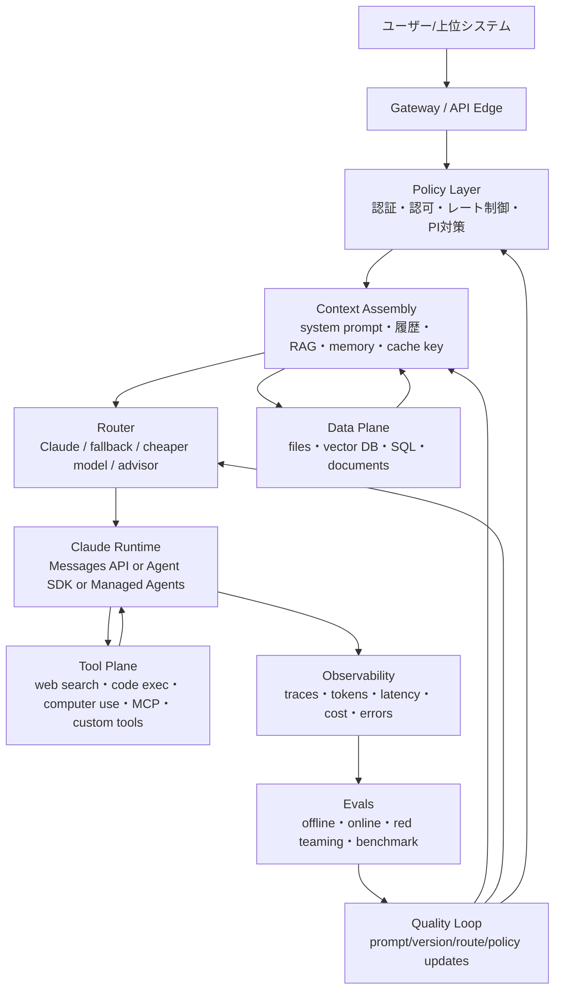
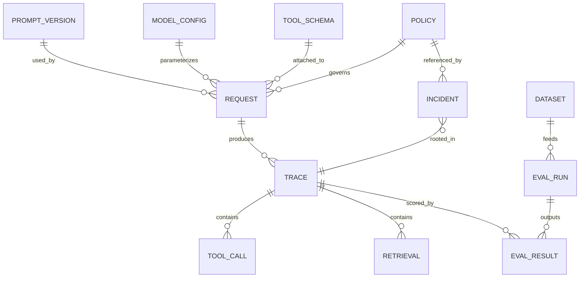

# Claude中心LLMハーネス総覧

## エグゼクティブサマリー

本レポートでは、**LLMハーネス**を「モデル本体の外側にある、入出力契約、ワークフロー、ツール接続、評価、観測、運用、ガバナンスまでを含む実行基盤」と定義する。Anthropicの現行公式スタックを見ると、Claude中心の実装はすでに単純な「API呼び出し」ではなく、**Messages API**、**Claude Code由来のAgent SDK**、**Claude Managed Agents**、**MCP接続**、**Web検索・コード実行・Computer Use等のツール**、**プロンプトキャッシュ**、**バッチ処理**、**構造化出力**、**引用付き検索結果**といった複数のハーネス原語を備える段階にある。したがって、Claude中心システムの成熟度は、モデル性能だけではなく、これら周辺層をどう編成するかで決まる。 citeturn10search15turn24search13turn25search2turn35search1turn26search3turn26search7turn25search5turn40search11turn40search2turn30search7turn10search6

実務上もっとも有用な見取り図は、**マイクロ層**、**マクロ層**、**メタ層**の三層に、**オーケストレーション**、**評価**、**安全**、**データパイプライン**、**アダプタ**、**ツール利用**、**RLHF/IL**、**ベンチマーク**、**オブザーバビリティ**、**コスト/レイテンシ**、**デプロイ**、**ガバナンス**を横断セグメントとして重ねる整理である。これはAnthropicの「Claudeでの構築」ドキュメント、OpenAIのエージェント構成要素、LangGraphの永続実行オーケストレーション、DSPyのメトリクス駆動最適化、LlamaIndex/HaystackのRAG評価モジュール、NIST AI RMFの全ライフサイクル管理を統合した実装者向け分類である。 citeturn26search22turn8search6turn38search1turn38search0turn39search6turn37search2turn18search14

Claude中心ハーネスでいま最重要の設計原則は五つある。第一に、**プロンプトを自然文ではなく契約として扱う**こと。第二に、**ツール呼び出しと構造化出力をパーサ頼みではなくスキーマ頼みにする**こと。第三に、**トレースと評価を本番前ではなく本番中にも回し続ける**こと。第四に、**安全制御をプロンプト内に閉じ込めず、外側の承認・認可・サンドボックス・ポリシーで支える**こと。第五に、**コスト・レイテンシ・品質を単一目的ではなく三者最適化として扱う**ことである。Anthropic自身も、複雑なツール利用ではより高能力モデルの採用を推奨し、tool descriptionの厚み、stop reasonの厳密処理、プロンプトキャッシュ、バッチ、適応型思考やeffortの活用を前提とした設計を案内している。 citeturn29search4turn30search1turn26search1turn40search11turn40search2turn29search12turn29search8

比較の観点では、Claudeの強みは、**ツール統合と長文・長時間ワークロード向けの公式原語が厚いこと**にある。OpenAIは**Responses/Agents SDK、Background mode、Compaction、Prompt Caching、Agent evals**を前面に出し、Googleは**Agent Platform、Agent evaluation、Online monitors、Prompt optimizer**を強化している。一方、Claudeは、**Agent SDKがClaude Codeのループと文脈管理を直接継承**し、さらに**Managed Agents**でサンドボックス付き実行基盤を提供しつつ、**MCPコネクタ**や**Advisor tool**まで持つ。Claude中心で組む意味は、単にClaudeを推論器として使うことではなく、**Claudeの周囲に形成された公式ハーネス面を活用すること**にある。 citeturn25search2turn35search1turn26search13turn8search14turn32search1turn31search10turn31search2turn12search8turn33search6turn33search5

なお、ユーザー文中の **“Febble 5”** について、レビューした権威ソースではこの表記を確認できず、Anthropic公式文書では **Claude Fable 5** が参照されている。本レポートでは、この点を**“Claude Fable 5文脈の可能性が高いが未確証”**として扱い、結論は特定モデル名に依存しないように記述する。Anthropicの現在のモデル概説では、Fable 5は「長時間稼働エージェント向け次世代知能」と位置づけられている。 citeturn19search6turn24search7turn29search13

## 調査範囲と前提

本レポートの対象は、**Claudeを中心に据えた実運用向けLLMハーネス**であり、単なるプロンプトテクニック集ではない。対象範囲には、推論呼び出し、状態管理、RAG、ツール利用、モデル切替、評価、観測、セーフティ、ガバナンス、SRE運用、ベンチマーキング、コスト制御を含む。Anthropic公式の構築面では、Claudeは現在、**Claude API**、**Claude Platform on AWS**、**Amazon Bedrock**、**Google Cloud**、**Microsoft Foundry**から利用でき、機能差とAPI差がハーネス設計に直接影響する。特に、Claude Managed Agentsは直APIおよびClaude Platform on AWSで利用でき、Bedrockにはレガシー導線とMessages API導線が併存する。 citeturn19search7turn40search9turn19search1turn19search10

実装前提については、**対象デプロイ環境は未指定**、**対象言語も未指定**である。そのため、本レポートでは、まず**直API利用**、**クラウド提供面利用**、**モデル非依存フレームワーク利用**の三択を示し、言語は公式の厚みが最も高い**Python**と**TypeScript**を主軸に、必要に応じてJVM系やGoを補助選択肢として扱う。AnthropicのAgent SDKはPython/TypeScriptで提供され、Google CloudのClaudeサンプルもPython中心、Vercel AI SDKはTypeScript中心である。 citeturn25search2turn20search3turn20search12turn21search4

また、ハーネス論では**モデルそのものの学習方法**と**モデルを包む推論基盤**を分ける必要がある。AnthropicのRLHF研究やConstitutional AI研究、OpenAIのInstructGPT、DPO研究は学習層の議論であり、LangGraph、Haystack、LiteLLM、Langfuse、Managed Agents、MCPは推論時ハーネスの議論である。この二つを混同すると、「モデル変更」と「システム変更」の責任分界が曖昧になる。 citeturn22search3turn9search2turn22search0turn22search1turn38search1turn16search14turn16search4turn15search0turn35search1turn26search6

## ハーネスの定義と参照アーキテクチャ

### 定義と分類

本レポートでいうハーネスは、厳密には**「モデル呼び出しを、再現可能・測定可能・統制可能・拡張可能にする外部構造」**である。ClaudeのMessages APIだけでも、messages、tools、files、streaming、stop_reason、citations、search results、batch、prompt caching、rate limits、fallbackなど、すでにハーネス的な契機が多数含まれている。そこにAgent SDKやManaged Agents、外部フレームワークを重ねることで、Claudeは単一モデルから「制御可能なエージェント実行面」へ変化する。 citeturn10search15turn10search2turn10search6turn10search8turn40search2turn40search11turn10search4turn26search1turn25search2turn35search1

スケール別には、次の三層で整理すると設計判断がしやすい。

| 層 | 主対象 | 典型責務 | Claudeでの代表原語 | 代表的な失敗 |
|---|---|---|---|---|
| マイクロ層 | 1回の推論呼び出し | 入出力契約、スキーマ、文脈長、stop reason、キャッシュ | Messages API、Structured Outputs、prompt caching、token counting、effort/adaptive thinking citeturn10search15turn30search7turn40search11turn29search2turn29search8 | 形式崩れ、隠れたtruncate、コスト肥大、未処理のrefusal |
| マクロ層 | 1本のワークフロー | RAG、ツールループ、メモリ、サブエージェント、承認 | Tool use、web search、code execution、computer use、Agent SDK、Claude Code memory citeturn29search14turn26search3turn26search7turn26search4turn25search2turn24search1 | ツール誤選択、状態破損、間接プロンプト注入、長期ドリフト |
| メタ層 | システム全体 | ルーティング、評価、監視、ガバナンス、継続改善 | Managed Agents、LangGraph/LangSmith、DSPy、Langfuse、NIST RMF citeturn35search1turn38search1turn37search3turn38search0turn15search0turn18search14 | ベンダーロック、評価欠落、ガードレール不在、運用不能 |

この三層を横断する機能セグメントを並べると、ハーネス設計の全景が見える。

| セグメント | 主役割 | Claude中心での実装焦点 | 参考原系 |
|---|---|---|---|
| オーケストレーション | 状態遷移・分岐・並列・承認 | LangGraph、Haystack Agent、LlamaIndex Workflows、Managed Agents citeturn38search1turn16search2turn39search3turn35search1 |
| 評価 | オフライン・オンライン評価 | Claude Eval Tool、LangSmith、Ragas、DeepEval、Agent evaluation on Google Cloud citeturn9search4turn37search3turn37search16turn37search21turn33search6 |
| 安全 | jailbreak・PI・権限・承認 | Anthropicガードレール、MCP認可、OWASP LLM Top 10、IPA/AISI guides citeturn26search0turn26search6turn17search1turn28search7turn28search6 |
| データパイプライン | ingest・index・更新・評価データ化 | Files API、LlamaIndex、Haystack、LangSmith datasets citeturn10search17turn16search9turn16search14turn37search15 |
| アダプタ | ベンダー差異吸収 | LiteLLM、Semantic Kernel、Vercel AI SDK、PydanticAI citeturn16search4turn21search1turn21search4turn16search3 |
| ツール利用 | 外部世界との作用 | tools、web search、code execution、computer use、MCP connector、advisor tool citeturn29search14turn26search3turn26search7turn25search5turn35search1turn26search13 |
| RLHF/IL | モデル行動の事前整形 | RLHF、Constitutional AI、InstructGPT、DPO citeturn22search3turn9search2turn22search0turn22search1 |
| ベンチマーキング | 比較可能な測定 | HELM、MMLU系、SWE-bench、BFCL、τ-bench、HarmBench、GAIA citeturn12search8turn12search1turn12search2turn13search0turn14search2turn12search3turn36search0 |
| オブザーバビリティ | トレース・メトリクス・再現 | OpenTelemetry GenAI、OpenInference、Langfuse、Arize、Helicone citeturn23search0turn23search10turn15search7turn23search5turn15search2 |
| コスト/レイテンシ | 単価・待ち時間・効率 | prompt caching、batch、effort、compaction、background mode、context caching citeturn40search11turn40search2turn29search12turn31search10turn32search1turn31search3 |
| デプロイ | 実行面・ネットワーク・SRE | Claude API、AWS、Bedrock、Google Cloud、Foundry、Kubernetes-ready frameworks citeturn19search7turn19search4turn19search1turn20search2turn20search10turn16search21 |
| ガバナンス | 方針・説明責任・監査 | Responsible Scaling Policy、Transparency Hub、NIST AI RMF、EU AI Act、日本AI事業者ガイドライン citeturn9search0turn9search15turn18search14turn17search2turn17search3 |

### 参照アーキテクチャ

次の図は、Claude中心ハーネスの**最小にして十分な参照構成**である。ポイントは、モデルの前後に**ポリシー面**、**コンテキスト面**、**評価/観測面**を明示的に分離することだ。Anthropic・OpenAI・Googleの三者とも、エージェント開発ではモデル単体ではなく、ツール、状態、オーケストレーション、評価、観測を組み合わせる構成を推奨している。 citeturn8search6turn26search22turn33search5



### 実体関係の最小単位

ハーネスを運用可能にするには、少なくとも以下のエンティティを永続化すべきである。評価や監査が弱いチームほど、**PromptVersion**, **ModelPolicy**, **Trace**, **EvalRun**, **Incident** を別物として持っていない。これは後から必ず痛点になる。LangSmith、Langfuse、Arize、OpenInferenceがいずれも「trace-first」で設計されている理由はここにある。 citeturn37search11turn15search10turn23search6turn23search16



## レイヤー別設計原則とベストプラクティス

### マイクロ層

マイクロ層では、**一回のClaude呼び出し**をできるだけ壊れにくく、測りやすく、再利用しやすくする。Anthropicは一貫して、複雑な挙動を期待するなら、長い自然文の願望に頼るよりも、**明示的な役割分離**、**XML/区切り構造**、**例示**、**ツール説明の充実**、**構造化出力**を推奨している。特に、valid JSONが必要なら、プロンプトだけで粘るより、Structured Outputsを使うべきだと明示している。 citeturn9search1turn30search1

ここでの第一原則は、**prompt as contract**である。system promptは「振る舞い規約」、user promptは「可変要求」、retrieval contextは「証拠」、tool descriptionsは「機能契約」、output schemaは「受渡契約」として分ける。Claudeのtool useでは、ツールの説明量が性能に直結し、Anthropicは複雑ツールなら説明を3〜4文以上入れるよう勧めている。これはモデルの“賢さ”以前に、契約定義の質の問題である。 citeturn29search4turn26search5

第二原則は、**stop_reasonをアプリケーション・プロトコルとして扱う**ことだ。Claudeでは `tool_use`、`pause_turn`、`max_tokens`、`refusal` など、停止理由に応じて継続・再送・ツール実行・フォールバックの処理が変わる。これを無視すると、ツール未完了や途中中断を成功扱いするバグが起きる。Anthropicはstop_reasonごとの処理を公式に案内しており、Claude 4世代以降ではストリーミング拒否も `refusal` として明示される。 citeturn26search1turn26search11

第三原則は、**トークンと文脈長を先に設計する**ことである。Claudeの文脈窓はモデルにより最大1Mトークンまで拡張され、tool useやthinkingも文脈計算に入る。特にClaude Sonnet 5では適応型思考がデフォルトでONになり、新しいtokenizerにより同じテキストでもトークン数が増えるため、旧モデル時代の `max_tokens` やコスト見積もりを持ち越すと簡単に破綻する。入力前のtoken counting、出力予算の分離、context compaction相当の要約/圧縮戦略が必須になる。 citeturn29search2turn29search8turn29search5

第四原則は、**キャッシュ可能な接頭辞を守る**ことだ。Anthropicのprompt cachingは、一貫した接頭辞の再利用でコストと処理時間を下げる。したがって、system promptや固定ガイドライン、長大な共通知識はできるだけprefix-stableに保ち、毎ターン異なる識別子や時刻・乱数を前の方に混ぜない設計が得である。バッチ処理はさらにコスト半減をもたらすので、対話性が不要な評価・バックフィル・要約大量処理には最優先で検討すべきである。 citeturn40search11turn40search2turn40search3

### マクロ層

マクロ層では、**複数回のモデル呼び出しや外部ツールを含む手続き全体**を設計する。ここでの基本発想は、**非決定的なLMを、決定的なワークフローで囲う**ことにある。LangGraphが「durable execution / streaming / human-in-the-loop」を重視し、HaystackやLlamaIndexが状態を持つエージェント/ワークフローを提供するのはこのためである。Claude側でもAgent SDKがClaude Code由来のエージェントループと文脈管理を提供し、Managed Agentsはさらにサンドボックス付きの状態ful sessionへ進んでいる。 citeturn38search1turn16search2turn39search3turn25search2turn35search1

実務で有効なパターンは少数の定番に収束する。**retrieve-rerank-read** はRAGの基本、**planner-executor** は長い問題分解向け、**advisor-executor** は高能力モデルの思考を安価モデルの実行に注入する型、**orchestrator-workers** は並列分担、**subagent fan-out/fan-in** は専門分業、**human approval gate** は高リスク操作前の承認である。Anthropicはadvisor toolを正式に提供し、Cookbookではorchestrator-workersを提示している。ReActやToolformerは学術的には同じ方向性、すなわち「推論と行動の統合」が価値源だと示した。 citeturn26search13turn40search15turn27search4turn27search1

Claude特有に重要なのは、**ツール面の厚さ**である。Web search toolは最新情報へのアクセスと引用を返し、Search result content blocksはRAGアプリ内でも自然な出典提示を可能にする。Code execution toolは安全なサンドボックスでPython/Bashを実行でき、Computer use toolは画面・マウス・キーボードを扱うが、プロンプトインジェクション対策としてスクリーンショット上の疑わしい指示には自動分類器と確認要求が入る。つまりClaude中心ハーネスでは、「モデルに検索や計算を“させる”」のではなく、**検索・計算・GUI操作をClaudeの外側の安全な原語に逃がす**のが設計上の正道である。 citeturn26search3turn10search6turn26search7turn9search12

MCPはマクロ層の要石になりうる。Anthropicは2025年にMCP connectorを公開し、MCP仕様はHTTP transport向け認可にOAuth 2.1、Protected Resource Metadata、Dynamic Client Registrationの採用を求めている。言い換えると、MCPは「LLMが何でも触れるための近道」ではなく、**権限委譲されたツール面を標準化するためのハーネス層**である。MCPサーバをRAG延長で雑に扱うと、実際には認可・監査・最小権限の設計問題になる。 citeturn35search1turn26search6turn21search3turn21search19

### メタ層

メタ層は、個々のリクエストではなく**システム全体の進化**を扱う。ここでは、**どのモデルをいつ使うか**、**どう評価し、いつロールバックするか**、**安全基準をどこで強制するか**、**コスト上限をどう執行するか**が中心になる。OpenAIはエージェント構築の基本要素を「models, tools, state/memory, orchestration」と置き、Googleは「評価→失敗クラスター分析→最適化」のQuality Flywheelを提示し、DSPyはメトリクス関数を与えてプログラム全体を最適化する。Claude中心でも、これらはそのまま有効である。 citeturn8search6turn33search2turn38search0

メタ層の最良パターンは、**eval-driven system design** である。つまり、まず品質基準と失敗例をデータセット化し、次にプロンプト・ルーティング・ツール設計を変え、最後に再評価して差分を見る。AnthropicのClaude Eval Tool、LangSmithのoffline/online evaluation、RagasやDeepEval、Googleのoffline/online monitors、MicrosoftのASSERTは、表現は違っても同じ発想で動いている。ハーネスの実力は、モデルの試行錯誤回数ではなく、この改善ループの回転速度と再現性で決まる。 citeturn9search4turn37search3turn37search16turn37search21turn33search6turn34search1

## 実装パターンとコード例

### Claude直結の最小実装

もっとも制御しやすいのは、**Claude Messages APIを直接呼び、ツールループをアプリ側で持つ**構成である。これがハーネスの基礎体力をつくる。ClaudeではMessages APIが基本の推論I/O面であり、tool use、files、citations、streaming、stop reasonsに対応する。 citeturn10search15turn29search14turn10search17turn10search2turn26search1

```python
# Python-like pseudocode
from anthropic import Anthropic

client = Anthropic()

TOOLS = [
    {
        "name": "search_docs",
        "description": (
            "社内文書インデックスを検索する。"
            "必ず query を自然文で指定し、検索意図を短く要約すること。"
            "返り値は document_id, title, snippet, score の配列。"
            "必要なら再検索してから最終回答すること。"
        ),
        "input_schema": {
            "type": "object",
            "properties": {
                "query": {"type": "string"},
                "top_k": {"type": "integer", "minimum": 1, "maximum": 20}
            },
            "required": ["query"]
        }
    }
]

messages = [{"role": "user", "content": "社内規程の出張旅費の上限を教えて"}]

while True:
    resp = client.messages.create(
        model="claude-sonnet-5",
        max_tokens=1200,
        system=(
            "あなたは社内規程アシスタント。"
            "規程根拠が不十分なら断定せず、検索してから答える。"
            "最終回答では根拠文書IDを示す。"
        ),
        tools=TOOLS,
        messages=messages
    )

    if resp.stop_reason == "tool_use":
        tool_calls = [b for b in resp.content if b.type == "tool_use"]
        for call in tool_calls:
            result = search_docs(query=call.input["query"], top_k=call.input.get("top_k", 5))
            messages.append({"role": "assistant", "content": resp.content})
            messages.append({
                "role": "user",
                "content": [{
                    "type": "tool_result",
                    "tool_use_id": call.id,
                    "content": [{"type": "text", "text": json.dumps(result, ensure_ascii=False)}]
                }]
            })
        continue

    if resp.stop_reason in ("max_tokens", "pause_turn", "refusal"):
        handle_special_stop_reason(resp)
        break

    print(render_final_answer(resp))
    break
```

この構成の利点は、**tool loop・retry・approval・logging・fallback** をすべてアプリ側で握れることだ。複雑化したら、ここからLangGraphやHaystackへ持ち上げればよい。逆に、最初から抽象度の高いフレームワークに乗ると、stop_reasonやtoken budget周りの理解が弱いまま本番へ出やすい。 citeturn26search1turn38search1turn16search2

### 構造化出力を使う実装

構造化出力が必要なタスク、たとえば分類・リスク判定・フォーム生成では、**正規表現や脆いJSON修復に頼らず、schema-firstにする**のが定石である。Anthropicは「常に妥当なJSON schemaに従う必要があるならStructured Outputsを使うべき」と明示しており、2026年のGA変更ではパラメータ面も `output_config.format` に整理された。 citeturn30search1turn30search7

```typescript
// TypeScript-like pseudocode
const response = await claude.messages.create({
  model: "claude-sonnet-5",
  max_tokens: 800,
  system: "問い合わせを triage し、必ずスキーマどおり返す。",
  messages: [{ role: "user", content: "VPN接続はできるが社内Wikiだけ開けない" }],
  output_config: {
    format: {
      type: "json_schema",
      name: "support_ticket_triage",
      schema: {
        type: "object",
        properties: {
          category: { type: "string", enum: ["network", "identity", "device", "other"] },
          severity: { type: "string", enum: ["low", "medium", "high"] },
          next_action: { type: "string" },
          needs_human: { type: "boolean" }
        },
        required: ["category", "severity", "next_action", "needs_human"]
      }
    }
  }
})
```

### モデル非依存アダプタ

ハーネスを長生きさせるなら、**プロバイダSDKを直接アプリ中枢に撒かない**ことが重要だ。LiteLLM、Semantic Kernel、Vercel AI SDK、PydanticAIはいずれも「差異吸収」や「型安全」や「OpenAI互換ゲートウェイ」を提供するが、最も本質的なのは自前の**LLMAdapter境界**を切ることである。 citeturn16search4turn21search1turn21search4turn16search3

```pseudo
interface LLMAdapter {
  generate(request: NormalizedRequest): NormalizedResponse
  stream(request: NormalizedRequest): Stream<NormalizedEvent>
  supports(feature: Capability): boolean
}

class ClaudeAdapter implements LLMAdapter
class OpenAIAdapter implements LLMAdapter
class GeminiAdapter implements LLMAdapter

route(task):
  if task.requires == ["computer_use"] and claude.supports(COMPUTER_USE):
      return claude
  if task.requires == ["background_exec"]:
      return openai
  if task.requires == ["online_monitors", "prompt_optimizer"]:
      return gemini
  return claude
```

この境界の中で吸収すべき差は、少なくとも**メッセージ形式**、**ツール呼び出し表現**、**ストリーミングイベント**、**構造化出力機構**、**長時間ジョブ機構**、**キャッシュ/バッチ**、**評価/トレース連携**である。OpenAIはResponses/Agents SDK、Background mode、Compaction、Prompt Caching、Batchを持ち、GoogleはContext Caching、Batch、Prompt Optimizer、Agent Evaluationを持つ。ClaudeはMessages/Agent SDK/Managed Agents、prompt caching、batch、advisor tool、tool stackが強い。比較は「どのモデルが賢いか」ではなく、**どのハーネス原語が必要か**で行うべきである。 citeturn8search14turn32search1turn31search10turn31search2turn32search0turn31search3turn33search0turn33search6turn25search2turn35search1turn40search11turn40search2turn26search13

### 公式スタック比較

| 面 | Claude | OpenAI | Google |
|---|---|---|---|
| 主要推論面 | Messages API、Agent SDK、Managed Agents citeturn10search15turn25search2turn35search1 | Responses API、Agents SDK、Agent Builder citeturn8search14turn8search10 | Gemini API、Agent Platform、Partner ModelsとしてClaudeも提供 citeturn20search2turn20search10 |
| 長時間ジョブ | Managed Agents session runtime、batch、advisor tool citeturn24search18turn40search2turn26search13 | Background mode、Batch API citeturn32search1turn32search0 | Batch API、Agent Platformの評価/最適化面 citeturn31search0turn33search5 |
| 文脈管理 | 1M context、adaptive thinking、prompt caching、token counting citeturn29search2turn29search8turn40search11 | Compaction、Prompt Caching、Conversation state citeturn31search10turn31search2turn32search15 | Context Caching、Batch with cached content citeturn31search3turn31search0 |
| ツール面 | web search、code execution、computer use、MCP connector、advisor citeturn26search3turn26search7turn25search5turn35search1turn26search13 | built-in tools、computer use、agent safety guidance citeturn32search6turn8search2 | Google Search、Maps grounding、File Search、Code Execution、function calling citeturn31search7 |
| 評価面 | Claude Eval Tool、prompt library、release-driven migration guides citeturn9search4turn9search1turn30search12 | Evals、agent evals、evaluation best practices citeturn8search0turn8search12turn8search4 | Agent evaluation、Online Monitors、prompt optimizer citeturn33search6turn33search5turn33search0 |

### オーケストレーションフレームワーク比較

| 代表ツール | 向く用途 | 強み | 注意点 |
|---|---|---|---|
| LangGraph | 状態ful・長寿命エージェント | durable execution、HITL、streaming、persistence citeturn38search1turn38search5 | 抽象度が低く、設計責任は重い |
| DSPy | メトリクス駆動最適化 | optimizer compile、prompt/weights最適化 citeturn38search0turn38search4 | 評価関数が弱いと最適化が暴走 |
| Haystack | 明示的パイプライン/RAG | modular pipeline、Agent、RAG eval tutorial citeturn16search14turn16search2turn37search2 | Python中心 |
| LlamaIndex | データ接続/RAG/Workflow | ingestion-index-retrieval、workflow、eval/observability citeturn16search9turn39search3turn39search6turn39search1 | 高機能ゆえ構成のばらつきが出やすい |
| PydanticAI | typed agent contracts | 型安全、Logfire/OTel観測、evals citeturn16search3turn16search11 | Python寄り |
| Semantic Kernel | 企業統合・多言語SDK | model-agnostic、multi-agent orchestration citeturn21search1turn21search5turn21search17 | エコシステムの理解が必要 |
| LiteLLM | ルーティング/ゲートウェイ | 100+ providers unified、budgets、proxy citeturn16search0turn16search4 | 最低限の抽象化で、品質管理は別途必要 |
| Vercel AI SDK | Web/TSアプリ | tool calling、UI/agent integration citeturn21search0turn21search12 | フロント/TypeScript文脈に最適化 |

## 評価、ベンチマーク、安全、ガバナンス

### ハーネス評価のメトリクス

ハーネスを測るメトリクスは、基盤モデルベンチマークとは別に設計すべきである。RAGで重要なのは**faithfulness**や**context relevancy**であり、エージェントでは**task completion**、**plan adherence**、**tool correctness**、**argument correctness**、**step efficiency**が重要になる。LangSmithはオフライン/オンライン評価を分け、HaystackはDocument MRRとAnswer Faithfulnessを例示し、LlamaIndexはcorrectness, faithfulness, context relevancy, answer relevancy, guideline adherenceを整理し、DeepEvalはagent metrics群を提供する。 citeturn37search3turn37search2turn39search6turn37search9

| 評価対象 | 推奨メトリクス | 実務上の意味 |
|---|---|---|
| モデル呼び出し | format success rate、schema conformance、refusal precision | マイクロ層の壊れにくさ |
| RAG | retrieval MRR/hit rate/nDCG、faithfulness、context relevancy | 根拠検索の質と幻覚抑制 citeturn37search2turn39search6turn37search14 |
| ツール利用 | tool correctness、argument correctness、tool selection accuracy | API誤呼び・引数誤りの検出 citeturn37search9turn13search0 |
| エージェント | task completion、plan quality、plan adherence、step efficiency | 完了率と無駄手順の把握 citeturn37search9 |
| 安全 | attack success rate、unsafe completion rate、false refusal rate | セーフティ実効性の測定 citeturn12search3turn34search17 |
| 運用 | p50/p95/p99 latency、cost per task、retry rate、cache hit rate | SREと予算管理 citeturn8search1turn8search9turn40search11 |

### 主要ベンチマーク群

**ベンチマークは一つでは足りない**。MMLUやGPQAは知識・推論の断面しか見ず、SWE-benchはソフトウェア修正、BFCLは関数呼び出し、τ-benchはユーザーと規則付きの対話ツール利用、HarmBenchは攻撃耐性、GAIAは一般的アシスタント能力を測る。HELMは比較条件の透明性に優れる。したがって、Claudeハーネスを評価するなら、**能力ベンチ + ハーネスベンチ + 安全ベンチ + 自社シナリオベンチ** の組み合わせが必要である。 citeturn12search8turn12search1turn36search2turn12search2turn13search0turn14search2turn12search3turn36search0

| ベンチマーク | 測るもの | 使いどころ | 主な限界 | 原典 |
|---|---|---|---|---|
| HELM | 幅広いシナリオと透明評価 | モデル/設定比較の基礎 | 実アプリ固有性は薄い | citeturn12search0turn12search8 |
| MMLU / MMLU-Pro / MMLU-Redux | 多分野知識・推論 | ベース能力の大雑把比較 | 元MMLUには誤りや汚染懸念 | citeturn12search1turn12search9turn12search5 |
| GPQA | 高難度専門推論 | 高精度知識推論の比較 | 範囲が狭い | citeturn36search2 |
| MMMU | 専門的マルチモーダル理解 | 画像/図表を使う業務 | 実ツール利用は測らない | citeturn36search1 |
| SWE-bench | 実コード修正 | コーディングエージェント | データ汚染/記憶の懸念が指摘 | citeturn12search2turn12search6 |
| BFCL | 関数呼び出し精度 | custom toolsの精度検証 | 長い対話文脈は限定的 | citeturn13search0turn13search4 |
| ToolBench / StableToolBench | ツール操作 | 多API利用の評価 | API変動性問題 | citeturn13search1turn13search9 |
| AgentBench | エージェント行動 | 汎用エージェント比較 | 実運用規則の再現は限定的 | citeturn13search2 |
| τ-bench | ツール・エージェント・ユーザー相互作用 | ルール付き顧客対応型タスク | 産業ドメインの偏り | citeturn14search2 |
| GAIA | 一般アシスタント能力 | 検索/ツール/推論混在の総合力 | 実業務に合わせた調整は必要 | citeturn36search0 |
| TruthfulQA | 真実性 | 幻覚・誤情報耐性 | 単独では十分でない | citeturn36search3turn36search11 |
| HarmBench | 攻撃/拒否堅牢性 | 自動レッドチーミング | 実運用ポリシーとの差分あり | citeturn12search3 |

### 安全とアラインメント

Claude中心ハーネスを理解するうえで、**学習時アラインメント** と **推論時ガードレール** を分けることは重要である。AnthropicはRLHFで「helpful and harmless assistant」を調整し、その後Constitutional AIで、人手ラベルを減らしつつ原則群に基づく自己改善を行う枠組みを提示した。OpenAIのInstructGPTは人間の嗜好に合わせるRLHF系の代表であり、DPOはRLHFを簡略化したRLフリー代替として広く影響を持った。これらは**モデルの素性**を決めるが、**本番の安全性を保証するものではない**。 citeturn22search3turn9search2turn22search0turn22search1

推論時には別の安全層が必要になる。Anthropicはjailbreakやprompt injectionへの対策として、軽量モデルによる事前スクリーニング、structured outputsでの単純分類、ツール利用やComputer Use時の追加確認、ストリーミング拒否の処理、コンテンツモデレーション実装例を示している。IPAも、RAG経由の**間接プロンプトインジェクション**を重要脅威として挙げている。つまり、Claude中心ハーネスの安全は「Claudeが安全か」ではなく、**Claudeの前後に何層の検査と承認を置くか**で決まる。 citeturn26search0turn11search5turn26search11turn9search16turn28search4

### ガバナンスと説明責任

組織レベルでは、Anthropicの**Responsible Scaling Policy 3.0** と **Transparency Hub** が、ベンダー側の安全統治の参照点になる。一方で、利用企業側の内部統治は別途必要であり、NIST AI RMF 1.0およびGenerative AI Profileは、設計・開発・利用・評価の各段階でtrustworthinessを組み込むための枠組みを提供する。EU AI Actは法的義務の方向性を示し、日本では総務省・経産省の**AI事業者ガイドライン 第1.2版**、IPA/AISIの**AIセーフティ評価観点ガイド**、**レッドチーミング手法ガイド**が実務導入に直結する。 citeturn9search0turn9search15turn18search14turn18search3turn17search2turn17search3turn28search7turn28search6

Claude中心ハーネスのガバナンス実装としては、少なくとも次の対応が望ましい。**リスク分類**、**モデル/プロンプト/ツールの版管理**、**traceの監査保存**、**本番前オフライン評価**、**本番中オンラインモニタ**、**変更管理**、**高リスク操作のHITL**、**権限の最小化**、**インシデント後レビュー**である。これはNISTの「govern / map / measure / manage」にほぼそのまま対応する。 citeturn18search14turn18search0


## 運用、性能、コスト、エコシステム

### 運用ランブック

Claude中心ハーネスの運用は、通常のAPI運用よりも**障害種類が多い**。以下のランブックは、最小限の実戦形である。

| 事象 | 最初に見る場所 | 一時対応 | 恒久対応 |
|---|---|---|---|
| schema崩れ | trace + raw response | structured outputsへ切替、暫定validator追加 | schema-first化、プロンプト簡素化 citeturn30search1turn30search7 |
| ツール誤呼び | tool call logs | tool description修正、required引数強化 | BFCL/自社ツールベンチで回帰評価 citeturn29search4turn13search0 |
| RAG幻覚 | retrieval trace + faithfulness eval | 根拠不足時は未確定応答へ | retriever改善、rerank、faithfulness監視 citeturn37search14turn39search6 |
| prompt injection | source context / MCP / search input | 該当ツール停止、承認必須化 | 事前分類、ソース分離、出力無害化 citeturn26search0turn28search4turn21search3 |
| コスト急増 | token/cost dashboard | effort下げる、長文prefixをcache化、batch化 | ルーティング、prompt compaction、予算アラート citeturn29search12turn40search11turn40search2turn8search9 |
| レイテンシ悪化 | p95/p99 + queue depth | 小型モデルへ一時退避、streaming活用 | キャッシュ設計、batch分離、Fast/Background利用検討 citeturn8search1turn40search11turn32search1turn29search1 |
| モデル更新後の退行 | offline eval diff | canary率を下げる、旧版に戻す | 回帰データセット常設、migration checklist運用 citeturn30search12turn8search4 |

### コストとレイテンシのトレードオフ

Claude中心運用で最も見落とされやすいのは、**高性能モデルが常に高コストとは限らない**点である。AnthropicのComputer Useドキュメントは、場合によっては `low` thinking のほうが再試行減少により総コストを下げると示している。つまり、1回の出力トークンを減らすことと、**タスク完了あたりの総コスト**を減らすことは別問題である。Quality-per-dollarで測定すべきだ。 citeturn29search16

Claudeでは、**effort** がレイテンシ・知能・コストの重要レバーであり、最近のOpus/Sonnetではモデル乗り換えよりeffort調整のほうが有効な場合がある。さらに、**prompt caching** は繰り返しprefixの多いユースケースで効き、**Batch API** は非同期処理を半額化する。Claude Sonnet 5ではadaptive thinkingがデフォルトONで、旧4.6比で同等textでもtoken countが増えるため、モデル移行時には見た目の価格表だけでなく、**tokenizer差分を含む実測TCO** を見なければならない。 citeturn29search12turn40search11turn40search2turn29search8turn19search8

OpenAIとGoogleを含めると、長時間系の戦略はさらに明確になる。OpenAIはBackground modeとBatch API、Prompt Caching、Compactionを持ち、GoogleはContext CachingとBatch API、Prompt/Agent optimizerを持つ。Claude中心アーキテクチャでも、これら他社実装から学ぶべき点は大きい。すなわち、**対話経路** と **バルク経路** を分け、**長文prefixの再利用** と **長時間タスクの非同期化** を前提にすることである。 citeturn32search1turn32search0turn31search2turn31search10turn31search3turn31search0turn33search0

### スケーリング戦略

スケーリングは、単純な水平分散よりも、**仕事の種類で流路を分ける**ほうが効く。推奨されるのは、**screening lane**、**interactive lane**、**bulk lane**、**high-risk lane** の四分割である。screening laneは小型モデルや軽量判定器でリクエスト分類、interactive laneはユーザー対話を低遅延処理、bulk laneはbatchで後追い処理、高-risk laneは承認付きまたは高能力モデルで実行する。ClaudeのAdvisor toolやManaged Agents、OpenAIのBackground mode、GoogleのOnline monitorsは、こうした流路の分離を後押しする。 citeturn26search13turn35search1turn32search1turn33search6

### 観測と可観測性

オブザーバビリティは、もはや「ログを残す」ことではない。Langfuse、Arize Phoenix/AX、Helicone、OpenInference、OpenTelemetry GenAIは、**トレースを中心に、トークン・コスト・レイテンシ・ツール・評価を統一的に扱う**方向に進んでいる。OpenTelemetry GenAI semantic conventions はGenAI client, MCP, provider-specific conventionsを定義し、OpenInferenceはLLM / Tool / Agent / Retriever span kindのようなAI特化属性を足す。Claude中心ハーネスでも、traceを標準フォーマットで持たない設計は中長期的に脆い。 citeturn23search0turn23search10turn15search7turn23search5turn15search2

### オープンソースと商用エコシステム

| 区分 | 主要選択肢 | 役割 |
|---|---|---|
| Claudeネイティブ | Messages API、Agent SDK、Managed Agents、Claude Code、MCP connector citeturn10search15turn25search2turn35search1turn25search8 | Claude機能を最短距離で使う |
| ゲートウェイ/アダプタ | LiteLLM、Semantic Kernel、Vercel AI SDK、PydanticAI citeturn16search4turn21search1turn21search4turn16search3 | ベンダー差異吸収、型付け、統一入口 |
| オーケストレーション | LangGraph、Haystack、LlamaIndex、CrewAI citeturn38search1turn16search14turn39search3turn21search2 | 状態遷移、RAG、マルチエージェント |
| 評価 | Claude Eval Tool、LangSmith、Ragas、DeepEval、ASSERT citeturn9search4turn37search3turn37search16turn37search21turn34search1 | 回帰検知、品質計測、要件テスト |
| 観測 | Langfuse、Arize Phoenix/AX、Helicone、OpenInference/OTel citeturn15search0turn23search5turn15search2turn23search10 | トレース、評価、コスト監視 |
| クラウド面 | Claude API/AWS、Amazon Bedrock、Google Cloud Agent Platform、Microsoft Foundry citeturn19search7turn19search1turn20search2turn20search10 | 契約、ネットワーク、コンプライアンス、運用統合 |

## 研究ギャップと優先参考文献

### 研究ギャップと今後の方向

今後の最大論点は、**ハーネスの標準化** と **評価の再現性** である。MCPはツール接続の標準に近づき、OpenTelemetry GenAI/OpenInferenceは観測標準に近づき、OracleのOpen Agent Specは可搬なエージェント定義を狙い、MicrosoftのASSERT/ACSは評価とランタイム制御の標準化を狙う。まだ完全には繋がっていないが、数年スパンでは**MCP × Agent Spec × OpenInference × ASSERT/ACS** の連接が、ハーネスの“HTTP化”に相当する基盤になる可能性が高い。 citeturn26search6turn23search0turn23search10turn34search2turn34search0

第二のギャップは、**ツール利用評価の安定性**である。ToolBench系にはAPI変動性があり、SWE-benchには汚染・記憶の疑義があり、MMLUにも問題文品質の課題がある。評価結果がそのまま実力差ではない以上、今後はStableToolBenchのような安定化、τ-benchのようなポリシー付き対話、GAIAのような一般アシスタント型、HarmBenchのような安全評価を組み合わせる必要がある。評価は「ベンチを回すこと」ではなく、**どの失敗モードを代表させているか**の設計になる。 citeturn13search9turn12search6turn12search5turn14search2turn36search0turn12search3

第三のギャップは、**日本語・日本企業文脈の評価資産不足**である。日本ではAI事業者ガイドラインやIPA/AISI資料は整ってきたが、日本語agent benchmark、日本企業のRAG/業務規程向けgold dataset、MCP認可制御の実践知はまだ不足している。今後、日本語でのハーネス研究は、**日本語評価セットの整備**、**内部統制付きエージェント評価**、**日本法・社内規程・業務手続のツール化**に向かうべきである。 citeturn17search3turn28search7turn28search6turn28search2

### 優先参考文献

以下は、**一次資料を優先**した実務上の必読文献である。

| 優先度 | 文献 | 位置づけ |
|---|---|---|
| 高 | Anthropic Docs: Intro to Claude / Models overview / Messages API / Tool use / Prompt caching / Batch / Stop reasons / Search results / Web search / Code execution / Computer use / Managed Agents citeturn19search6turn19search7turn10search15turn29search14turn40search11turn40search2turn26search1turn10search6turn26search3turn26search7turn25search5turn35search1 | Claude中心ハーネスの公式基礎 |
| 高 | Anthropic, *Training a Helpful and Harmless Assistant with RLHF* citeturn22search3turn9search14 | Claude系アラインメントの出発点 |
| 高 | Anthropic, *Constitutional AI: Harmlessness from AI Feedback* citeturn9search2 | Constitutional AIの原典 |
| 高 | Anthropic, Responsible Scaling Policy / Transparency Hub / Claude’s Constitution citeturn9search0turn9search15turn9search7 | ベンダー側ガバナンス理解 |
| 高 | NIST AI RMF 1.0 / Generative AI Profile citeturn18search14turn18search3 | 利用企業側のリスク管理基盤 |
| 高 | 総務省・経産省, AI事業者ガイドライン 第1.2版 citeturn17search3 | 日本企業向けガバナンス基盤 |
| 高 | IPA/AISI, AIセーフティ評価観点ガイド / レッドチーミング手法ガイド citeturn28search7turn28search6 | 日本語での安全評価実務 |
| 高 | OpenAI Docs: building agents / evals / background / prompt caching / compaction / batch citeturn8search6turn8search12turn32search1turn31search2turn31search10turn32search0 | 比較対象としての公式原語群 |
| 高 | Google Agent Platform: Claude partner models / evaluation / prompt optimizer / context caching / batch citeturn20search2turn33search6turn33search0turn31search3turn31search0 | 比較対象としてのクラウド型ハーネス |
| 高 | LangGraph overview / LangSmith evaluation docs citeturn38search1turn37search11turn37search3 | 状態fulオーケストレーションと評価 |
| 高 | DSPy paper/docs citeturn38search0turn38search4turn38search14 | メトリクス駆動ハーネス最適化 |
| 中 | LlamaIndex docs on workflows / evaluating / observability citeturn39search3turn39search6turn39search1 | データ中心ハーネス設計 |
| 中 | Haystack agent / evaluating RAG tutorials citeturn16search2turn37search2 | 明示的RAG/Agentパイプライン |
| 中 | LiteLLM docs / PydanticAI / Semantic Kernel / Vercel AI SDK citeturn16search4turn16search3turn21search1turn21search4 | アダプタ・開発者体験の比較 |
| 中 | OpenTelemetry GenAI / OpenInference / Langfuse / Arize citeturn23search0turn23search10turn15search0turn23search5 | 観測標準と実装 |
| 中 | HELM / BFCL / τ-bench / HarmBench / GAIA / SWE-bench / MMLU-Redux citeturn12search8turn13search0turn14search2turn12search3turn36search0turn12search2turn12search5 | ハーネス特性を多面的に測るためのベンチ群 |
| 中 | MCP specification and security best practices citeturn26search6turn21search3turn26search9 | ツール面の標準化と認可設計 |
| 中 | Open Agent Spec / ASSERT / ACS open trust stack citeturn34search2turn34search1turn34search0 | 将来の標準化動向 |

### 結論

Claude中心LLMハーネスの本質は、**Claudeを呼ぶこと**ではなく、**Claudeを中心に据えた制御可能な実行系を設計すること**にある。最終的な推奨は明快である。まず、**マイクロ層では契約第一・schema第一・stop_reason厳守**。次に、**マクロ層では決定的ワークフローと安全なツール面でLMを囲う**。最後に、**メタ層では評価・観測・ガバナンスを常設化する**。この三点を満たす限り、Claude Messages APIでも、Agent SDKでも、Managed Agentsでも、さらには他社モデルとの混成でも、堅牢なハーネスは構築できる。逆に、この三点を欠くなら、どれほど高性能なモデルでも本番では“ただの賢い不定形API”に留まる。Claude中心アーキテクチャを決定版にしたいなら、モデル選定より先に、**ハーネスを設計対象として扱う**べきである。 citeturn10search15turn25search2turn35search1turn37search3turn18search14