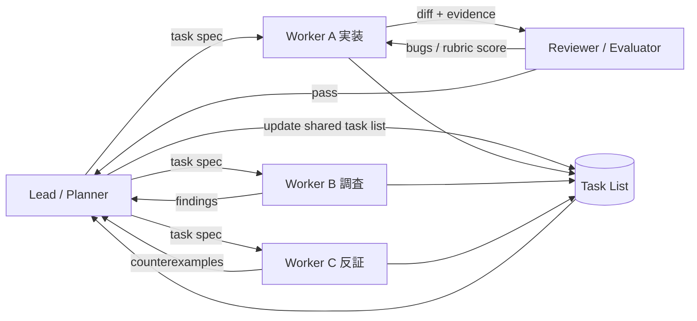

# ループエンジニアリングとClaude CodeにおけるマルチAIエージェントのループ設計

## エグゼクティブサマリ

本調査の結論を先に言うと、**ループエンジニアリング**とは「AIに一回うまいプロンプトを書く技術」ではなく、**AIが自律的に観測し、行動し、検証し、必要なら次の手を選び続ける“反復構造そのもの”を設計する技術**である、という理解が最も実務的です。Anthropic公式はこの語を必ずしも正式用語として前面には出していませんが、Claude Codeはすでにそのための主要プリミティブを揃えています。具体的には、セッション内の agentic loop、`/goal`、`/loop`、Stop hook、subagents、agent teams、dynamic workflows、Agent SDK、hooks、OpenTelemetry などが、内側ループ・外側ループ・ハーネス・監視・多エージェント協調の設計空間を事実上構成しています。Claude Code自身も、モデルの外側にある「agentic harness」であると公式に説明されています。 citeturn8view1turn7search2turn17search8

Claude Codeの**内側ループ**は、Anthropic公式の説明では「コンテキスト収集 → アクション実行 → 結果検証」を回し続ける turn-level の実行ループです。これをタスク終了まで回すのが基本的な agentic loop であり、Agent SDKからも同じループを埋め込めます。これに対して**外側ループ**は、ターン間の継続条件や時間駆動を付与する層です。`/goal` は「前のターンが終わるたびに完了条件を評価して、未達なら次のターンを自動起動する」条件駆動ループで、`/loop` は「一定時間または動的時間間隔が経過したら次のターンを起動する」時間駆動ループです。Stop hook はより汎用な外側ループ化機構であり、`/goal` はそのセッション限定ショートカットです。 citeturn8view1turn22view4turn21view0turn5view2

Anthropic公式資料から見た最重要ポイントは、**ループの質はモデル単体よりハーネス設計で大きく変わる**ことです。長時間タスクでは、コンテキスト飽和、早すぎる完了宣言、評価の甘さ、同一ファイル競合、監視不足、コスト暴走がボトルネックになります。Anthropicはこれに対し、initializer agent と coding agent の分離、progress file や feature list のような永続アーティファクト、planner / generator / evaluator の三者構成、テストオラクル、Playwrightによる評価、context resets、shared task list と messaging などの設計を提示しています。つまり、**良いループは「回すこと」より「何を根拠に止めるか」「何を根拠に続けるか」「失敗時にどう復帰するか」で決まる**、ということです。 citeturn11view1turn12view3turn13view0turn13view1turn13view2turn13view3

マルチAIエージェント環境では、Anthropic公式は少なくとも四つの並列化面を分けています。**subagents** は主会話からの委譲で、要約だけ返す。**agent teams** は共有タスクリストとメッセージングを持つ独立セッション群。**dynamic workflows** はClaudeが書いたJavaScriptオーケストレーションをランタイムが実行するスクリプト駆動型。**agent view** は独立背景セッションの管理面です。重要なのは、どの方式でも「並列にすればよい」のではなく、**依存が少なく、役割境界が明確で、検証可能な仕事に分解できるか**が成功条件になる点です。Anthropic自身も、研究タスクでは multi-agent が有効だが、依存性の強いコーディングでは有効性が下がり、トークン消費が大きいと明言しています。 citeturn18view2turn16view2turn19view0turn20view0turn11view2

理論面では、Claude Codeのループ設計は複数分野の知見で読むと整理しやすくなります。制御理論は**安定性・収束・フィードバック設計**を与え、動的計画法と強化学習は**局所行動と長期目的の整合**を与え、ReAct / Self-Refine / Reflexion / Tree of Thoughts は**推論・行動・自己修正の反復様式**を与え、Nash均衡や分散合意理論は**多エージェント協調・競合・停止不能性**の限界を与えます。Anthropicの multi-agent 研究、long-running harness、agent autonomy 研究は、これら理論をプロダクト設計へ接続する実例です。 citeturn34search5turn35search3turn35search0turn31search0turn31search1turn31search2turn31search3turn33search4turn33search1turn33search0turn36view0

本レポートでは、以上を踏まえて、**Claude Code中心のループ設計を厳密に分解し、実務パターン・比較表・評価プロトコル・哲学的含意まで一体で整理**します。なお、以下で用いる「内側ループ／外側ループ」「Loop Engineering」は、Anthropicの一次資料に明示定義があるわけではなく、公式仕様と学術文献を統合した**分析上の定義**です。この点は仮定として明示します。 citeturn8view1turn22view4turn14view0

## 詳細分析

### Claude Codeのループ機能と設計意図

Anthropic公式は、Claude Codeの基本構造を**agentic harness**と呼び、モデルの外側で、ツール、権限、コンテキスト管理、実行環境、そしてアクションを連鎖させるループを提供すると説明しています。また、Claudeにタスクを与えると「コンテキスト収集・アクション実行・結果検証」という三相が相互に重なりながら回ると説明しています。これは、チャット応答ではなく**状態遷移をもつ反復系**としてClaude Codeを見るべきだ、という意味です。 citeturn8view1turn7search2

この基盤の上に、外側ループを明示的に付与する機能が`/goal`と`/loop`です。`/goal`はClaude Code v2.1.139以降で利用でき、**一つのセッションに一つだけ有効な完了条件**を設定します。条件を設定すると即座に1ターン開始され、その後は**各ターンの終了時に小型・高速モデルが条件成立を判定**し、未達なら理由を次ターンのガイダンスとして返して継続します。条件成立時には自動的にgoalがクリアされます。評価モデルは既定でHaiku系の small fast model で、`/goal`は prompt-based Stop hook のセッション限定ラッパーです。評価器はコマンドやファイルを独立に読まず、**会話内に現れた証拠だけで判定**するため、条件は transcript 上で実証可能でなければなりません。条件長は最大4,000文字、再開時には active goal が復元されますが、ターン数・経過時間・トークン基準はリセットされます。trusted workspace と hooks 有効化が前提で、`disableAllHooks` や `allowManagedHooksOnly` が設定されていると使えません。 citeturn22view4turn22view1turn22view2turn22view3turn24view0

`/loop`はClaude Code v2.1.71で追加された**時間駆動の繰り返し実行**です。Claude Code公式では scheduled tasks の一形態として説明され、セッションが開いている間に、指定プロンプトまたはスキルを繰り返し起動できます。固定間隔では cron に変換され、最小粒度は1分、7分や90分のように cron で表しにくい間隔は近いステップに丸められます。間隔を省略すると**Claudeが各回の観測結果をもとに次の待ち時間を1分〜1時間の間で動的選択**し、場合によっては Monitor tool を使ってポーリング自体を避けます。プロンプトも省略した bare `/loop` では built-in maintenance prompt か、`.claude/loop.md` / `~/.claude/loop.md` の内容が使われます。loop.md は25,000 bytesを超えると切り捨てられ、次イテレーションから反映されます。dynamic `/loop`にも7日有効期限があり、固定間隔ループは Esc で停止するまで、または7日経過まで動作します。プロンプトなしの挙動は一部プロバイダでは異なり、Bedrock / Vertex AI / Microsoft Foundry では usage message になる、または10分固定スケジュールになるなどの制約があります。 citeturn21view0turn21view1turn21view2turn21view3turn24view1

`/goal`と`/loop`は似て見えますが、設計意図は明確に異なります。`/goal`は**条件収束型**で、「1ターン終わるごとに fresh evaluator が完了条件を判定する」ため、完了判定が明示的で、長い実装作業や backlog 消化、テスト収束に向きます。`/loop`は**時間駆動型**で、デプロイ監視、PR babysitting、CI poll、定期保守に向きます。Anthropic公式自身も、`/goal` は substantial work with a verifiable end state に使い、`/loop` は quick polling during a session に使うよう区別しています。Stop hookは両者の一般化であり、スクリプトベース・promptベース・agentベースの判定器を任意イベントに差し込めます。 citeturn22view4turn5view0turn15view2turn15view1

その意味で、Claude Codeのループ機能は単なる convenience command ではなく、**「セッションを誰が再起動するか」を制御する機構**です。Agent SDK側でも同じ execution loop が使われ、`max_turns` と `max_budget_usd` でハード上限を課せます。さらに read-only tool は並列実行、state-changing tool は逐次実行という規律があり、これはループの局所安定性と競合回避に直結します。 citeturn17search16turn5view3turn5view4

### 内側ループと外側ループの定義

以下は本レポートの**分析上の定義**です。Claude Code公式はこの二層を明示命名していませんが、仕様上ははっきり分離できます。**内側ループ**は、1ターンまたは1エージェントが内部で回す「観測→判断→ツール実行→結果反映→検証」の閉ループです。Claude Codeの agentic loop、Agent SDKの turn loop、ReActの reasoning/action interleave、Toolformerの tool selection、Self-Refine や Reflexion の自己修正は、この層に属します。 citeturn8view1turn17search16turn31search0turn37search1turn31search1turn31search2

**外側ループ**は、その内側ループを**いつ再開するか、誰が再起動するか、何をもって止めるか**を定める上位の閉ループです。`/goal`、`/loop`、Stop hook、background sessions、agent teams、dynamic workflows、CI / GitHub Actions 常駐、nightly routines がこれにあたります。Anthropicの long-running harness がやっている initializer → coding sessions → artifact handoff も、多コンテキスト窓にまたがる外側ループです。 citeturn22view4turn21view0turn18view1turn11view1turn13view2

より実務的には、ループは少なくとも四階層に分解できます。

| 階層 | 本レポートでの定義 | Claude Code中心の対応物 | 主要停止条件 |
|---|---|---|---|
| マイクロループ | 単一ツール呼び出し・単一検証単位 | tool call、hook、permission gate | 成功 / 拒否 / 失敗 |
| メゾループ | 1ターン内の探索・修正・確認 | agentic loop、ReAct風turn | turn completion / max tokens |
| マクロループ | セッションやワークフロー単位の継続 | `/goal`、`/loop`、workflow run、team task list | 条件成立 / 時間 / 予算 / no-progress |
| メタループ | ループ設計そのものの改善 | prompt tuning、hook tuning、eval suite、rubric更新 | 指標改善の鈍化 / ガバナンス判断 |

この階層化は、Anthropicの docs / long-running harness / evaluation記事と、ReAct・Self-Refine・Reflexion・Tree of Thoughts・動的計画法・RLの知見を束ねた分析です。特に重要なのは、**内側ループの改善だけでは長時間安定運用は得られず、外側ループとメタループまで設計しないと premature completion と context drift を防げない**ことです。 Anthropicの long-running harness でも、compaction だけでは不十分で、initializer agent、progress file、feature list、incremental progress が必要だったと明言されています。 citeturn11view1turn12view3turn31search3turn35search3turn35search0

### 同期設計・非同期設計・収束条件

**同期ループ**は、前段の判定が終わるまで次へ進まない構造です。`/goal`、Stop hook、foreground subagent、planner→generator→evaluator のスプリント境界、agent-based Stop hook はこれに当たります。同期ループは品質統制が強く、局所的な安全境界や合格条件を明示しやすい反面、待ち時間とコストが増えます。Anthropicの harness 記事でも、evaluatorは有効だが、モデル能力の向上とともに**境界を越えた領域では価値があるが、簡単な領域では不要なオーバーヘッドになりうる**と述べられています。 citeturn15view1turn13view1turn12view2

**非同期ループ**は、親が待たずに進める構造です。`/loop` の scheduled fire、background subagent、agent view の背景セッション、dynamic workflow の background runtime、Monitor-based waiting などが該当します。非同期ループはスループットと稼働率を高めますが、**状態の見落とし・ログ散逸・孤児タスク・競合**のリスクが上がります。agent teams も teammates が独立コンテキストで進み、共有タスクリストと mailbox でゆるく同期するため、典型的な非同期協調系です。 citeturn21view0turn16view0turn18view2turn19view3

収束条件は、Claude Code公式仕様から読む限り、三種類に分けるのが有効です。第一は**成果条件**で、`/goal`が典型です。たとえば「all tests pass」「queue is empty」のような transcript で実証可能な end state です。第二は**監視条件**で、`/loop` のように現象変化を待つ構造で、完了は「provably complete だから次の wakeup を予約しない」か、人間の停止操作になります。第三は**保険条件**で、`max_turns`、`max_budget_usd`、time clause、seven-day expiry、8 consecutive Stop-hook blocks のようなガードレールです。これらは「設計どおりに収束しないときに、暴走を止める」ための第2停止条件です。 citeturn22view4turn21view2turn5view3turn5view2

### ハーネス設計の本質

AnthropicはClaude Codeを「agentic harness」と呼びますが、この言い方は重要です。**ハーネスは単なるラッパーではなく、モデルが何を見て、何をできて、どのタイミングで止まり、何を記録し、どのように失敗を回復するかを規定する“操作系”**だからです。Anthropicの eval記事でも「agent を評価するとは harness と model の組を評価することだ」と明言されています。 citeturn8view1turn13view5

Anthropicの long-running harness 記事群から抽出すると、ハーネスには少なくとも五つの役割があります。まず**テスト・オラクル**で、進捗を「感覚」ではなくテストや reference implementation で定義する役割です。次に**状態運搬**で、`claude-progress.txt` や `CHANGELOG.md`、feature list、CLAUDE.md のような永続アーティファクトを通じて、フレッシュコンテキストに最小限の高信号状態を受け渡します。第三に**メタ制御**で、initializer / planner / evaluator / checker を分離し、実装者が自分の仕事を自分で採点する構造を緩和します。第四に**安全ゲート**で、permissions、auto mode、hook、sandbox、worktree、deny rules を通じて作用範囲を限定します。第五に**観測性**で、transcript・OpenTelemetry・action log・status panel を通じて、失敗の原因を見える化します。 citeturn12view3turn13view3turn13view0turn14view2turn28view0turn28view4

Anthropicが繰り返し報告している失敗モードはかなり一貫しています。長時間タスクでの**context saturation / context anxiety**、初期仕様不足による**one-shotting**、後半での**premature declaration of done**、評価器の**甘いQA**、並列作業での**same-file overwrite**、権限や未信頼入力による**unsafe actions / prompt injection**、そして multi-agent 化による**token blow-up**です。逆に回復策も一貫しており、**context reset + structured handoff、failing-by-default feature list、incremental progress only、fresh-context reviewer、shared task list、separate worktrees、prompt-injection probe / capability boundary、telemetry**が繰り返し出てきます。ここから分かるのは、Loop Engineeringの中心は「Claudeをどう賢くするか」より、**誤差がどこで累積するかを見越して系を閉じること**にある、ということです。 citeturn11view1turn12view3turn13view1turn19view4turn14view2turn37search0

### マルチAIエージェント協調とスケーリング課題

Anthropic公式の並列化面は、**subagents、agent teams、dynamic workflows、background sessions**を明確に使い分けています。subagentsは「副作用の少ない調査やレビューを独立コンテキストで行い、結果だけ返す」仕組みです。teamsは「共有タスクリストと mailbox を持つ peer セッション群」で、メンバー同士が直接メッセージできます。dynamic workflows は「Claudeが書いた JavaScript に計画を移し、そのスクリプトが agents を束ねる」ため、計画の保持主体がAIの文脈ではなくコードになります。これは Loop Engineering 上、大きな差です。Subagent / Team は turn-by-turn judgment に依存しますが、workflow は**計画そのものを再実行可能な artifact にする**からです。 citeturn16view2turn19view3turn20view1turn20view3

通信プロトコルの観点でみると、Claude Code系の協調は三形式に整理できます。第一は**要約返信型**で、subagent が親へ summary を返すだけの単方向通信です。第二は**共有状態型**で、agent teams の shared task list のように、pending / in-progress / completed と依存関係を共有する方式です。第三は**メッセージング型**で、team mailbox による peer-to-peer 通知です。さらに workflow は script variables と agent results をランタイム側で保持するため、**言語メッセージより構造化変数に近い通信**になります。これらは、分散システムでいう「メッセージ・共有ログ・調停ノード」の違いに近い設計差を持ちます。 citeturn19view3turn18view1turn18view0

競合解決は、Claude Code公式資料では驚くほど素朴で、同時編集を避けるには**作業分割と worktree 隔離**が基本です。subagent や手動セッションでは worktree を使えますが、agent teams では teammate ごと worktree 分離は基本ではないため、**別ファイル所有権で分割せよ**と明示されています。これを理論的に言い換えると、現状のLLM multi-agent はまだ強いトランザクション整合性や自動マージ合意に依存すべき段階ではなく、**事前 partitioning で競合確率を下げる方が安定**ということです。 citeturn18view2turn19view4

スケーリング限界もAnthropicはかなり率直です。multi-agent research system の記事では、research 系では parallel reasoning が効くが、**coding の多くは research ほど並列化可能でなく、依存が強い領域では不適**と述べています。また token cost は大きく、Research system は chat の約15倍トークンを使うと報告しています。agent teams も single session より大幅に高コストで、dynamic workflows は同時16 agent、総計1,000 agent/ run の制約を置いています。これはまさに、分散システムの並列度が上がるほど coordination overhead と failure surface が増える、という古典的性質と一致します。 citeturn11view2turn19view2turn20view0

### 理論的基盤と適用可能性

Loop Engineeringを学術的に見ると、最も直接に効くのは**制御理論**です。Åström と Murray の Feedback Systems は、フィードバック系の目的を「観測した誤差をもとに制御入力を更新し、安定な目標追従を実現すること」と捉えます。Claude Codeの `evaluator → generator`、`Stop hook → next turn`、`test oracle → patch` は、そのまま誤差フィードバック設計として読めます。収束を良くするには、誤差が**測定可能**で、更新が**過大でなく**、観測遅延が**許容範囲**で、発散時の**飽和制御**がある必要があります。`max_turns`、budget cap、no-progress stop は、この飽和制御に相当します。 citeturn34search5turn5view3

動的計画法と強化学習は、ループの**局所修正と長期目標の整合**を考えるのに有用です。Bellman の recursive optimization は「今の一手を選ぶとき、将来の価値を織り込む」枠組みで、planner が sprint contract を書き、coding agent が incremental progress を残す設計に対応します。Sutton & Barto の RL は報酬遅延と credit assignment を扱いますが、LLM agent では gradient 更新の代わりに、テスト結果・review finding・verbal reflection を**外部報酬や言語報酬**として扱う場面が多いです。Reflexionはこの点を端的に示し、重みを変えず、言語による反省文を episodic memory として次試行へ渡す verbal reinforcement を提案しました。Anthropicの progress file や CHANGELOG.md も、実務上は同型の記憶装置です。 citeturn35search3turn35search0turn31search2turn13view3

推論ループの研究では、ReAct、Self-Refine、Tree of Thoughts が直接参考になります。ReAct は reasoning と acting を交互に回すことで計画修正と外界接続を両立し、Claude Codeのツール使用ループと整合的です。Self-Refine は feedback と refine の反復で品質を高める枠組みで、`generator ↔ evaluator` や reviewer subagent に近い。Tree of Thoughts は複数候補の探索と自己評価を通じて lookahead / backtracking を行うため、workflow で複数計画案を並列生成して比較する設計に対応します。Anthropicの dynamic workflow が「複数独立案を草案し、互いに検証させる」パターンを推奨しているのは、この系譜に近いです。 citeturn31search0turn31search1turn31search3turn20view2

メタ学習の知見は、**ループそのものを学習対象にする**発想を与えます。MAML は少量データに素早く適応する初期化を学び、Learning to Learn by Gradient Descent by Gradient Descent は optimizer そのものを学習問題にします。Loop Engineeringへ引き寄せると、これは「どの evaluator rubric がよいか」「どの stop 条件が早く安全に収束するか」「どの subagent 構成がタスク群に対して汎化するか」を、メタループとして最適化する視点です。Anthropicの harness tuning や evaluator prompt tuning は、まさに非微分的なメタ学習に近いプロダクション実践だと解釈できます。 citeturn35search1turn35search2turn12view2

ゲーム理論は、複数エージェントの**競争的検証**や**合意形成の停留点**を考えるのに役立ちます。Nash の非協力ゲーム均衡は、各プレイヤーが他者戦略を所与として最善応答している点ですが、multi-agent review や devil’s advocate pattern は「相互批判しても改善余地がなくなった点」を operational equilibrium として使えます。ただし、多くの LLM multi-agent は payoff 設計が曖昧で、共謀・迎合・早期合意が起きやすいため、レビュー役と作業役の報酬関数や権限を分ける必要があります。Anthropicが evaluator を fresh context に置くのは、このバイアス分離に近い設計です。 citeturn33search4turn6view1turn13view1

分散システム理論は、合意・停止・障害耐性の限界を与えます。Paxos / Raft は leader と replicated log を通じて合意値を選ぶ方法を与え、Claude Codeの team lead + shared task list + mailbox は、厳密な合意プロトコルではないものの、**リーダー主導の軽量オーケストレーション**として見るとわかりやすいです。一方、FLP impossibility は、非同期系で故障可能なプロセスがあると決定的 consensus の保証が不可能であることを示します。LLM multi-agent に翻訳すると、**完全非同期・不完全観測・故障可能エージェントの下で、常に有限時間で正しい合意に達することは設計上諦めるべき**で、だからこそ timeout、human interrupt、task dependency、no-progress cutoff、approval gates が必要になります。 citeturn33search2turn33search1turn33search0

最後に安全側では、Anthropicの auto mode は input side の prompt-injection probe と output side の transcript classifier の二層防御を採用しています。これは、LLM agent を「賢い単体」ではなく「外界接続ソフトウェア」として守る発想です。CaMeL論文が示す control flow / data flow 分離も同方向で、Loop Engineeringが高度化するほど、**プロンプト設計だけではなく capability boundary と provenance を持つシステム設計**へ移る必要があります。 citeturn14view2turn37search0

```mermaid
flowchart TD
    U[ユーザー目的] --> H[ハーネス]
    H --> G[/goal 条件駆動]
    H --> L[/loop 時間駆動]
    H --> S[Stop hook 汎用停止判定]
    G --> T[内側ループ]
    L --> T
    S --> T
    T --> O[観測]
    O --> A[行動]
    A --> V[検証]
    V --> E[評価器 / テスト / 監視]
    E -->|未達| T
    E -->|達成| X[停止]
    T --> M[ログ / OTel / Progress file]
    M --> H
```

この図の要点は、**内側ループの性能と、外側ループの停止規則、さらにハーネスの観測性が別物**だということです。Claude Codeはこの三者を独立に組み替えられるため、同じモデルでもまったく違う運用特性が出ます。 citeturn8view1turn22view4turn21view0turn28view4

## 設計パターン

以下は、Claude Code中心の Loop Engineering を実装する際に再利用しやすい**テンプレート集**です。各パターンは Anthropic公式仕様・研究記事・関連学術文献を統合したものです。明示的に公式がそう命名していない場合は、本レポートの分析ラベルです。 citeturn11view1turn13view0turn18view1turn31search0turn31search1

| パターン | 適用条件 | 利点 | 欠点 | 実装上の注意 |
|---|---|---|---|---|
| 条件収束ループ | 終了条件を transcript 上で実証できる | 明示停止、夜間運転しやすい | 条件設計が甘いと誤停止 | `npm test exits 0` など証拠が会話に残る条件にする。`/goal` は評価器が独立にファイルを見ない。 citeturn22view4 |
| 時間駆動ループ | CI監視、PR babysit、デプロイ待ち | 容易に始められる | 無駄なポーリングが増えやすい | 動的 `/loop` は Monitor を活かす。固定間隔は7日で失効。 citeturn21view0turn21view3 |
| 二層停止ループ | 成果条件に加えて暴走防止も必要 | 事故を起こしにくい | 条件が多いと早期停止 | 成果条件 + turn / budget / no-progress 条件を併置する。 citeturn22view4turn5view3 |
| Initializer + Worker | 長期・多コンテキスト窓・空振りが多い | 初期地図を作れる | 初期化が重い | `init.sh`、feature list、progress file を最初に作る。 feature は failing-by-default が有効。 citeturn12view3 |
| Planner + Generator + Evaluator | 仕様の曖昧さと品質不足がボトルネック | 仕様化・実装・査読を分離 | コスト高、遅い | evaluator は fresh context と明示 rubric が有効。容易なタスクでは過剰。 citeturn13view0turn12view2 |
| Maker-Checker | 実装者の自己甘さを避けたい | バイアス分離、品質向上 | トークン増 | reviewer に diff と acceptance criteria だけ見せる。Anthropicも fresh-context review を推奨。 citeturn6view1 |
| Subagent Research Fan-out | 調査や検索が主目的で依存が少ない | 主会話の文脈汚染を防ぐ | summary が粗いと情報落ち | 背景調査は subagent、重要決定は親が統合。各 subagent は own context。 citeturn16view2turn16view3 |
| Team Lead 共有タスクリスト | 相互通信が必要な複雑協調 | 役割分担と自律協調 | 同期コスト、競合 | same-file conflict を避けるよう事前にファイル所有権を切る。 citeturn19view3turn19view4 |
| Scripted Workflow | dozens〜hundreds規模の反復対象 | 再実行可能、監査しやすい | スクリプト品質に依存 | 計画をコードへ移す。sign-off が必要なら stage を分割。 citeturn20view1turn20view0 |
| 監査ログ + OTel | 本番運用、再現調査、コスト監視 | 失敗解析しやすい | 設定負荷 | turn、tool、hook、token、cost を span / event として記録。 `session.id` を活用。 citeturn28view0turn28view4 |
| Capability Boundary | 機密・破壊的操作の危険がある | 被害半径を限定 | 柔軟性低下 | permissions / auto mode / sandbox / deny rules / worktree を重ねる。 citeturn14view2turn19view1 |
| Progress File Memory | 長期反復で再試行や忘却が起こる | dead-end 再挑戦を減らす | 古い記憶が腐る | CHANGELOG に failed approaches と known limitations を書く。 citeturn13view3 |

### 実務テンプレート

以下は、Claude Codeで「小さく始める」ためのテンプレートです。公式機能とAnthropic研究パターンを併用した**最小構成**です。 citeturn22view4turn21view1turn12view3

```bash
# 条件収束ループ
/goal src/auth 配下の failing test をすべて修正し、npm test -- test/auth が通り、
git status で auth 以外の変更がないこと。20ターンで停止。

# 時間駆動ループ
/loop 10m check whether CI passed and address any review comments

# bare /loop 用の project default
# .claude/loop.md
Check the current PR. If CI is red, inspect the failing job logs and propose
the smallest fix. If review comments exist, address them one by one. If all is
green and quiet, output one concise status line.
```

よりコード化したハーネスが必要なら、Agent SDKの turn / budget / telemetry を束ねる設計が有効です。以下は**実装イメージ**であり、公式サンプルの要素を実務向けに統合した擬似コードです。 `maxTurns`・`maxBudgetUsd`・OTel・Stop hook 相当の no-progress 判定を組み合わせています。Claude Agent SDK は Claude Codeと同じ agent loop を使用します。 citeturn17search8turn5view3turn28view0

```python
from claude_agent_sdk import query, ClaudeAgentOptions

options = ClaudeAgentOptions(
    max_turns=30,
    max_budget_usd=5.0,
    allowed_tools=["Read", "Glob", "Grep", "Edit", "Bash(npm test *)"],
    env={
        "CLAUDE_CODE_ENABLE_TELEMETRY": "1",
        "OTEL_TRACES_EXPORTER": "otlp",
        "OTEL_METRICS_EXPORTER": "otlp",
        "OTEL_LOGS_EXPORTER": "otlp",
    },
)

prompt = """
Goal:
- fix all failing auth tests
Stop when:
- npm test -- test/auth exits 0
- no files outside src/auth and test/auth changed
- OR two consecutive turns make no measurable progress
"""

for msg in query(prompt=prompt, options=options):
    # stream events / collect telemetry / compute progress delta
    pass
```

### アーキテクチャ図



この図は、Anthropicの planner / generator / evaluator パターン、agent teams の shared task list、そして multi-agent research の orchestrator-worker pattern を単一の実務図式へまとめたものです。実装時は、**同じファイルを複数 worker に触らせないこと**、**reviewer を fresh context に置くこと**、**task list に dependency を書くこと**が最も効きます。 citeturn13view0turn19view3turn13view4turn19view4

## 実装比較表

### Claude Code中心の実装比較

| 実装 | 種別 | 主要機能 | 利点 | 欠点 | 適用場面 |
|---|---|---|---|---|---|
| Claude Code agentic loop | 商用公式 | turnごとの観測・行動・検証 | 最低摩擦で始められる | 長時間化すると drift しやすい | 単発〜中規模タスク。 citeturn8view1turn17search16 |
| `/goal` | 商用公式 | 条件成立まで自走、各ターン後に独立評価 | 明示的停止、夜間運転しやすい | 条件設計が曖昧だと誤停止 | テスト修正、backlog消化、収束作業。 citeturn22view4 |
| `/loop` | 商用公式 | 時間駆動 / 動的間隔 / loop.md | 運用監視に強い | ポーリング化しやすい | CI見守り、deploy待ち、PR保守。 citeturn21view0turn21view1 |
| Stop / prompt / agent hooks | 商用公式 | 決定的・モデル判定・実地検証を差し込む | ハーネス化しやすい | 過剰に使うと複雑化 | 組織ルール、完了条件、安全ゲート。 citeturn15view1turn15view2turn5view2 |
| Subagents | 商用公式 | 独立コンテキストの委譲、要約返信 | context節約、役割分担 | summary 依存 | 調査、レビュー、サイドタスク。 citeturn16view2turn16view3 |
| Agent Teams | 商用公式 | shared task list、peer messaging、lead coordination | 相互批判・協調が可能 | 高コスト、競合、experimental | 役割協調が必要な複雑仕事。 citeturn18view0turn19view1turn19view2 |
| Dynamic Workflows | 商用公式 | script が agents を数十〜数百規模でオーケストレート | 再実行可能、監査しやすい | mid-run input不可、script依存 | 大規模監査、マイグレーション、cross-check research。 citeturn18view1turn20view0turn20view1 |
| Claude Agent SDK | 商用公式 | same loop as Claude Code、turn/budget/telemetry をコード制御 | 本格ハーネス化に最適 | 実装負荷 | 本番組み込み、CI統合、メトリクス収集。 citeturn17search8turn5view3turn28view0 |
| Anthropic long-running harness | 研究実装 | initializer + coding agent + artifacts | 多コンテキスト窓で安定 | 初期整備が重い | 長時間アプリ生成。 citeturn11view1turn12view3 |
| Planner / Generator / Evaluator harness | 研究実装 | planner, generator, evaluator の三分業 | 仕様・実装・QAを分離 | evaluator tuning が必要 | 品質主導の長時間生成。 citeturn13view0turn13view1 |
| Multi-agent Research system | 研究実装 | orchestrator-worker、並列探索、要約統合 | context 拡張と並列推論に強い | 15x tokenコスト、依存強い仕事に不向き | deep research。 citeturn11view2 |

### OSS・周辺実装と日本語実務解説

| 実装 / 解説 | 種別 | 中核アイデア | 利点 | 欠点 | 本レポートでの位置づけ |
|---|---|---|---|---|---|
| AutoGen | OSS / 論文 | conversable multi-agent conversation framework | 柔軟な多エージェント会話 | 会話設計が複雑化しやすい | Claude Codeの teams / workflows と比較する外部参照。 citeturn32search0turn32search4 |
| CAMEL | OSS / 論文 | role-playing と inception prompting | 役割分担を明示しやすい | role drift の危険 | 役割プロトコル設計の先行例。 citeturn32search1turn32search9 |
| MetaGPT | OSS / 論文 | SOP をプロンプト列へ埋め込む software company metaphor | 人間組織の手順を移植しやすい | バッチ的で重い | SOP化された外側ループの代表例。 citeturn32search2turn32search14 |
| 松尾研究所系実務解説 | 日本語実務 | subagent + custom slash command による実装↔レビュー強制ループ | 現場導入しやすい | 公式仕様依存、コスト増 | Claude Code運用の実務型として有用。なお本調査では松尾氏本人の一次解説そのものは確認できず、周辺実務解説を採用した。 citeturn27view0 |
| Classmethod実践記事 | 日本語実務 | bash while、`/loop`、`/schedule`、Maker-Checker、Agent SDK hooks、GitHub Actions の6段階 | 導入順序が明快 | 公式仕様との差分確認が必要 | 初期導入ロードマップとして有用。 citeturn27view1 |
| Zenn `/loop` `/goal` 解説 | 日本語実務 | `/goal` を成果ベース、`/loop` を時間ベースとして整理 | 概念整理がわかりやすい | 一次仕様ではない | 社内説明資料向き。 citeturn27view2 |

## 評価プロトコル

Loop Engineeringを本番で使うには、**性能・信頼性・安全性・倫理リスク**を別々に測る必要があります。Anthropicの eval記事は、task / trial / grader / transcript / outcome / evaluation harness を分けて考えるべきだと述べています。また、agent eval はインフラ条件で数ポイント以上動くことがあり、Terminal-Bench 2.0 のような hard benchmark でも infra noise が成績を揺らすため、**結果だけではなく資源条件も固定・公開**すべきです。 citeturn13view5turn30search3turn30search5

### 推奨メトリクス

| 観点 | 指標 | 測定方法 | 補足 |
|---|---|---|---|
| 性能 | 成功率 | タスク達成の environment outcome を採点 | transcript の自己申告ではなく outcome を採点。 citeturn13view5 |
| 性能 | 収束速度 | time-to-success、turns-to-success | `/goal` は turns と token spend を表示可能。 citeturn22view5 |
| コスト | token / cost per success | OTel metrics、usage counters | multi-agent は token が急増する。 citeturn28view0turn11view2 |
| 信頼性 | no-progress rate | 連続2回 progress delta=0 の割合 | workflow 例でも two rounds no progress が使われる。 citeturn20view2 |
| 安定性 | oscillation index | 同一エラーの再発回数、同一タスク reopen 回数 | 制御理論上の発振に相当する実務指標。 citeturn34search5 |
| 品質 | regression rate | 修正後テスト再失敗率 | test oracle 必須。 citeturn13view3 |
| 協調 | conflict rate | same-file overwrite、task contention、mailbox round-trip | teams では競合観測が重要。 citeturn19view4turn19view3 |
| 安全 | blocked-action rate | permission denials、auto mode denials、retry率 | 安全境界が厳しすぎると throughput 低下。 citeturn14view3turn19view1 |
| 安全 | prompt-injection susceptibility | 悪性入力を含む tool output に対する逸脱率 | auto mode / CaMeL系評価と接続。 citeturn14view2turn37search0 |
| 自律性 | human intervention frequency | 100ターンあたりの承認・中断・修正介入数 | autonomy は capability と分けて測る。 citeturn36view0turn36view1 |
| 監査性 | trace completeness | turn / tool / hook / model request の span 欠落率 | OTel で測れる。 citeturn28view4 |

### 実験プロトコル案

**プロトコルA: 単一エージェント vs 評価器付きループ**  
同一タスク集合を、baseline Claude Code 単独、`/goal`、Stop hook + agent verifier、planner+generator+evaluatorで比較します。成功率、time-to-success、cost/success、regression rate を計測し、どの難易度帯から evaluator が純増益になるかを見る設計です。Anthropic自身も evaluator は「タスクがモデル単独の信頼境界を越えるとき」に価値が出ると述べています。 citeturn13view1turn13view5

**プロトコルB: 並列化スイートスポット**  
single session、subagents、agent teams、dynamic workflows を、同一タスクを parallelizability の高低で層別化して比較します。parallelizable research、cross-layer feature、same-file heavy refactor で分け、token cost、conflict rate、success rate、handoff loss を測ります。Anthropicの multi-agent research 記事が示す通り、仕事の依存構造が強いと multi-agent の利得は下がるはずです。 citeturn11view2turn19view0

**プロトコルC: 安全境界試験**  
manual permissions、auto mode、deny-heavy settings、sandbox、CaMeL系 capability boundary を比較し、危険操作検知率、false positive、throughput を測ります。Anthropicの auto mode は classifier と prompt-injection probe を分けているため、入力攻撃と出力危険操作を別指標で測るべきです。 citeturn14view2turn14view3turn37search0

**プロトコルD: 実運用 autonomy 評価**  
Feng らの autonomy levels と Anthropic の agent autonomy data を参照し、operator / collaborator / consultant / approver / observer の5水準で同一ワークフローを走らせます。成功率だけでなく、介入頻度、責任認識、満足度、再現可能性、ログ可読性を測ります。 citeturn36view0turn36view1

### ベンチマーク候補

SWE-bench / SWE-bench Verified は real-world GitHub issue 解決能力の評価に向き、Terminal-Bench 2.0 は terminal 上での hard realistic task に向きます。いずれも useful ですが、Anthropicが指摘するように infra specifications を揃えないと解釈を誤りやすい点には注意が必要です。Claude Codeのようなループ設計評価では、**ベンチマークだけでなく実トレース評価が不可欠**です。 citeturn30search0turn30search4turn30search5turn30search3

## 哲学的考察

Loop Engineeringが示す最も大きな変化は、**「知能」を単発応答の質ではなく、反復し続けるシステムのふるまいとして見る**ことです。ここでは、モデルは単体の知能というより、ハーネス・ツール・停止条件・ログ・人間監督を含む一つの社会技術システムの部品になります。Anthropicの docs が Claude Code を harness と呼ぶのは、この見方に極めて近いです。 citeturn8view1turn13view5

第一に、**自己参照**の問題があります。`/goal` の evaluator が transcript を読み、未達理由を次ターンの指示へ返す構造は、系が自分の出力を材料に自分を制御しているという意味で、弱い自己参照です。Self-Refine や Reflexion はこれをさらに押し進め、自己の出力への自己批評をループの駆動力にします。ただし、ここで起きているのは「主体の内面を理解した自己意識」というより、**履歴を利用した方策改善**です。哲学的には intention のように見えても、設計的には誤差修正の回路として扱うほうが安全です。 citeturn31search1turn31search2turn36view0

第二に、**意図性**はどこに宿るのか、という問題があります。ユーザーが「目的」を与え、planner が仕様へ展開し、worker が手段を選び、evaluator が是非を判定するなら、意図は単一の場所にありません。Feng らが autonomy を capability と分けるのは、この点をよく捉えています。高能力でも低自律な設計はあり得るし、逆もあり得る。つまり「このエージェントは自律的だから危険」ではなく、**誰がどこで関与しなくても進むように設計されているか**がリスクの本体です。 citeturn36view0turn36view1

第三に、**説明可能性**は思考開示ではなく履歴可視化へ移ります。agentic system の説明責任は「なぜそう考えたか」を完全に語らせることより、**何を読み、何を実行し、どこで止められ、何が却下され、どの証拠で評価器が継続/停止を決めたか**を後から追えることの方が重要です。Anthropicが OpenTelemetry、transcript、/goal reason、Recently denied、task list などを整えているのは、説明可能性を reasoning narrative ではなく operation ledger として実装しているからだと解釈できます。Shavit らの governing agents も、action ledgers と human approval gates を重視しています。 citeturn28view4turn14view3turn22view4turn37search2

第四に、**責任の所在**は単一主体モデルでは捉えにくくなります。multi-agent team では、lead が計画し、teammate が実装し、auto mode classifier が一部を止め、human approver が一部を許可します。このとき「誰の判断だったか」は一意ではありません。だからこそ、責任論は「最終出力の作者」ではなく、**設計者、デプロイヤ、承認者、実行環境提供者、監視者の連帯構造**へ移る必要があります。これは agent governance が accountability assignment を重視する理由でもあります。 citeturn19view1turn14view2turn37search2

最後に、Loop Engineering は人間を不要にするのではなく、**人間の役割を操作員から制度設計者へずらす**傾向があります。日本語実務記事が強調する「AIに毎回指示するのではなく、AIが回る条件を設計する」という感覚は、Anthropic公式の `/goal`・`/loop`・workflows・harness 設計の方向性と整合しています。ただし、これは「AIに任せて終わり」ではありません。むしろ、誤作動したときに**どこをどう止めるかを設計できる人間**の責任は重くなります。 citeturn27view1turn27view2turn13view5

## 実務チェックリストと推奨文献・実験課題

### 短縮版チェックリスト

| 項目 | 確認内容 |
|---|---|
| 目的 | end state は transcript 上で検証可能か |
| 停止条件 | 成果条件に加え、turn / time / budget / no-progress の保険条件があるか |
| 役割 | planner / worker / reviewer / monitor を必要最小限で切っているか |
| 状態 | CLAUDE.md、progress file、feature list、README など永続状態があるか |
| 安全 | permissions、auto mode、sandbox、deny rules、worktree を設けたか |
| 観測性 | transcript、OTel、task list、denied actions が追えるか |
| 並列化 | truly parallelizable か。same-file edit を避けているか |
| 評価 | outcome-based grader があるか。自己申告だけで終わっていないか |
| 回復 | rewind / checkpoint / resume / relaunch が定義されているか |
| ガバナンス | 人間が承認すべき操作と、ログだけでよい操作を分けたか |

### 推奨文献

以下は、本テーマをさらに深化させる際の核となる文献です。Anthropic一次資料を最優先し、その上に理論文献を重ねる順番が最も実務効率が良いです。 citeturn8view1turn22view4turn21view0turn11view1turn11view2turn14view0

```text
[Anthropic / Claude Code 公式]
- Claude Code の仕組み (2026): https://code.claude.com/docs/ja/how-claude-code-works
- /goal Docs (2026): https://code.claude.com/docs/en/goal
- Scheduled Tasks / /loop Docs (2026): https://code.claude.com/docs/en/scheduled-tasks
- Hooks Guide (2026): https://code.claude.com/docs/en/hooks-guide
- Hooks Reference (2026): https://code.claude.com/docs/en/hooks
- Subagents Docs (2026): https://code.claude.com/docs/en/sub-agents
- Agent Teams Docs (2026): https://code.claude.com/docs/en/agent-teams
- Dynamic Workflows Docs (2026): https://code.claude.com/docs/en/workflows
- Agent SDK Overview / Agent Loop / Observability (2026):
  https://code.claude.com/docs/en/agent-sdk/overview
  https://code.claude.com/docs/en/agent-sdk/agent-loop
  https://code.claude.com/docs/en/agent-sdk/observability
- Best practices for Claude Code (2025/2026): https://code.claude.com/docs/en/best-practices

[Anthropic Engineering / Research]
- Effective harnesses for long-running agents (2025):
  https://www.anthropic.com/engineering/effective-harnesses-for-long-running-agents
- Harness design for long-running application development (2026):
  https://www.anthropic.com/engineering/harness-design-long-running-apps
- How we built our multi-agent research system (2025):
  https://www.anthropic.com/engineering/multi-agent-research-system
- Building a C compiler with a team of parallel Claudes (2026):
  https://www.anthropic.com/engineering/building-c-compiler
- Effective context engineering for AI agents (2025):
  https://www.anthropic.com/engineering/effective-context-engineering-for-ai-agents
- How we built Claude Code auto mode (2026):
  https://www.anthropic.com/engineering/claude-code-auto-mode
- Demystifying evals for AI agents (2026):
  https://www.anthropic.com/engineering/demystifying-evals-for-ai-agents
- Measuring AI agent autonomy in practice (2026):
  https://www.anthropic.com/research/measuring-agent-autonomy

[主要学術文献]
- Åström & Murray, Feedback Systems (2008/2020):
  https://www.cds.caltech.edu/~murray/books/AM08/pdf/fbs-public_24Jul2020.pdf
- Bellman, The Theory of Dynamic Programming (1954):
  https://www.rand.org/content/dam/rand/pubs/papers/2008/P550.pdf
- Sutton & Barto, Reinforcement Learning: An Introduction (2018):
  https://incompleteideas.net/book/the-book-2nd.html
- Yao et al., ReAct (2022): https://arxiv.org/abs/2210.03629
- Madaan et al., Self-Refine (2023): https://arxiv.org/abs/2303.17651
- Shinn et al., Reflexion (2023): https://arxiv.org/abs/2303.11366
- Yao et al., Tree of Thoughts (2023): https://arxiv.org/abs/2305.10601
- Wu et al., AutoGen (2023): https://arxiv.org/abs/2308.08155
- Li et al., CAMEL (2023): https://proceedings.neurips.cc/paper_files/paper/2023/file/a3621ee907def47c1b952ade25c67698-Paper-Conference.pdf
- Hong et al., MetaGPT (2023/2024): https://arxiv.org/abs/2308.00352
- Du et al., Multi-agent Debate (2023): https://arxiv.org/abs/2305.14325
- Ongaro & Ousterhout, Raft (2014): https://raft.github.io/raft.pdf
- Lamport, Paxos Made Simple (2001): https://lamport.azurewebsites.net/pubs/paxos-simple.pdf
- Fischer, Lynch, Paterson, FLP Impossibility (1985):
  https://groups.csail.mit.edu/tds/papers/Lynch/jacm85.pdf
- Nash, Non-Cooperative Games (1951): https://www.cs.upc.edu/~ia/nash51.pdf
- Feng et al., Levels of Autonomy for AI Agents (2025):
  https://arxiv.org/abs/2506.12469
- Debenedetti et al., Defeating Prompt Injections by Design (2025):
  https://arxiv.org/abs/2503.18813

[日本語実務解説]
- Classmethod: Loop EngineeringをClaudeを使って実践してみた (2026):
  https://dev.classmethod.jp/articles/claude-loop-engineering-practice/
- Zenn: Claude Code の /loop と /goal という考え方 (2026):
  https://zenn.dev/aria3/articles/claude-code-loop-goal-engineering
- note: Claude Code中心のAIコーディング運用：実務で効いた5つの型 (2025):
  https://note.com/it_eng_strtg_mth/n/ncfb3ae201721
```

### 研究をさらに進めるための実験課題

| 実験課題 | 目的 | 推奨設定 |
|---|---|---|
| `/goal` 条件文のアブレーション | 良い停止条件の形を抽出 | 同じバグ修正タスクで condition phrasing を比較。 citeturn22view4 |
| reviewer fresh-context 効果測定 | self-review バイアスの定量化 | writer-only と writer+reviewer を比較。 citeturn6view1turn13view1 |
| feature list failing-by-default 効果 | premature done の抑制効果測定 | initializer あり/なし比較。 citeturn12view3 |
| team vs workflow vs subagent 比較 | 並列化の最適単位を求める | 依存の強さ別に token/success を測る。 citeturn18view2turn20view1 |
| no-progress heuristic 最適化 | 早期終了と無駄継続のトレードオフ | 2回連続ゼロ進捗 vs 3回連続を比較。 citeturn20view2 |
| safety boundary 実験 | throughput と安全の最適化 | manual / auto / sandbox / deny rules 比較。 citeturn14view2turn14view3 |
| telemetry completeness 実験 | 本番監査の実用性向上 | OTel export interval と trace loss を測る。 citeturn28view4 |

### オープンクエスチョンと限界

本調査で高信頼に言えるのは、Claude Code周辺の外側ループ設計は急速に公式機能へ取り込まれているという点です。一方で、**Loop Engineering** という語自体はコミュニティ主導の総称であり、Anthropic公式の正式用語体系ではありません。このレポートでの内側ループ／外側ループの定義は、公式仕様と学術文献からの分析的統合です。松尾氏本人による Claude Code ループ設計の一次資料は本調査範囲では確認できず、日本語実務解説としては周辺実務者・企業記事を用いました。また、agent teams・dynamic workflows は experimental / evolving な機能を含むため、**2026年7月3日時点の仕様**として読むべきであり、将来変更の可能性があります。 citeturn18view0turn20view0turn27view0