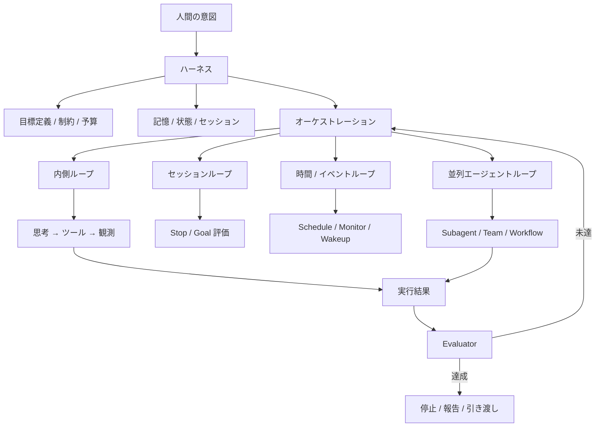
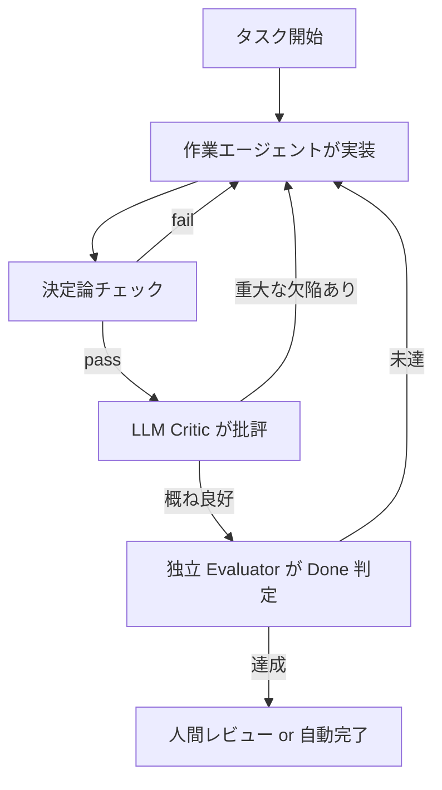

# ループエンジニアリングの深層

## エグゼクティブサマリ

ループエンジニアリングは、単発の「良いプロンプト」を書く技法ではなく、**エージェントに次のプロンプト・次の行動・次の検証を生み出させ続ける仕組み**そのものを設計する技法です。AnthropicのClaude Codeでは、その核心がすでに製品機能として露出しており、単一ターン内の**エージェントループ**、ターン間を自走させる **`/goal`**、時間起動の **`/loop`**、決定論的またはモデル評価型の **hooks**、並列化の **subagents / agent teams / dynamic workflows / worktrees**、継続性を担う **sessions / memory / compaction** が、ひとつの体系として接続されています。Anthropic自身も、Claude Codeを「モデル」ではなく**ハーネス**として捉え、長時間エージェントの性能はモデル単体ではなく、モデルとハーネスの相互作用で決まると明示しています。 citeturn4view5turn4view3turn13view3turn13view1

この観点から見ると、ループは少なくとも五層に分解できます。**内側のツール使用ループ**、**セッション内ターンループ**、**スケジュール・イベント起動ループ**、**並列エージェントの協調ループ**、そして運用者が自分のループを評価・改善する **メタループ** です。Claude Codeの `/goal` は「完了条件に基づく後続ターン起動」、`/loop` は「時間起動の再実行」、Stop hook は「任意の判定ロジックによる継続・停止」を与え、これらは同じ問題を別のトリガー軸で解いています。 `/goal` は毎ターン後に小型高速モデルで条件判定し、`/loop` は固定間隔または自己ペースで起動し、Stop hook はスクリプト・LLM・subagent を使って制御できます。 citeturn34view0turn34view1turn10view1turn10view2turn8view3turn9view3turn11view0

この世界で最重要なのが **Evaluator** です。Evaluator は「生成物が良いか」を見るだけではなく、**何を成功とみなすかを機械可読に定義する装置**です。Claude Code の `/goal` は本質的に session-scoped な prompt-based Stop hook であり、Evaluator はツールを呼べず、**会話に surfaced された証拠しか判断できません**。つまり、ループ設計の本丸は「どう書かせるか」より先に、**どう証明させるか** にあります。学術的にも、ReAct・Tree of Thoughts・Self-Refine・Reflexion はいずれも、観測→生成→自己評価→方策更新のループを異なる粒度で実装したものと読めます。また、LLM-as-a-judge 研究は、LLM評価器が人間と高相関を示す一方で、位置バイアス、冗長性バイアス、自己優遇バイアスを持つことを繰り返し示しています。 citeturn34view1turn25search0turn25search1turn25search2turn25search3turn27search0turn26search0turn26search1turn27search1turn27search2turn27search11

したがって、実務上の結論は明確です。**良いループは「作業ループ」ではなく「証拠生成ループ」である**、ということです。最良の設計は、目標を単一の可観測終状態に落とし、Maker と Checker を分離し、状態を外部化し、停止条件と予算制御を持ち、並列性をファイル隔離と責務分離で扱い、最後に人間が効率よく介入できるようにするものです。これは制御理論なら MAPE-K や receding-horizon control、RLなら Dyna や exploration–exploitation、認知科学なら active inference、哲学なら自己参照と価値定義の問題として再記述できます。ループエンジニアリングの本質は、**AI に仕事を頼むことではなく、AI が自分で“次の仕事”を正しく見つけ、正しく止まれる環境を設計すること**です。 citeturn28search7turn28search19turn28search13turn29search16turn30search2turn30search15turn37search2turn37search1turn13view0

## ループエンジニアリングとは何か

Anthropic周辺で語られるハーネスは、単なるラッパーではありません。Anthropic は agent harness を「モデルをエージェントとして動かすシステム」、evaluation harness を「課題・実行・記録・採点・集計を end-to-end で回す基盤」と定義しています。さらに Claude Code の Agent SDK は、Claude Code を支えるのと同じ **tools / agent loop / context management** をプログラム可能にすると説明しています。つまり、ループエンジニアリングの一次対象はプロンプトではなく、**ハーネスが持つ遷移規則・状態・観測・停止・評価**です。 citeturn13view3turn5search16turn4view3

Anthropic の長時間エージェント研究は、この点を非常に率直に示しています。単に「高水準の目標を与えて無限に走らせる」だけでは、モデルは一度にやり過ぎて中途半端な状態を残したり、後半で早すぎる終了宣言をしたりします。そこで Anthropic は、**initializer agent** が最初に環境・進捗ファイル・初期コミットを作り、その後の **coding agent** が毎セッションで小さな前進をしつつ、次セッションに引き継げるアーティファクトを残す二段構えを提案しました。これは「文脈窓の中の知能」ではなく、「文脈窓を跨いで継続するための外部構造」に性能の一部が宿ることを意味します。 citeturn13view0

この発想は、業界側でもほぼ同じ言葉で整理されています。Addy Osmani は loop engineering を「エージェントにプロンプトする人間の代わりをシステムにやらせること」とまとめ、日本語解説でも「トリガー」と「検証可能なゴール」がループの最小要件だと繰り返し説明されています。日本語圏の実務解説では、さらに worktrees、skills、subagents、memory/state を「ループの基本部品」と見なし、プロンプト指示から**制御系設計**へ重心が移ることが強調されています。これは Anthropic 本家の長時間ハーネス論とほぼ整合的です。 citeturn32search0turn24view1turn24view2turn24view0

ここで重要なのは、「ループ」は while 文の比喩ではなく、**観測・判断・行動・評価・更新の閉ループ**だということです。ReAct は reasoning と acting を交互に回し、Tree of Thoughts は複数候補の探索と自己評価を入れ、Self-Refine は生成→批評→改稿を同一モデルで反復し、Reflexion は失敗の言語的反省を memory buffer に蓄積して次試行へ持ち越します。いずれも、エージェント性の本質を「一発出力」ではなく、**反復的な状態更新**として定式化しています。 loop engineering は、それをUIやプロダクトや運用レベルで徹底したものです。 citeturn25search0turn25search1turn25search2turn25search3

## Claude Codeでのループ設計

Claude Code の最内層には、すでに明確なエージェントループがあります。Agent SDK 文書は、ひとつの turn を「Claude がツール呼び出しを伴う応答を出す → SDK がツールを実行する → 結果を Claude に返す」の一往復と定義し、**ツール呼び出しがなくなるまで 反復**すると説明しています。これは Claude Code の「思考→操作→観測→再計画」の最小単位であり、ユーザーが毎回キーボードを打たなくても回る **内側のループ**です。 `max_turns` や `max_budget_usd` が存在するのも、この内側ループに収束・費用制約を与えるためです。 citeturn4view3

その外側にあるのが **セッション内ターンループ** です。 `/goal` は、ターン完了ごとに小型高速モデルで条件評価し、未達なら次ターンを自動開始します。重要なのは、 `/goal` が「指示」ではなく **完了条件** を受け取り、その判定が fresh な別モデルで行われる点です。Anthropic は `/goal` を session-scoped な prompt-based Stop hook のラッパーだと明示しており、Evaluator はツールを呼ばないので、会話に載った証拠だけを見て yes/no を返します。したがって `/goal` を使うときは「npm test が exit 0」や「git status が clean」など、**Claude 自身が transcript に証拠を残せる条件**に翻訳する必要があります。 citeturn34view0turn34view1

これと対照的なのが **時間起動ループ** である `/loop` です。 `/loop` は scheduled tasks の一形態で、固定間隔なら cron に変換され、間隔省略時は Claude が 1分〜1時間の範囲で自己ペースを決めます。動的スケジュールでは Monitor tool を使ってポーリングそのものを回避することもあり、固定間隔ループは停止されるか 7日で期限切れになるまで継続します。 prompt を省略した bare `/loop` では built-in maintenance prompt か `loop.md` が使われ、未完了作業、PR、CI、クリーンアップを順に見ます。これは「人間が定期確認する」行為を、Claude Code が明示的な time-based outer loop として製品化したものです。 citeturn4view1turn10view1turn10view2turn10view3turn10view4

さらに柔軟なのが **hooks によるハーネス拡張** です。 hooks は Claude Code のライフサイクルで shell command・HTTP・prompt・agent・MCP tool を発火できる決定論的制御点で、PreToolUse で遮断、PostToolUse で追記、Stop で継続/停止を判定できます。 prompt hooks は単発の LLM 評価、agent hooks は最大 50 tool-use turns を伴う検証 subagent を起動できます。 async command hooks はバックグラウンド実行でき、完了後に `additionalContext` を次ターンへ返せますが、**動作をブロックする権限は失います**。これは同期ループと非同期ループの設計差を、そのままプロダクト機能として示しています。 citeturn8view3turn9view1turn9view3turn11view0

状態管理もループ設計の中心です。Claude Code は、起動時に CLAUDE.md、auto memory、MCP tool names、skill descriptions などを読み込み、長くなると compaction を行います。 compaction 後には system prompt、project-root CLAUDE.md、auto memory、invoked skills は再注入されますが、path-scoped rules や nested CLAUDE.md は対応ファイル再読込まで失われます。 また session はローカル transcript として継続保存され、`--resume` や `/resume` で再開でき、auto memory はリポジトリ単位で worktrees 間共有されます。 したがって、**何をコンテキスト窓に置き、何を外部記憶に逃がし、何を再注入可能にするか**がループ設計そのものです。 citeturn8view0turn8view1turn8view2

並列性はさらに外側のループです。Claude Code には、軽量な **subagents**、直接通信できる **agent teams**、多数の subagents をスクリプトで回す **dynamic workflows**、そしてファイル干渉を避ける **worktrees** があります。Anthropic は「誰が次を決めるか」によって、subagent は親エージェント、agent team は lead agent、workflow は script が次の実行を決めると整理しています。つまり、**並列ループの本質は worker 数ではなく、次遷移の意思決定主体をどこに置くか**です。Claude Code における “inner vs outer loop” は、単に時間スケールの違いではなく、**制御権の階層**でもあります。 citeturn6view0turn6view1turn6view2turn6view3turn6view4

次の図は、その階層を抽象化したものです。



この図の読み方は単純です。**ループはひとつではなく、複数の閉ループが入れ子で存在する**。そして、どのループで何を観測し、どこに状態を保持し、誰が次の遷移を決めるかを分解すると、Claude Code の機能群はかなり整理して理解できます。 citeturn4view3turn34view1turn10view1turn6view1

## エバリュエーター中心設計

Evaluator を最も狭く定義すると、「ある時点の出力・状態・軌跡に対して、継続・停止・採用・棄却・修正方向を決める判定器」です。Anthropic の評価文脈では grader は性能の一側面を採点するロジックであり、task ごとに複数 grader を持ち得ます。 `/goal` の evaluator も、hooks の prompt/agent judge も、security-guidance plugin の各層も、みな広義の evaluator です。Evaluator は品質保証機構であると同時に、**ループの遷移関数**でもあります。評価が「No」を返すと、それ自体が次ターンへの指令になるからです。 citeturn13view3turn34view1turn35search6

機能分類としては、少なくとも四つに分けると見通しが良くなります。第一に **scoring evaluator** は数値や pass/fail を返します。第二に **critic evaluator** は「何が悪いか」「次に何を直すか」を返します。第三に **counterfactual evaluator** は「別案A/Bのどちらがよいか」「違う方策なら何が起きたか」を比較します。第四に **meta-evaluator** は evaluator 自体の妥当性を監査します。学術的には G-Eval は structured form-filling による scoring/critique の両面を持ち、 MT-Bench 系は pairwise judge を通じて比較評価を行い、Pairwise Preference 系研究は直接採点より pairwise ranking の方が人間判断に整合しやすいことを示しています。 survey 研究は、こうした judge を一つの設計空間としてまとめています。 citeturn26search0turn27search0turn27search1turn26search1

実装パターンも複数あります。**同一モデル自己評価** は Self-Refine 的で実装が最も軽いですが、自己正当化・過大評価の危険があります。 **モデル分離型評価** は `/goal` のように作業モデルとは別の小型高速モデルで判定する方式で、fresh judge の利点があります。 **外部決定論評価** は unit tests、lint、contract tests、regex、policy engine のように、ルールベースで outcome を判断します。 **agent evaluator** は Claude Code の `type: "agent"` hook のように、ファイルやコマンドを見て tool-enabled に評価します。 **human-in-the-loop 評価** は LangGraph interrupts や Codex review queue のように、人間承認点を明示的に埋め込みます。実務では、これらを単独でなく**合成**して使うのが普通です。 citeturn25search2turn34view1turn9view3turn22search5turn22search15turn16view2

Claude Code 自体が、Evaluator を多層化する設計例をすでに持っています。security-guidance plugin は、各編集時の pattern check、各ターン終了時の model review、commit/push 時の deeper agentic review という三層を回します。これは評価の頻度・粒度・コストを分離した構成で、**高頻度・低コストの粗い検査**と、**低頻度・高コストの深い検査**を使い分ける典型です。 `/goal` も同じ発想で、各ターン評価は cheap だが tool-less、より重い検証は Stop hook や agent hook に委ねるときれいに整理できます。 citeturn35search6turn35search0turn34view1

信頼性の観点では、LLM judge は強力ですが無謬ではありません。MT-Bench と Chatbot Arena は、強い judge が人間判断と 80% 以上で整合しうることを示しましたが、同時に **position bias、verbosity bias、self-enhancement bias** を指摘しています。後続研究や survey も、judge reliability の中核論点を一貫して「人間との一致」「一貫性」「キャリブレーション」「バイアス低減」に置いています。つまり Evaluator は“置けば終わり”ではなく、**Evaluator 自身の評価**が必要です。これは loop engineering における meta-loop の中心課題です。 citeturn27search0turn26search1turn27search1turn27search2turn27search11

Claude Code に統合するなら、実務上の原則は次の順になります。まず、**最終判定は transcript の上で証明可能なものにする**。次に、**Maker と Checker を分離**する。さらに、**cheap checks を高頻度に、expensive checks を節目で**回す。最後に、**block cap・turn cap・budget cap** を置く。Claude Code では Stop hook が連続8回ブロックで上書きされるため、停止不能ループを設計しないことも重要です。 Anthropic の best practices も、「作業者が自分を採点しない」「証拠を見せる」「verification subagent や dynamic workflow を使う」と繰り返し勧めています。 citeturn9view2turn4view4turn34view1

次のフローチャートは、評価ループの一例です。



この形にすると、Evaluator は単なる「採点」ではなく、**反復の交通整理**だと分かります。 Loop engineering の難しさは、生成器よりむしろ、この判定交通整理をどこまで安く・頑健に・誤魔化されにくく作れるかにあります。 citeturn13view3turn35search6turn27search0

## 普遍理論から見るループ

制御理論との接続は最も直接的です。MAPE-K は Monitor, Analyze, Plan, Execute over Knowledge という自律システムの基本形で、Claude Code の gather context / take action / verify results や、`/goal` の turn-end evaluation、memory と sessions の再利用はほとんどそのまま写像できます。さらに model predictive control 的に見れば、各 turn は有限地平での計画と実行であり、実行後の観測を受けて次の地平で再最適化する **receding horizon** です。 long-running harness が「一気に完遂」を避け、「毎セッションで incremental progress と clean state を残せ」と言うのは、MPC的な安定性要求に近い設計です。 citeturn28search7turn28search19turn4view5turn13view0

強化学習・最適化の観点では、ループは exploration/exploitation の配分でもあります。 Anthropic の multi-agent research は、BrowseComp 比較で性能分散の 80% を token usage だけで説明できたと報告しており、さらに number of tool calls と model choice が大きな要因だと述べています。これは loop engineering が、単なる知能の話ではなく、**探索予算配分の設計問題**であることを示します。 Dyna は learning, planning, reactive execution を統合して応答性を保つ古典的アーキテクチャですが、現代エージェントではその役割を transcript、memory、tools、external files が担っています。 citeturn13view2turn28search13turn29search16

ゲーム理論との接続では、Generator と Evaluator の分離が典型です。Goodfellow の GAN は generator と discriminator の minimax ゲームでしたが、loop engineering でも「作る者」と「見破る者」を分けたほうが品質が上がる、という直感が繰り返し現れます。 Claude Code の `/goal` が作業モデルとは別の小型モデルで判定し、security-guidance が別レイヤで review を入れ、Anthropic の best practices が verification subagent や dynamic workflow を勧めるのは、この adversarial separation のソフトウェア工学版です。 citeturn29search6turn34view1turn35search6turn4view4

認知科学との接続では、active inference が示唆的です。active inference は、内部モデルが予測し、行動し、観測し、更新する閉ループとして知能を捉えます。 Claude Code の context window、auto memory、compaction、subagent による context 分離は、脳内で完結した固定知性というより、**外部化された作業記憶を持つ認知系**としてのエージェント像に近いです。Anthropic 研究が「search の本質は compression」と述べるのも、知能を情報圧縮として捉える古典的見方と響き合います。 citeturn30search2turn30search15turn13view2turn8view1

哲学的には、少なくとも三つの含意があります。第一に **自己参照** です。ループは自分の前回出力や自分が残したアーティファクトを次の入力に含めるので、本質的に自己参照的です。しかも judge が同じモデルだと、自己批判と自己弁護が同じ主体に宿り、パラドクス的なねじれが起きやすい。第二に **価値定義** です。 reward misspecification や Goodhart 型の問題が示す通り、「何を指標に成功とみなすか」を雑に書くと、ループはその指標を上手に満たしつつ、本来価値を壊します。第三に **主体の同一性** です。Anthropic の long-running harness や Managed Agents は、長時間エージェントを単一の意識としてではなく、**session / harness / sandbox / append-only log** の組として扱っています。哲学的にいえば、ここで持続しているのは「心」よりむしろ**運用的同一性**です。 citeturn37search2turn37search1turn37search4turn36search5turn13view0turn13view1

この意味で、ループエンジニアリングは「AIに任せる」思想ではありません。むしろ逆で、**価値・証拠・停止・責任の所在をどれだけ明示的に設計できるか**を人間に要求します。人間が担うべき仕事は減るのではなく、より上位の設計判断へ移る。Claude Code の usage data 研究が「人が what を決め、Claude が how を決める」と要約したのは、この構図を経験的に裏づけています。 citeturn13view4

## 実践パターンとアンチパターン

実践パターンの第一は、**Goal-first design** です。ループを「何をさせるか」から設計すると崩れやすく、**どうなったら終わりか**から設計すると安定します。 `/goal` ドキュメントが推奨する条件は、「一つの measurable end state」「どう証明するかの明記」「守るべき制約」です。これは一般論としても正しく、たとえば「レビューコメントを片付ける」より「CI 緑・未解決レビューコメント 0・`git status` clean」を終状態にするほうが、停止と検証がはるかに明確です。 citeturn34view1

第二は、**State externalization** です。長いループでは、仕様・計画・進捗・決定理由を外部ファイルに出すほうが安定します。Anthropic の long-running harness は `claude-progress.txt` と git history を橋渡しに使い、OpenAI の long-horizon Codex 実践も Prompt.md / Plan.md / Implement.md / Documentation.md という durable project memory を要諦として挙げています。日本語の実践記事でも STATE.md や Memory/State が繰り返し出てきます。強いループは、会話の長さで賢くなるのではなく、**会話外の構造化記憶で賢くなる**ことが多いです。 citeturn13view0turn16view3turn24view2

第三は、**Maker–Checker separation** です。作業者本人に「終わりましたか」を聞くと、早期終了や自己擁護が起こりやすい。Anthropic の best practices、`/goal` の evaluator 分離、security-guidance の多層 review、dynamic workflows の cross-check 設計、日本語実務記事の Maker-Checker 推奨はすべて同じ方向を向いています。最低限でも、実装ループと評価ループは別 prompt・別 model・別 agent に分離する価値があります。 citeturn4view4turn34view1turn35search6turn24view2

第四は、**Parallelize only where ownership is separable** です。Anthropic は subagents / agent teams / workflows を使い分ける際、同一ファイルに触るなら worktree で隔離し、agent teams ではファイル所有を分割せよと明言しています。並列度を上げればよいのではなく、**競合しない責務分割が可能なときだけ並列化する**のが正しい。 research では breadth-first 探索が有効でも、密結合なコード改修は単一セッションの方が速いことが多い、という Anthropic の経験則も重要です。 citeturn6view0turn6view2turn13view2

アンチパターンも明確です。最も危険なのは **曖昧な done** で、「いい感じに」「改善しておいて」「必要なら止まって」はほぼ失敗します。次が **evaluator blindness** で、judge が見えない根拠に依存した完了条件を書くことです。さらに **no-progress loops** は何度も同じ検査を繰り返し、Stop hook の連続ブロック上限や 7日 expiry にぶつかるまで回り続けます。最後に **metric monoculture** は、単一指標だけを最適化させて reward hacking を起こします。 Goodhart 的な歪みは、エージェントでも本質的に同じです。 citeturn34view1turn9view2turn10view3turn36search5turn37search13

テスト手法としては、Anthropic の evals 文書に沿って、**task / trial / transcript / outcome / grader** を分けるのがよいです。実装変更時は1回の成功例で満足せず、複数 trial を流し、環境 outcome で判定し、トレースを残し、judge を複層化します。ベンチマーク候補としては、実コード改修なら SWE-bench 系、CLI 操作なら Terminal-Bench、Web 調査なら BrowseComp が代表的です。ただし agentic benchmark は実運用の完全代替ではないため、自社タスクでの regression suite を併設すべきです。 citeturn13view3turn31search12turn31search1turn31search2turn31search11

セキュリティと倫理では、Claude Code 側にもかなり明示的な知見があります。hooks は OS 権限でコマンドを実行するため入力のサニタイズと権限制御が必須であり、worktree や sandbox は blast radius を下げる部品です。OpenAI Codex でも automations は sandbox 設定を引き継ぎ、full access の背景実行は高リスクとされます。さらに、評価器は人の判断を近似できても代理変数にすぎず、バイアスと報酬ハッキングの対象になり得ます。**安全なループは、能力の強さではなく、失敗したときの傷の浅さで設計する**べきです。 citeturn11view0turn35search2turn16view2turn27search0turn26search1

実装前チェックリストを一つにまとめると、次の七項目になります。  
**ゴールは単一か。証拠は transcript または environment outcome に落ちるか。評価者は作業者と分離されているか。状態は外部化されているか。停止条件と予算上限はあるか。並列化の責務境界は明確か。失敗時の人間介入点はあるか。** これを満たさないループは、大抵どこかで“賢い無駄働き”になります。 citeturn34view1turn13view0turn13view3

## 比較表と実装サンプル

まず、Claude Code と主要プラットフォームの比較を置きます。ここでの比較軸は「ループをどう起動するか」「状態をどう保持するか」「評価をどう差し込むか」「並列性をどう扱うか」です。

| プラットフォーム | 主要ループ面 | 状態・メモリ | 評価・停止 | 並列化・隔離 | 含意 |
|---|---|---|---|---|---|
| **Claude Code** | 内側の agent loop、`/goal`、`/loop`、Stop hooks、scheduled tasks citeturn4view3turn34view1turn10view1turn8view3 | sessions、CLAUDE.md、auto memory、compaction、transcripts citeturn8view0turn8view1turn8view2 | prompt/agent hooks、`/goal` evaluator、security-guidance 多層 review citeturn34view1turn9view3turn35search6 | subagents、agent teams、dynamic workflows、worktrees citeturn6view0turn6view1turn6view2turn6view3 | 最も“ループ”が前面化した製品 |
| **OpenAI Codex** | app/web の parallel threads、Automations、background work、plan mode citeturn16view0turn16view1turn16view2turn16view3turn16view4 | threads / projects、review queue、既存 thread を再起床する thread automations citeturn16view2 | review queue、人間レビュー前提、skills と automations の組合せ citeturn16view0turn16view2 | built-in worktrees、parallel agents、cloud background runs citeturn16view0turn16view4 | ループは強いが、Claude Codeほど hook 面が露出していない |
| **OpenAI Agents SDK / Responses** | orchestration and handoffs、agents-as-tools、background mode、Agent Builder citeturn18search6turn18search1turn18search8turn18search10 | results and state、conversation state、traces、stored responses citeturn18search4turn16view5turn18search15 | platform evals、graders、datasets、eval runs citeturn18search2turn18search16 | manager-style orchestration は SDK で自前構築 citeturn18search6turn18search0 | “部品”は豊富だが、ハーネス設計責任は開発者側に大きい |
| **LangGraph / LangSmith** | graph 実行、interrupts、durable execution、time travel、HITL citeturn22search5turn22search1turn22search17turn22search18 | checkpoints と stores による short-term / long-term memory 分離 citeturn22search1turn22search0 | LangSmith observability / evals / HITL resumption citeturn22search3turn22search8turn22search15 | subgraphs、thread 単位の再開、承認点の明示化 citeturn22search17turn22search2 | “loop as graph” の明示性が高く、研究・実装に向く |
| **Meta Llama ecosystem** | Llama Stack を agentic apps の標準 interface として提示。モデルは tool-calling / agentic system 向けだが、ツール実行や loop は外部システムで構築 citeturn19search5turn21search2turn21search1 | ループ状態はアプリ実装依存 | evaluator・scheduler・memory は原則アプリ実装依存 | Llama Stack / agentic-system examples を利用 citeturn19search2turn21search1 | “モデルと標準化インターフェース”寄りで、製品ハーネスは薄い |

この比較から見えるのは、**Claude Code は loop surfaces が製品機能として厚く、OpenAI Agents SDK と LangGraph は loop construction kit 的、Meta は model/tool interface 寄り**という差です。したがって、研究・実験・独自運用なら LangGraph や Agents SDK、すぐに運用したい coding loop なら Claude Code、広くオープンな自前ハーネス前提なら Llama 系、という棲み分けがかなり自然です。 citeturn34view1turn8view3turn16view2turn18search6turn22search5turn19search5

### Claude Code での最小評価ループ例

以下は、Claude Code の documented hook schema に沿って、**Stop 時に独立評価を入れる**最小例です。`type: "prompt"` は軽量、`type: "agent"` は実ファイルやコマンドを見に行ける重量版です。仕様自体は Claude Code docs の prompt-based / agent-based hooks に対応しています。 citeturn9view4turn9view3

```json
{
  "hooks": {
    "Stop": [
      {
        "hooks": [
          {
            "type": "prompt",
            "prompt": "タスクが完了しているか判定せよ。未完なら {\"ok\": false, \"reason\": \"残作業を1文で\"}、完了なら {\"ok\": true} を返す。"
          }
        ]
      }
    ]
  }
}
```

```json
{
  "hooks": {
    "Stop": [
      {
        "hooks": [
          {
            "type": "agent",
            "prompt": "pytest -q を実行し、失敗があれば内容を要約して {\"ok\": false, \"reason\": \"...\"} を返せ。成功なら {\"ok\": true}。",
            "timeout": 120
          }
        ]
      }
    ]
  }
}
```

### 外部ハーネスでの manager–worker–evaluator 例

次は、Claude Code の内側ループを利用しつつ、さらに外側から manager–worker–evaluator を回す擬似コードです。考え方は Anthropic の harness 論、Agent SDK の loop、そして long-running harness が示す「incremental progress + explicit artifacts」を合わせたものです。 citeturn13view0turn4view3turn13view3

```python
from dataclasses import dataclass
from typing import Optional

@dataclass
class LoopState:
    goal: str
    budget_turns: int = 20
    turns_used: int = 0
    last_verdict: Optional[str] = None
    evidence: list[str] = None

def worker_step(state: LoopState) -> str:
    # 実際には Claude Code / Agent SDK / headless 実行に置き換える
    # ここでは「証拠を残す前提」で1ステップ実行する
    return "Ran tests: 12 passed, 1 failed in auth/test_login.py"

def deterministic_check(report: str) -> bool:
    return "0 failed" in report or "all passed" in report.lower()

def evaluator(report: str) -> tuple[bool, str]:
    # 実務では別モデル or agent hook or human review でもよい
    if deterministic_check(report):
        return True, "完了条件を満たした"
    return False, "test_login.py の失敗を修正して再実行"

def run_loop(goal: str) -> LoopState:
    state = LoopState(goal=goal, evidence=[])
    while state.turns_used < state.budget_turns:
        report = worker_step(state)
        state.evidence.append(report)
        done, verdict = evaluator(report)
        state.turns_used += 1
        state.last_verdict = verdict
        if done:
            break
        # verdict を次ターンの明示指令として worker に渡す
    return state
```

この例のポイントは三つだけです。**goal があること、evidence が蓄積されること、verdict が次ターンの入力になること**。Loop engineering の本質は、実はこの三点を高品質に、安価に、壊れにくく設計することへ収束します。 citeturn34view1turn13view0turn25search2

### Open questions / limitations

このレポートは、補助線として制御理論・RL・認知科学・哲学を強く引きましたが、**ループエンジニアリング自体を統一的に定式化した学術理論は、現時点ではまだ固まっていません**。現状は、Anthropic や OpenAI などのプロダクト実装、ReAct 系の推論枠組み、LLM-as-a-judge 研究、自律システム理論を横断して再構成するのが最も正確です。また、Boris Cherny の発言や日本語圏での “Loop Engineering” 用語体系の一部は、一次ソースよりも業界記事・解説記事を経由して流通しているため、**概念水準では高信頼でも、用語の厳密な起源や固定定義は流動的**です。とはいえ、Claude Code 公式 docs と Anthropic engineering blog の内容だけでも、「ループを設計する」という実践的中核は十分に裏づけられています。 citeturn13view0turn34view1turn10view1turn8view3turn32search0turn24view1

### 参考文献

本文中で参照した主要ソースは、Anthropic Claude Code Docs、Anthropic Engineering / Research、OpenAI Developers / OpenAI docs、LangChain / LangGraph / LangSmith docs、Meta Llama docs と blog、ならびに ReAct、Reflexion、Self-Refine、Tree of Thoughts、G-Eval、MT-Bench / Chatbot Arena、Pairwise Preference、MAML、BrowseComp、Terminal-Bench、SWE-bench などの一次論文・一次実装です。具体的な出典は各段落末の注記を参照してください。