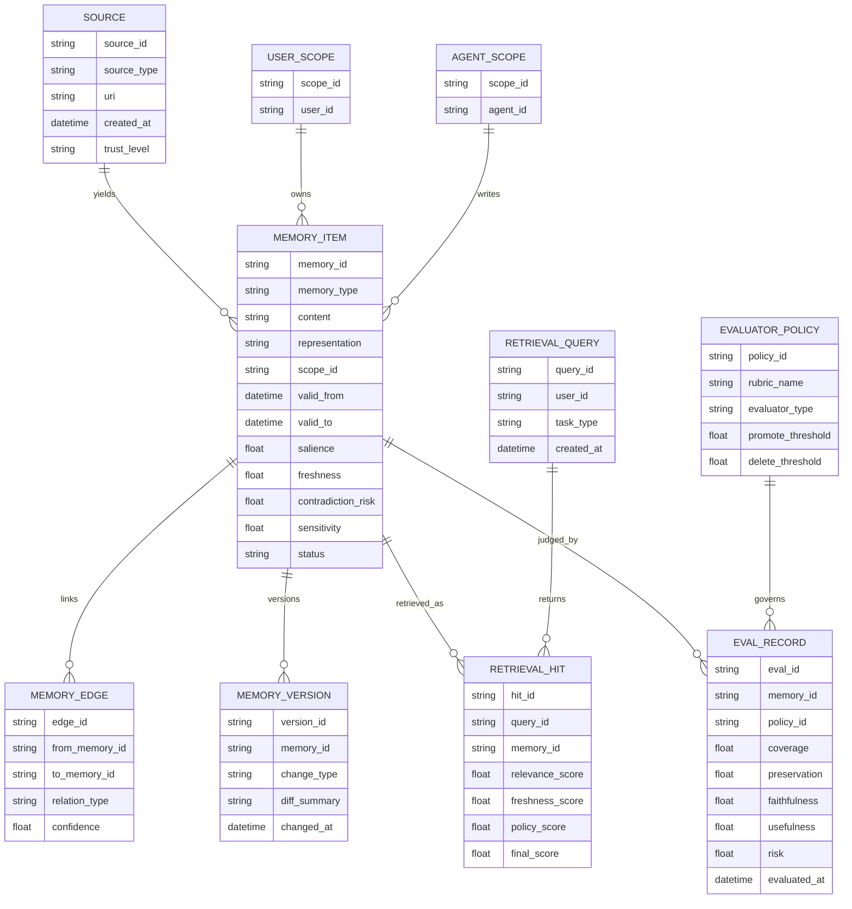
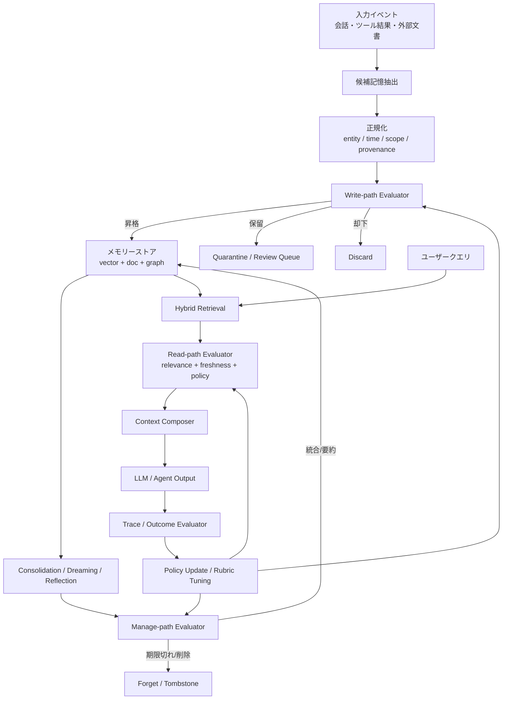

# 長期記憶とエバリュエーターの包括的ディープリサーチ

## エグゼクティブサマリー

長期記憶は、いまや単なる「会話履歴の保存」ではなく、エージェントの性能・継続性・個別最適化・安全性を左右する**制御面そのもの**になっています。最新サーベイでは、エージェント記憶は **write–manage–read** の循環として整理され、表現はベクトル、シンボリック、グラフ、JSON ドキュメント、要約文書、あるいはそれらのハイブリッドへ急速に多様化しています。評価も、単発の QA 精度から、複数セッション・知識更新・忘却・ツール実行まで含むベンチマークへ移行しています。LongMemEval、LoCoMo、MemBench、Memora、Mem2ActBench、EverMemBench などは、その転換点を示す代表例です。citeturn23view0turn28view0turn28view1turn28view2turn29view0turn28view6turn28view4

本調査で最も重要な結論は、**長期記憶の品質は、ストレージ単体では決まらない**という点です。必要なのは、何を保存し、何を昇格させ、何を却下し、何を忘れ、どのように再検索し、どの記憶を“今この場で使ってよいか”を判断する仕組みです。その中心にあるのが、本レポートで扱う**エバリュエーター**です。これは学術・実務で用語が統一されておらず、grader、judge、verifier、critic、reward model、policy gate などに分散していますが、共通する役割は「出力だけでなく、記憶更新そのものを査定すること」です。Anthropic は eval を「入力を与え、grading logic で成功を測るテスト」と定義し、OpenAI は graders / trace grading を用いてエージェントのワークフロー全体を評価する実装を提供しています。最近の TrustMem は、記憶遷移ごとに verifier を置き、coverage・preservation・faithfulness を観測して報酬化することで、記憶の永続汚染を防ごうとしています。citeturn23view8turn26view1turn26view2turn26view3turn23view9

ハーネス、ハーネスエンジニアリング、メタハーネス、そしてループエンジニアリングの文脈でも、長期記憶は補助機能ではありません。Anthropic はハーネスを、モデルがツールや環境とどう相互作用するかを決める実装面として扱い、長時間実行では各セッションが前回を「忘れる」ため、ディスク上の進捗ファイルや構造化アーティファクトが必要だと述べています。AHE や Meta-Harness は、ハーネス自体を最適化対象にし、AHE のアブレーションでは性能向上が system prompt よりも **tools / middleware / long-term memory** に強く依存したと報告しています。Addy Osmani の loop engineering は、こうしたハーネスの一段上に「仕事を見つけ、割り当て、検証し、状態を書き残し、次を決める」ループを置く考え方であり、そこでも記憶は中核部品として位置づけられています。citeturn25view2turn25view3turn24view0turn23view3turn25view4

実装面では、Mem0 は conversation / session / user / organizational memory の多層化、ネイティブ graph memory、多信号検索を前面に出し、LangGraph は namespace と key を持つ JSON ストアを基盤に、semantic / episodic / procedural memory を扱う設計を明示しています。OpenAI の ChatGPT / Codex は、background consolidation や local memory files など、「会話直後にすべて確定書き込みしない」設計へ進んでおり、OpenAI は ChatGPT memory に dreaming を導入して、過去チャットから背景的に記憶を合成・更新する方式を採用しました。つまり近最新の潮流は、**ベクトル検索だけではなく、要約・構造化・関係抽出・時間管理・背景更新・明示的な削除制御を組み合わせる方向**です。citeturn23view5turn23view6turn23view7turn22search0turn22search14turn23view4turn26view0turn26view5

したがって、今後の長期記憶システムの設計原則は明確です。**「すべてを保存する」のではなく、「保存候補を生成し、エバリュエーターが昇格・更新・削除・保留を判断し、検索時にも再評価をかける」二重審査型アーキテクチャ**が必要です。実務では、意味記憶、エピソード記憶、手続き記憶、イベント記憶、抽象概念記憶を明示的に分け、さらに freshness、contradiction、provenance、sensitivity、scope を第一級のメタデータにするべきです。これにより、ユーザーが挙げた「普遍知識」「雑学」「意思決定のプロセス」「抽象概念」「イベントごとの記憶」を、それぞれ異なる更新則・検索則・忘却則で扱えるようになります。citeturn30search3turn22search0turn23view0turn29view0turn35view1

## 調査範囲と全体像

本レポートは、一次情報を優先して、学術論文、公式ドキュメント、企業ブログ、技術解説、補助的に YouTube / 日本語技術記事を横断しました。中心となる学術基盤は、RAG、Generative Agents、CoALA、MemoryBank、LongMemEval、LoCoMo、MemBench、Memora、Mem2ActBench、TrustMem、GraphRAG 系研究、そして 2026 年の記憶サーベイと judge/evaluator サーベイ群です。企業・実装ソースは Anthropic、OpenAI、LangChain / LangGraph、Mem0、Microsoft GraphRAG、Obsidian 公式を主軸にしました。日本語の補助線として IBM Japan、Zenn、Qiita の記事も含めています。citeturn7search0turn7search1turn30search3turn30search10turn28view0turn28view1turn28view2turn29view0turn23view9turn12search2turn35view1turn35view0turn35view2

この分野の語彙はまだ固まっていません。**長期記憶**は比較的定着していますが、**エバリュエーター**は標準化語ではなく、OpenAI では grader、Anthropic では grading logic / verifier、研究では LLM-as-a-Judge や Agent-as-a-Judge、critic、reward model などに分散しています。**ハーネス**も 2025–2026 年に急速に理論化された用語で、agent harness / runtime / controller / substrate / policy layer が近縁です。さらに **macro-harness / micro-harness** は実務家や最新論文周辺で使われる便宜的語彙であり、学術の安定した共通規格ではありません。このため本レポートでは、標準化済み概念と新興概念を明確に分けて扱います。citeturn26view3turn23view8turn31search6turn19search3turn19search4turn20search5turn25view4

全体を俯瞰すると、長期記憶研究は大きく三段階で進化しています。第一段階は、RAG のように**外部ストアを参照する非パラメトリック記憶**です。第二段階は、Generative Agents、MemoryBank、LangGraph などに見られる、**記憶の抽出・要約・再利用・反省**を持つ会話／エージェント記憶です。第三段階が現在進行形で、GraphRAG、TrustMem、Memora、AHE、Meta-Harness などに見られる、**記憶管理・評価・忘却・ガバナンスを含む制御系**への移行です。ここでは「検索できるか」よりも、「どの記憶を、いつ、どの根拠で採用／棄却するか」が主要課題になっています。citeturn7search0turn7search1turn30search10turn23view0turn12search2turn23view9turn24view0turn23view3

## 長期記憶の定義と技術基盤

長期記憶の最も実務的な定義は、**単一スレッドや単一コンテキスト窓を超えて、後続セッションで再利用可能な外部状態**です。LangGraph は long-term memory を、スレッドを越えて保存され任意時点で再利用できる JSON ストアとして定義し、Anthropic は長時間実行エージェントの核心課題を「各セッションが前のセッションを覚えていないこと」と説明しています。OpenAI も ChatGPT memory を、過去チャット・ファイル・接続アプリから「自動的に有用なコンテキストを記憶する」仕組みとして位置づけています。つまり現在の実務定義は、単なる“保存”ではなく、**継続運用のための再生可能な状態管理**です。citeturn23view7turn25view0turn26view0

記憶の分類としては、CoALA と LangChain 系が最も実務へ落とし込みやすい枠組みを与えています。そこでは、**semantic memory** が事実・好み・一般知識、**episodic memory** が過去の経験・行動・結果、**procedural memory** が振る舞い方・手順・スキル・方針を指します。Generative Agents はこれに近い形で、経験を自然言語として蓄積し、そこから reflection を生成して計画に再利用しました。MemoryBank は時間経過と重要度を使った忘却・強化を導入し、ユーザー理解や人格推定まで含めた長期相互作用を狙いました。citeturn30search3turn22search0turn22search8turn7search1turn30search10

ご提示の記憶対象を、この標準分類へマッピングすると、実務上は次のように整理するのが合理的です。**普遍的知識**と**雑学**は semantic memory のうち、前者は比較的安定した reference knowledge、後者は低優先度の auxiliary knowledge として扱うべきです。**意思決定プロセス**は episodic でもあり procedural でもあり、最終結論ではなく「どう判断したか」を再利用可能な decision trace として残す価値があります。**抽象概念**は単純なベクトル埋め込みより、概念ノードと関係を持つ symbolic / graph 表現の方が扱いやすいことが多いです。**イベントごとの記憶**は時間・参加者・因果・更新履歴を伴うため、純粋な要約文より event graph / temporal index 向きです。これは CoALA・GraphRAG・Mem0 graph memory・近年の temporal memory 研究と整合的です。citeturn30search3turn12search2turn23view6turn6search16turn35view1

表現形式は、大きく **ベクトル / シンボリック / ハイブリッド** に分かれます。ベクトル表現は意味類似検索に強く、Pinecone、Qdrant、Milvus などが dense / sparse / hybrid 検索や metadata filter を提供しています。しかし、複数記憶の関係や時間変化、矛盾解消は苦手です。シンボリック表現は JSON ドキュメント、ルール、テーブル、知識グラフ、イベントグラフなどで、更新や監査に強い一方、柔らかい意味類似には追加実装が要ります。ハイブリッド表現は、GraphRAG や Mem0 graph memory のように、意味検索・キーワード検索・エンティティ接続・再ランキングを複合し、関係性と曖昧一致を同時に扱います。最新の実装と調査は、**ハイブリッドが実務の主流**になりつつあることを示しています。citeturn11search0turn11search2turn11search3turn11search13turn12search2turn23view6turn33view0turn23view0

更新・忘却は、この分野の決定的な難所です。OpenAI は ChatGPT memory の旧方式が「明示的に書かれた saved memories に依存し、時間とともに stale になりやすかった」と述べ、dreaming により背景的に記憶を再合成する設計へ進みました。Codex も記憶生成を thread 終了直後に確定せず、アイドル時間やレート制限を見て background consolidation を行います。MemoryBank は忘却曲線に基づく強化・減衰を導入し、Memora は obsolete / invalidated memory の再利用を罰する FAMA を提案しました。ここからわかるのは、**良い長期記憶は append-only ではない**ということです。更新・再統合・削除・保留が不可欠です。citeturn23view4turn26view5turn30search10turn29view0

検索・リトリーバルは、現在では「埋め込み近傍探索」だけを指しません。LongMemEval は memory design を indexing / retrieval / reading の三段に分解し、Mem0 は multi-signal retrieval と entity matching を採用し、GraphRAG は knowledge graph、community hierarchy、summary を用いた構造化検索を行います。実務では、query reformulation、time-aware expansion、entity expansion、scope filtering、reranking を組み合わせるのが普通になっています。日本語の GraphRAG 解説でも、グラフ検索・全文検索・ベクトル検索の結果を RRF / RSF で再スコアリングする実装が紹介されており、これは実務感覚と一致します。citeturn28view0turn33view0turn12search2turn35view2

整合性と一貫性は、今後の最大テーマです。Memora は更新済みの記憶より古い記憶を再利用してしまう問題を定量化し、TrustMem は各記憶遷移に対し coverage・preservation・faithfulness を判定する verifier を入れています。Anthropic の multi-agent research system でも、評価基準には factual accuracy、citation accuracy、completeness、source quality、tool efficiency が含まれました。つまり、記憶の一貫性は「内部表現が矛盾していないか」だけでなく、**外部根拠、時系列、使用コスト、ソース品質まで含む複合概念**です。citeturn29view0turn23view9turn27view2

## ハーネスとループとエバリュエーター

ハーネスの最新定義は、AHE が比較的明快です。そこでは harness engineering は、**tools、interfaces、memory、execution constraints、feedback loops を含む、モデルの周囲のシステム設計**だとされます。Anthropic も、long-running agent の性能が system prompt 単体ではなく、initializer、progress files、compaction、context reset、structured handoff といった外部構造に強く依存することを示しました。要するにハーネスは、モデルの“外側”でありながら、性能の大部分を決める実装層です。citeturn19search3turn25view0turn25view3

長期記憶はこのハーネスの主要部品です。Anthropic は、各セッションが前回を覚えていないため、`claude-progress.txt` のようなアーティファクトが不可欠だとしています。AHE はアブレーションで、向上が system prompt よりも tools / middleware / long-term memory に由来すると報告しました。Loop engineering の実務論でも、「モデルは忘れるが、repo は忘れない」という形で、外部記憶がループの継続性を担うと説明されています。したがって、長期記憶はハーネスの一機能ではなく、**ループ持続性の基盤**です。citeturn25view0turn24view0turn25view4

**Meta-Harness** は、そのハーネス自体を最適化対象にします。Meta-Harness は、過去候補のコード・スコア・実行トレースをファイルシステムに保持し、提案エージェントがそれらを選択的に診断しながら、ハーネスを end-to-end に探索します。AHE も同じく closed loop によって harness evolution を進め、各編集に「次ラウンドでどう効くか」の予測を結びつけています。ここで重要なのは、**ハーネス最適化そのものが、外部化された長期記憶を必要とする**ことです。Meta-Harness / AHE のメモリは、単なるユーザープロファイルではなく、エージェント運用知識そのものです。citeturn23view3turn24view0

**Macro-harness / micro-harness** は、現時点では標準学術語ではなく、新しい実務語彙です。論文・記事では、macro-harness を複数エージェントやタイマー、スケジューラ、外部システム接続、状態遷移を束ねる上位オーケストレーションとして、micro-harness を個々のエージェントがその中で動く局所ループとして使う例が見られます。Addy Osmani の loop engineering は「loop engineering sits one floor above the harness」と述べ、別の実務記事は「the net is the macro-harness; the agent is the micro-harness」と表現しています。このため、実務上は **micro-harness = 単一エージェントの内側の制御ループ**、**macro-harness = 複数ループを束ねる上位制御面**と理解するのが最も整合的です。citeturn20search5turn25view4turn20search17

ここでエバリュエーターを定義すると、最も厳密には **「write / manage / read のいずれかの局面で、候補行動や候補記憶を採否判定する査定器」**です。Anthropic の用語では grading logic や verifier、OpenAI の用語では grader や trace grading、研究では LLM-as-a-Judge / Agent-as-a-Judge / verifier / critic / reward model が該当します。単なる出力採点器に留まらず、長期記憶システムでは以下の三階層で動きます。  
第一に、**write-path evaluator**。保存候補が重要か、十分に根拠づけられているか、既存記憶と矛盾しないかを判定します。  
第二に、**manage-path evaluator**。昇格・統合・要約・忘却・削除・有効期限切れの判断を行います。  
第三に、**read-path evaluator**。検索結果の relevance だけでなく freshness、authority、policy fitness を見ます。citeturn23view8turn26view2turn26view3turn31search6turn23view9

設計パターンとしては、少なくとも五類型があります。**ルール型**は exact match、schema validation、policy check のような決定論的査定で、最も安価で再現性が高いです。**LLM judge 型**はルーブリックに基づく柔軟評価で、Anthropic と OpenAI の両方が実務で使っています。**agent-as-a-judge 型**はツール・メモリ・計画を持つ evaluator で、より複雑な検証ができますが遅く高価です。**meta-evaluator 型**は evaluator 自体の信頼性を監視し、judge drift や bias を測ります。**human-in-the-loop 型**は高リスク更新や削除の最終承認を持つ方式で、現実の運用では依然として不可欠です。Anthropic も human evaluation が自動評価の取りこぼしを埋めると明言しています。citeturn27view0turn27view2turn31search6turn23view8turn26view4

最も重要なのは、エバリュエーターが**長期記憶の更新・保持・削除を直接左右する**ことです。TrustMem の verifier は、記憶遷移を coverage・preservation・faithfulness の三軸で採点し、transition-level reward として学習に使われます。この発想は、実運用にもそのまま移せます。たとえば、ある候補記憶が「新規性はあるが根拠が薄い」と判定されたら、即保存ではなく quarantine に送る。「既存記憶と競合するが更新日時が新しい」なら supersede 候補にする。「極端に機微情報である」なら retrieval 禁止か要 human approval にする。つまり evaluator は記憶を評価するだけでなく、**記憶の生態系を制御する政策エンジン**です。citeturn23view9turn26view2turn17search22

## 実装パターンとツール比較

まず強調すべきは、**RAG と長期記憶は重なるが同一ではない**という点です。RAG の古典定義は、パラメトリック記憶に対し、外部の非パラメトリック記憶を推論時に参照する仕組みでした。これは静的知識ベースやドキュメント QA に非常に強い一方で、「記憶の更新」「忘却」「矛盾解消」「個人化された状態変化」までは本質的には扱いません。長期記憶システムは、RAG の read-path に加え、write-path と manage-path を持つ必要があります。citeturn7search0turn23view0turn22search14

Mem0 は、現在の専用 memory service の代表例です。公式 docs では conversation / session / user / organization の階層を持ち、長期記憶として factual / episodic / semantic を扱うと説明しています。さらに graph memory により、人物・場所・組織・概念をノード化し、共有エンティティで記憶を結びます。研究面では 2025 年論文で graph-based memory を含む構成が LoCoMo で既存メモリ系より良く、full-context より低コストだと報告し、2026 年研究ページでは multi-signal retrieval と single-pass extraction を打ち出しています。ただし、ベンチマーク値の一部は自己報告であり、第三者再現の蓄積は今後必要です。citeturn23view5turn23view6turn33view1turn33view0

Obsidian は、専用 memory service ではなく、**人間中心の知識 OS** として位置づけるべきです。公式には backlinks、local graph、vault maintenance、orphan notes の整理など、再発見と人手メンテナンスを支援する機能が中心です。最近は Agent Skills や MCP 接続、Obsidian vault を長期記憶に使うガイドが増えていますが、これは「Obsidian が自律的に記憶管理する」のではなく、「人間が書いた構造化知識をエージェントが読む」方式です。したがって Obsidian は、semantic / procedural memory の母艦として優秀ですが、**自動昇格・自動忘却・整合性修復・背景 consolidation は別途実装が必要**です。citeturn10search0turn10search3turn35view0turn15search10

LangGraph / LangMem は、フレームワークとして最も設計思想が明瞭です。長期記憶を namespace + key を持つ JSON documents として扱い、semantic / episodic / procedural の区別を明示し、store によって short-term と long-term を支えます。これはベンダーロックインが比較的少なく、Postgres など既存基盤ともなじみやすい半面、Mem0 のような完成済み memory product と比べると、retrieval policy や evaluator policy は自前設計の割合が増えます。研究・PoC・中規模プロダクトには非常に良い選択肢です。citeturn23view7turn22search0turn22search1turn22search7

GraphRAG は、抽象概念・関係・多段推論を重視する場合に有力です。Microsoft の公式 docs は、生テキストから knowledge graph を抽出し、community hierarchy と summaries を作る階層的手法として説明しています。日本語の IBM / Qiita 解説も、GraphRAG がベクトル検索だけでは取りづらい関係構造や複雑データモデルを扱えるとまとめています。ただし、構築コスト、更新コスト、スキーマ品質、抽出誤差の影響は大きく、すべてを Graph 化すれば万能というわけではありません。実務では、GraphRAG は **concept memory / entity memory / decision graph** に向き、全文書コーパス全体の代替ではない、という理解が妥当です。citeturn12search2turn12search0turn12search1turn35view2turn12search16

OpenAI の ChatGPT / Codex memory は、コンシューマー向け・開発者向け双方で、**background consolidation** に振れています。ChatGPT memory は過去チャット、ファイル、接続アプリから文脈を合成する「memory summary」を持ち、dreaming によりバックグラウンドで記憶状態を合成します。Codex は local memory file を生成し、秘密情報の redact や external context 利用時の memory generation 抑制など、安全寄りのガードを備えています。これは「永続メモリは便利だが攻撃面でもある」という設計思想の反映です。citeturn26view0turn23view4turn26view5

### ツールと実装方式の比較

| 方式 / ツール | 中核表現 | 強み | 弱み | 適用ケース | コスト / スケール | プライバシー / セキュリティ |
|---|---|---|---|---|---|---|
| **Mem0** | 多層記憶 + graph memory + multi-signal retrieval | 専用 memory layer として実装が速い。user / session / org まで素直に扱える。graph memory で entity-centric recall がしやすい。citeturn23view5turn23view6turn33view0 | 一部性能主張は自己報告。高度運用では policy/evaluator 設計が別途必要。citeturn33view1turn33view0 | パーソナライズ assistant、support bot、multi-agent shared memory | managed / self-hosted の両方が可能。高スケール向き。citeturn32search10turn32search3 | 継続記憶ゆえ consent / deletion / poisoning 対策が必須。citeturn23view5turn17search22turn34search11 |
| **Obsidian + MCP / Skills** | Markdown 文書、リンク、frontmatter、graph | 人間可読・編集容易。手続き知識や概念知識の母艦として優秀。citeturn10search0turn10search3turn15search10 | 自動昇格・忘却・矛盾解消は弱い。多くが人手メンテ前提。citeturn10search0turn35view0 | 個人知識管理、研究ノート、AGENTS.md / SKILL.md 系の手続き記憶 | ローカル中心で安価。大規模自動運用は別基盤が必要。citeturn10search12turn35view0 | ローカル運用しやすく安全だが、MCP 接続時はアクセス境界管理が必要。citeturn15search10turn17search22 |
| **LangGraph / LangMem** | JSON docs + namespace/key + semantic search | memory types と write/read 戦略が明快。アプリ固有設計に強い。citeturn23view7turn22search0turn22search1 | 完成品ではなく toolkit。評価器・ライフサイクル設計は自前負担がある。citeturn23view7turn22search14 | 研究開発、独自 agent platform、業務システム統合 | Postgres 等でスケールしやすい。中〜大規模向き。citeturn23view7 | ストア分離や namespace で統制しやすい。citeturn23view7turn18search1 |
| **単純な Vector DB + RAG** | dense / sparse vector + metadata | 実装が最も広く普及。静的知識取得に強い。citeturn7search0turn11search15 | 更新・忘却・時系列・関係推論・個別状態の扱いが弱い。citeturn23view0turn29view0 | FAQ、社内文書検索、静的 KB | 安価に始めやすいが、運用が増えると補助レイヤーが必要。citeturn11search0turn11search3 | poisoning や stale retrieval に注意。citeturn34search2turn34search11 |
| **GraphRAG / KG memory** | ノード・エッジ・community hierarchy・summaries | 抽象概念、関係性、多段推論、cross-document coherence に強い。citeturn12search2turn12search1turn35view2 | 抽出品質と更新複雑性が高い。全文検索だけで済む用途には過剰。citeturn12search0turn12search13 | 概念ネットワーク、研究支援、因果・組織・イベント記憶 | 構築コスト高。大規模では索引・更新パイプラインが重い。citeturn12search18turn12search4 | graph poisoning という新攻撃面がある。citeturn34search4turn34search8 |
| **OpenAI ChatGPT / Codex memory** | summary + background consolidation + local memory files | 使い勝手が高く、background synthesis が進んでいる。citeturn26view0turn23view4turn26view5 | 内部 policy と可搬性は限定的。アプリ固有 memory system としては制御余地が少ない。citeturn26view0turn26view5 | 個人利用、codex workflow、軽量開発体験 | 高実装効率。詳細な infra 制御は難しい。citeturn26view5turn26view0 | summary 編集や削除は可能だが、全ソース削除が必要な場合がある。citeturn26view0 |

## 参照アーキテクチャ

以下は、**エバリュエーターを中心に組み込んだ長期記憶システム**の推奨参照アーキテクチャです。重要なのは、write / retrieve の両方に evaluator を置くこと、そして memory item に provenance / freshness / contradiction / sensitivity を持たせることです。これは TrustMem の transition verifier、OpenAI の trace grading、Anthropic の grading logic、Memora の stale memory 問題、OWASP の memory poisoning 警告を踏まえた設計です。citeturn23view9turn26view2turn23view8turn29view0turn17search16turn17search22

このアーキテクチャで肝になる API / インターフェースは、少なくとも次の五系統です。  
**`POST /memory/proposals`** は候補記憶の書き込み提案で、本文に `content`, `memory_type`, `scope`, `provenance`, `valid_from`, `confidence` を持ちます。  
**`POST /memory/evaluate-write`** は write-path evaluator を呼び、`promote / hold / reject / merge / supersede` のいずれかを返します。  
**`POST /memory/retrieve`** は query, task_type, scope, time_range を受け、raw hits ではなく evaluator 後の ranked hits を返します。  
**`POST /memory/consolidate`** は background reflecting / dreaming / summarization を走らせます。  
**`POST /memory/forget`** は削除要求または retention policy に基づく tombstone 化を行います。これらは trace id を通じて observability と audit trail に接続されるべきです。citeturn26view2turn26view1turn27view2turn18search1

この設計で特に推奨したいのは、記憶を最初から一枚岩にしないことです。実務上は、  
**semantic memory** を比較的安定した facts / profiles / concept cards、  
**episodic memory** を event logs / decision traces / solved examples、  
**procedural memory** を policies / skills / AGENTS.md / tool rules、  
**temporal memory** を state transitions / superseded facts、  
**sensitive memory** をアクセス制御された enclave  
として分ける方が健全です。LangChain、Mem0、ChatGPT / Codex いずれも、実質的にはこの方向へ向かっています。citeturn22search0turn23view5turn26view0turn26view5

## 評価方法とベンチマーク

長期記憶システムの評価は、**最終回答精度だけでは不十分**です。LongMemEval は information extraction、multi-session reasoning、temporal reasoning、knowledge updates、abstention の五能力を分け、MemBench は factual と reflective memory、participation と observation、effectiveness / efficiency / capacity を含む多面的評価を提案しました。Mem2ActBench は、受動的 recall ではなく、過去記憶を使って tool arguments を補完し行動できるかを測ります。評価は、用途別・相別・更新別に分解すべきです。citeturn28view0turn28view2turn28view6

### 推奨評価指標

| 指標群 | 何を測るか | 推奨指標例 | 留意点 |
|---|---|---|---|
| 検索品質 | 正しい記憶が上位に来るか | Recall@k, nDCG, MRR, entity-hit rate | ベクトル類似だけでなく freshness / scope 制約込みで測る。citeturn28view0turn11search15 |
| 回答品質 | 記憶を使った最終出力の質 | task accuracy, factuality, citation accuracy, completeness | LLM judge と決定論的採点を併用。citeturn27view2turn27view0turn26view1 |
| 更新品質 | 何を保存・更新・削除したか | write precision, write recall, false promotion rate, merge correctness | TrustMem 的に local transition を見る。citeturn23view9 |
| 忘却品質 | 古い記憶を正しく捨てられるか | FAMA, stale reuse rate, contradiction persistence rate | 古いが重要な記憶を消しすぎない balance が必要。citeturn29view0 |
| 実行適用力 | 記憶を行動に使えるか | tool grounding accuracy, parameter completion accuracy | Mem2ActBench 型が有効。citeturn28view6 |
| 効率 | 実運用可能か | p95 latency, token cost, memory growth rate, storage overhead | Mem0 論文・研究はここを重視。citeturn33view1turn33view0 |
| evaluator 品質 | judge 自体が安定か | human agreement, inter-run consistency, bias score, false reject / false accept | evaluator 自身を再評価する meta-eval が必要。citeturn23view8turn31search6 |

実験設計は、少なくとも四層で組むべきです。  
**単位評価**では individual memory update を査定します。TrustMem の coverage / preservation / faithfulness は、この層に適しています。  
**セッション評価**では 1 セッション内の抽出・再利用・整合性を見ます。  
**複数セッション評価**では更新競合、時間経過、忘却を見ます。LongMemEval や Memora が代表です。  
**運用ループ評価**では scheduler、subagents、handoff、tool-use、human review を含む全体性能を trace 単位で評価します。OpenAI の trace grading と Anthropic の agent eval はこの層を対象にしています。citeturn23view9turn28view0turn29view0turn26view2turn23view8

### 主要ベンチマークの整理

| ベンチマーク / 論文 | 年 | 主対象 | 主な評価軸 | 本テーマへの示唆 |
|---|---|---|---|---|
| RAG | 2020 | 非パラメトリック外部記憶 | knowledge-intensive QA | 外部記憶の起点。だが更新・忘却は弱い。citeturn7search0 |
| Generative Agents | 2023 | 体験記録・反省・計画 | believable behavior | reflection と episodic memory の古典。citeturn7search1 |
| CoALA | 2023 | memory taxonomy | semantic / episodic / procedural | 実務分類の基礎。citeturn30search3 |
| MemoryBank | 2024 | 長期会話記憶 | recall・forgetting | 忘却曲線を導入した先駆。citeturn30search10 |
| LoCoMo | 2024 | very long-term dialogues | QA・要約・対話生成 | 長会話・因果・時間変化を強く要求。citeturn28view1 |
| LongMemEval | 2024/2025 | interactive chat memory | extraction・multi-session・temporal・updates・abstention | 更新と検索設計を明示的に分解。citeturn28view0 |
| MemBench | 2025 | agent memory capability | effectiveness・efficiency・capacity | reflective memory と observation scenario を導入。citeturn28view2 |
| Memora | 2026 | personalized long-term memory | remembering・reasoning・recommending・FAMA | stale memory を罰する評価の必要性を示す。citeturn29view0 |
| Mem2ActBench | 2026 | tool-using agent memory | memory-driven tool grounding | 「覚えている」ではなく「使える」を測る。citeturn28view6 |
| EverMemBench | 2026 | million-token multi-party memory | recall・memory awareness・profile understanding | 現実的複雑性の上昇。citeturn28view4 |
| TrustMem | 2026 | trustworthy consolidation | transition verifier | evaluator を write-path に組み込む代表例。citeturn23view9 |
| Agentic Harness Engineering | 2026 | harness evolution | task success + observability | memory がハーネス性能の中核であることを示す。citeturn24view0 |

実務でベンチマークを作るなら、公開データだけでは足りません。Anthropic が述べるように、リアルユースの少数サンプルから早期に eval を回し、OpenAI の trace grading のように **workflow trace** を評価対象へ含めるべきです。とくに evaluator を含む長期記憶では、「どの記憶が採用されたか」「どの削除が行われたか」「どの stale memory を防げたか」をログとして回収しない限り、改善が止まります。citeturn27view2turn26view2

## 倫理・法務・セキュリティとロードマップ

長期記憶は、機能であると同時に攻撃面でもあります。OWASP の Agentic Security Initiative は Memory & Context Poisoning を主要リスクとして挙げ、AI Agent Security Cheat Sheet でも memory poisoning を独立の脅威として扱っています。研究面でも MINJA、AgentPoison、MemoryGraft、MemPoison、graph memory poisoning、systematic memory poisoning study などが相次いでおり、永続記憶があることで「一回の注入が将来の複数セッションへ持続的に効く」ことが問題化しています。citeturn17search16turn17search22turn34search9turn34search2turn34search7turn34search0turn34search4turn34search11

法務・プライバシーでは、GDPR の削除権と、NIST AI RMF / ISO 42001 のガバナンス原則が重要です。OpenAI の Memory FAQ でも、ある情報を完全に除去したい場合は summary だけでなく、関連チャット、ファイル、接続アプリなど**出所すべてから削除する必要がある**と説明されています。これは長期記憶システム一般でも同様で、memory item 単体削除ではなく、**source lineage に基づく完全消去**が設計要件になります。citeturn18search3turn18search1turn18search2turn26view0

設計原則としては、以下が高優先です。  
機微情報には sensitivity label を付し、通常 retrieval と高権限 retrieval を分けること。  
memory write を無制限にせず、write-path evaluator と quarantine を挟むこと。  
stale / superseded / disputed / revoked を状態として持つこと。  
memory summary あるいは user-facing memory ledger を提供し、本人が修正できること。  
human approval を、高リスク削除・高影響更新・共有 organizational memory の昇格に要求すること。  
この方向は OpenAI の memory controls、Codex の redact / external-context guard、Anthropic の human evaluation、OWASP のガイダンスと整合的です。citeturn26view0turn26view5turn27view2turn17search22

ロードマップは、短期・中期・長期で分けるのが現実的です。  
**短期**では、ベクトル DB に provenance, time, scope, freshness を付け、write evaluator を追加するだけでも大きく改善します。  
**中期**では、semantic / episodic / procedural を分離し、GraphRAG か event graph を部分導入し、FAMA 的な stale-memory 指標を運用へ入れる段階です。  
**長期**では、dreaming / reconsolidation / learned forgetting / agent-native memory infrastructure を持ち、evaluator も static judge ではなく meta-evaluator 付きの policy substrate に進化していくはずです。Mem0 の “agent-native memory”、OpenAI の dreaming、TrustMem の transition verifier、最新 survey の open challenges は、ほぼ同じ方向を指しています。citeturn33view0turn23view4turn23view9turn23view0

最後に、現時点で最も妥当な設計判断を一文でまとめるなら、こうなります。  
**長期記憶は「保存の問題」ではなく、「評価された更新と評価された再利用の問題」である。したがって、未来の memory system の中心部品は vector DB でも note vault でもなく、evaluator を内包した memory control plane である。** これは長期記憶研究、ハーネス研究、ループ工学、そして安全性研究が、2026 年時点でほぼ同じ方向へ収束しつつあることを示しています。citeturn23view0turn24view0turn23view3turn25view4turn34search8

### 参考となる主要ソース

以下は、特に参照価値の高い主要ソースです。一次情報と公式情報を優先し、その後に重要な survey / 補助解説を置いています。  
**学術・一次論文**: RAG, Generative Agents, CoALA, MemoryBank, LongMemEval, LoCoMo, MemBench, Memora, Mem2ActBench, TrustMem, A Survey on LLM-as-a-Judge, Agent-as-a-Judge, Memory for Autonomous LLM Agents, GraphRAG survey。citeturn7search0turn7search1turn30search3turn30search10turn28view0turn28view1turn28view2turn29view0turn28view6turn23view9turn14search20turn31search6turn23view0turn12search1  
**主要企業・公式 docs**: Anthropic の eval / harness / context engineering / multi-agent research、OpenAI の memory FAQ / dreaming / evals / agent evals / graders / Codex memories、LangChain / LangGraph memory docs、Microsoft GraphRAG docs、Mem0 docs / research。citeturn23view8turn25view0turn25view3turn25view1turn27view2turn26view0turn23view4turn26view1turn26view2turn26view3turn26view5turn23view7turn22search0turn12search2turn23view5turn23view6turn33view0  
**日本語ソース**: IBM Japan「AIエージェントのメモリーとは」、IBM Japan「GraphRAGとは」、Zenn の LangGraph 長期記憶実装記事、Qiita の GraphRAG 解説。citeturn35view1turn12search16turn35view0turn35view2  
**補助的な practitioner / YouTube ソース**: Addy Osmani「Loop Engineering」、YouTube の “Memory in AI agents”、Obsidian memory 実装ガイド。これらは一次論文の代替ではなく、実務用語や設計感覚の補助として読むのが適切です。citeturn25view4turn15search6turn15search10

### オープンな論点と限界

この分野では、2026 年の重要文献の相当数が arXiv preprint であり、査読前または採録直後のものが含まれます。また、Mem0 など一部の性能値は自己報告であり、独立再現の蓄積を要します。macro-harness / micro-harness / loop engineering は新興語彙で、厳密な標準定義はまだありません。したがって本レポートは、**高い確度で合意されつつある設計原則**と、**まだ不安定な新興概念**を区別してまとめています。citeturn24view0turn23view3turn25view4turn33view0