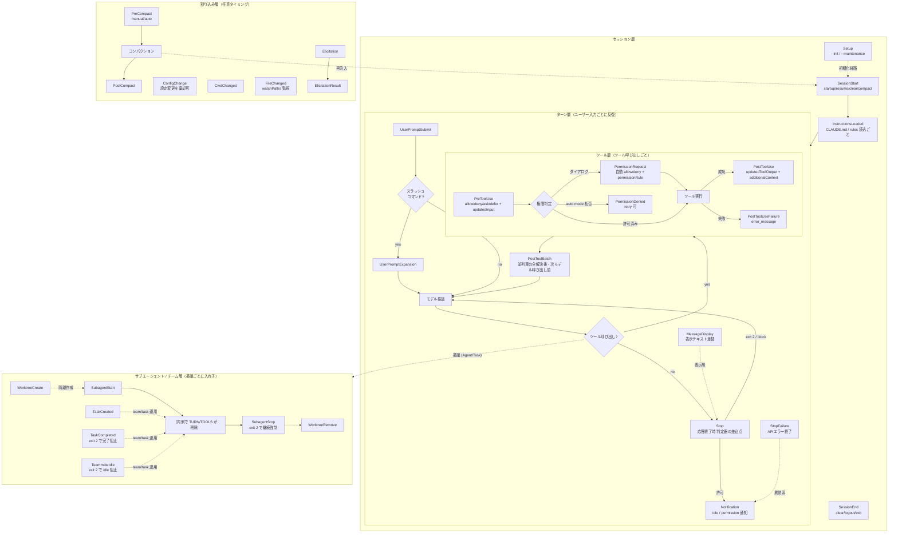

# Claude Code フック大全 ── ハーネスの割り込み点としての全フックイベント

> 調査時点: 2026-07-04。一次資料は code.claude.com/docs/en/hooks / hooks-guide（本文中で2回の独立フェッチにより照合）。コミュニティ事例は国内外の二次資料に基づき、各所に確信度を付す。筆者環境の実装フック（`~/.claude/scripts/hooks/` 配下・約30本）を「動いている実例」として併載する。

## エグゼクティブサマリ

本レポートの結論を先に言うと、**フックとは、非決定的なモデルの外側に固定配置された割り込み点（interposition points）の集合であり、プロンプト工学ではなく系（system）設計に属する**。プロンプトはモデルへの「お願い」だが、フックは実行系そのものに割り込んで振る舞いを**強制・観測・変換**する。先行研究（[01](./01-claude-harness-overview.md)）が「安全制御をプロンプト内に閉じ込めず、外側の承認・認可・ポリシーで支える」と述べた原則の、最も具体的な実装機構がフックである。

Claude Code のフックは現在、**約30種のイベント**に拡張されている（公式一覧表は31イベントを掲載。本調査で個別仕様まで確認できたのは30種）。初期によく知られた8種前後（PreToolUse / PostToolUse / Stop / SessionStart 等）から、並列ツール束の制御（PostToolBatch）、マルチエージェント協調の停止規則（SubagentStop / TeammateIdle / TaskCreated / TaskCompleted）、worktree・設定・ファイル監視（WorktreeCreate / ConfigChange / FileChanged）、MCP 対話（Elicitation / ElicitationResult）、表示層の変換（MessageDisplay）まで、**実行ライフサイクルのほぼ全遷移境界**に介入点が置かれた。日本語圏の解説記事の多く（「14イベント」「15フック」）は旧世代のスナップショットであり、現行仕様との差分に注意が要る。

機能面では、全フックは **制御ゲート（block）/ 文脈注入（additionalContext）/ 観測（ログ専用）/ 変換（updatedInput・updatedToolOutput）/ ループ制御（継続・停止）** の5軸に整理できる。そして本シリーズの中心命題「Stop hook は外側ループの一般化であり、`/goal` はその session-scoped な特化形」（[02](./02-loop-engineering-claude-code.md)/[03](./03-loop-engineering-deep-dive.md)）は、マルチエージェント時代には **PostToolBatch（ターン内ループの停止弁）・SubagentStop（委譲ループの停止弁）・TeammateIdle + TaskCompleted（協調ループの停止弁）へと同型に拡張**される。いずれも「証拠なき停止・完了を exit 2 で拒否する」という同一の停止規律の、制御スコープ違いの実装である。

コミュニティの実践（国内外30件超を確認）は PreToolUse の危険コマンドブロック・PostToolUse の自動フォーマット・Stop の完了検証と通知・SessionStart の文脈注入という「人気4イベント」に集中しているが、本質はレシピの物量ではない。**フックは evaluator（評価器）の設置点**であり、cheap-to-expensive カスケード（決定論チェック → Critic → 独立 Done 判定 → HITL）をどのフック境界に写像するかが、ハーネス設計の本丸である。同時に、**フックはユーザー権限で任意コードを実行する信頼境界**でもあり、制御力と攻撃面を同時に増やすことを常に勘定に入れる必要がある。

## 1. フックとは何か ── 系の割り込み点

ハーネスを「モデル呼び出しを再現可能・測定可能・統制可能・拡張可能にする外部構造」（[01](./01-claude-harness-overview.md)）と定義したとき、フックの位置づけは一意に定まる。フックとは、Claude Code の実行ライフサイクル（起動 → プロンプト受領 → ツール呼び出し → 応答終了 → サブエージェント → コンパクション → 終了）の各**遷移の境界**に固定配置された、確定的なコールバック点である。モデルが何を「考える」かとは独立に、系のどの瞬間に何が起きるかを外側から規定する。

制御理論の語彙で言えば、フックはプラント（モデル＝非決定的な被制御対象）を囲む**コントローラ**であり、各フックイベントはセンサ点（観測）とアクチュエータ点（介入）を兼ねる。MAPE-K（Monitor–Analyze–Plan–Execute over shared Knowledge）の枠では、共通入力（`session_id` / `transcript_path` / `cwd` / `permission_mode` 等）が Knowledge、観測系フックが Monitor、フック内スクリプトが Analyze + Plan、`exit 2` / `updatedInput` / `permissionDecision` 等の出力が Execute にあたる。フック機構全体が、非決定的なモデルという心臓の周りに巻きつけた**自己適応制御の神経系**である。

プロンプト（CLAUDE.md・rules）との決定的な違いは強制力の所在にある。「rule として実装したが行動変容ゼロだったため、フックへ昇格させた」という実例（後述 §7 の report-integrity-check）が象徴的だ。規約は読まれることを期待するが、フックは**発火する**。ループエンジニアリングの文脈では、この差が「AI が回る条件を設計する」ことと「AI に毎回お願いする」ことの差になる。

## 2. 全フックイベント一覧

2026-07 時点の公式リファレンスで確認した全イベント。**確信度: 確認済み**（イベント名・発火点・ブロック可否は2回の独立フェッチで照合。fact-check エージェントの1回は一覧の一部しか取得できなかったが、個別節見出しの実在まで再確認済み）。

| # | イベント | 発火点 | matcher | exit 2 でブロック | 主要な固有出力 | 機能軸 |
|---|---|---|---|:---:|---|---|
| 1 | **SessionStart** | セッション開始・再開 | `startup` / `resume` / `clear` / `compact` | ✗ | additionalContext / initialUserMessage / sessionTitle / watchPaths / reloadSkills | B 注入 |
| 2 | **Setup** | `--init-only`、`-p` の `--init` / `--maintenance` | `init` / `maintenance` | ✗ | additionalContext / watchPaths / reloadSkills | B 注入 |
| 3 | **UserPromptSubmit** | プロンプト送信直後・処理前 | なし | ✓（プロンプト阻止） | decision:block / additionalContext | A ゲート・B 注入 |
| 4 | **UserPromptExpansion** | スラッシュコマンド展開時 | コマンド名 | ✓（展開阻止） | decision:block / additionalContext | A ゲート |
| 5 | **PreToolUse** | ツール実行前 | ツール名（regex 可） | ✓（実行阻止） | permissionDecision(allow/deny/ask/defer) / updatedInput / additionalContext | A ゲート・D 変換 |
| 6 | **PermissionRequest** | 権限ダイアログ表示時 | ツール名 | ✓（deny） | decision.behavior(allow/deny) / updatedInput / permissionRule（永続化） | A ゲート・D 変換 |
| 7 | **PermissionDenied** | auto mode 分類器による拒否後 | ツール名 | ✗（拒否済み） | retry:true（再試行許可） | C 観測・D 変換 |
| 8 | **PostToolUse** | ツール成功後 | ツール名 | ✗（実行済み。decision:block で turn への差し戻しは可） | updatedToolOutput / additionalContext | B 注入・C 観測・D 変換 |
| 9 | **PostToolUseFailure** | ツール失敗後 | ツール名 | ✗（失敗済み） | additionalContext | B 注入・C 観測 |
| 10 | **PostToolBatch** | 並列ツール束の全解決後・次モデル呼び出し前 | なし | ✓（agentic loop 停止） | decision:block / additionalContext | A ゲート・E ループ |
| 11 | **Notification** | 通知送出時 | 通知種別（permission_prompt / idle_prompt 等） | ✗ | terminalSequence（デスクトップ通知等） | C 観測 |
| 12 | **MessageDisplay** | assistant テキスト表示時 | なし | ✗ | displayContent（表示のみ差替・transcript 不変） | D 変換 |
| 13 | **SubagentStart** | サブエージェント起動時 | agent 型 | ✗ | additionalContext | B 注入 |
| 14 | **SubagentStop** | サブエージェント終了時 | agent 型 | ✓（継続を強制） | decision:block / additionalContext | A ゲート・E ループ |
| 15 | **TaskCreated** | TaskCreate によるタスク生成時 | なし | ✓（作成ロールバック） | continue:false / stopReason | A ゲート・E ループ |
| 16 | **TaskCompleted** | タスク完了マーク時 | なし | ✓（完了阻止） | continue:false / stopReason | A ゲート・E ループ |
| 17 | **Stop** | Claude の応答終了時 | なし | ✓（停止を阻止し継続） | decision:block / reason / additionalContext | A ゲート・E ループ |
| 18 | **StopFailure** | API エラーによるターン終了時 | エラー種別（rate_limit / overloaded 等） | ✗（ログ専用） | — | C 観測 |
| 19 | **TeammateIdle** | agent team のチームメイトが idle 化する直前 | なし | ✓（idle 阻止・継続） | continue:false / stopReason | A ゲート・E ループ |
| 20 | **InstructionsLoaded** | CLAUDE.md / rules 読込時 | 読込理由（session_start / include / compact 等） | ✗（ログ専用） | — | C 観測 |
| 21 | **ConfigChange** | セッション中の設定ファイル変更時 | 設定源（user / project / local / policy / skills） | ✓（変更を棄却。policy 除く） | decision:block | A ゲート・C 観測 |
| 22 | **CwdChanged** | 作業ディレクトリ変更時 | なし | ✗ | —（CLAUDE_ENV_FILE 利用可） | C 観測 |
| 23 | **FileChanged** | 監視ファイルのディスク上変更時 | 監視ファイル名（SessionStart の watchPaths でも登録） | ✗ | —（change_type: created/modified/deleted） | C 観測 |
| 24 | **WorktreeCreate** | worktree 作成時（`--worktree` / isolation:worktree） | なし | 非0 exit で作成失敗 | worktreePath（既定 git 挙動を置換） | D 変換 |
| 25 | **WorktreeRemove** | worktree 削除時 | なし | ✗（cleanup 用途） | — | C 観測 |
| 26 | **PreCompact** | コンパクション直前 | `manual` / `auto` | ✓（コンパクション阻止） | decision:block / additionalContext | A ゲート・E ループ |
| 27 | **PostCompact** | コンパクション完了後 | なし | ✗ | — | C 観測 |
| 28 | **Elicitation** | MCP サーバがユーザー入力を要求した時 | MCP サーバ名 | ✓（deny） | action(accept/decline/cancel) / content | A ゲート・D 変換 |
| 29 | **ElicitationResult** | ユーザーの elicitation 応答後・サーバ返送前 | MCP サーバ名 | ✓（decline 化） | action / content（値の上書き） | A ゲート・D 変換 |
| 30 | **SessionEnd** | セッション終了時 | 終了理由（clear / logout / prompt_input_exit 等） | ✗（cleanup 用途） | — | C 観測 |

**グローバル JSON 出力**（全イベント共通）: `continue:false`（Claude を完全停止、`stopReason` を表示・イベント固有フィールドより優先）/ `suppressOutput`（stdout を transcript から隠す）/ `systemMessage`（ユーザーへの警告表示）/ `terminalSequence`（OSC 通知）。

**共通 stdin 入力**: `session_id` / `prompt_id` / `transcript_path` / `cwd` / `permission_mode` / `hook_event_name` / `effort`（対応モデル時）/ `agent_id`・`agent_type`（サブエージェント内のみ）。ツール系イベントはさらに `tool_name` / `tool_input`（PostToolUse は `tool_output`、PostToolUseFailure は `error_message`）。

## 3. ライフサイクルの中のフック位置 ── フロー

フックの価値は個々の機能ではなく、**どの遷移境界に置かれているか**で決まる。1セッションの時系列にすべてのフックを重ねると次のようになる。



読み方の要点は四つ。

第一に、**ツール層は「Pre → 権限 → 実行 → Post」の直列パイプ**であり、介入の強さが段階的に落ちる。PreToolUse は実行前なので唯一「何も起こさせない」ことができ、PermissionRequest は人間の代わりに裁定でき、PostToolUse / PostToolUseFailure は事後なので観測と差し戻し（次ターンへのフィードバック）しかできない。**ブロックしたいなら Pre 系、学習させたいなら Post 系**という使い分けが仕様から直接導かれる。

第二に、**PostToolBatch は「並列束の解決後・次のモデル呼び出しの前」という唯一の同期点**である。個々の PostToolUse はツールごとに発火するため並列実行中の全体像を持てないが、PostToolBatch は束全体の結果を見てから「次の推論に進ませるか」を決められる。ターン内（meso）ループの停止弁はここにしか置けない。

第三に、**Stop はターンの、SubagentStop は委譲の、TeammateIdle / TaskCompleted は協調の終端**にそれぞれ位置する。同じ「終わろうとする瞬間に判定器を差す」構造が、制御スコープごとに反復している（§6 で詳述）。

第四に、**割り込み層（Compact / Config / Cwd / File / Elicitation）はターンの直列軸に属さない**。これらは「セッションの環境そのもの」の変化を捕まえる。特に PreCompact → PostCompact はコンテキスト窓の境界であり、長期ハーネスでは「圧縮前に状態を外部化し、圧縮後に再水和する」記憶運搬の要所になる（[04](./04-agent-long-term-memory.md)/[05](./05-long-term-memory-and-evaluators.md) の write–read 経路のフック版）。

## 4. 設定と実行モデル

### 4.1 配置場所と優先順位

| 場所 | スコープ | git 共有 | 優先度 |
|---|---|---|---|
| `.claude/settings.local.json` | プロジェクト（個人） | しない | 最高 |
| `.claude/settings.json` | プロジェクト（チーム） | する | 2 |
| `~/.claude/settings.json` | 全プロジェクト | — | 3 |
| プラグイン `hooks/hooks.json` | プラグイン有効時 | する | 4 |
| Skill / Agent frontmatter | コンポーネント有効時 | する | 5 |
| Managed policy | 組織 | — | 6 |

日本語圏で支持される「3層構成」（Global＝安全基盤 / Project＝チーム規約 / Local＝個人環境）はこの優先順位の実務的運用形である。注意点として、**フック設定はセッション開始時にスナップショットされ、会話中の変更は即時反映されない**（`/hooks` で現在の登録を確認する）。また同名スキル・プラグインのシャドーイングと同様、優先順位による意図せぬ上書きは現実に起きる。

### 4.2 フックの type（5種）

| type | 実体 | 既定タイムアウト | 典型用途 |
|---|---|---|---|
| `command` | シェルコマンド（全イベント対応） | 600秒 | 決定論チェック・ログ・整形 |
| `http` | HTTP POST | 600秒 | 外部サービス連携・集中監査 |
| `mcp_tool` | MCP ツール呼び出し | 600秒 | MCP 側資産の再利用（対応イベントに制限あり・未確認部分あり） |
| `prompt` | 小型モデルによる single-turn 判定 | 30秒 | 自然言語基準の合否判定（`ok` / `reason` を返す） |
| `agent` | サブエージェント起動（実験的） | 60秒 | ツールを使う実地検証型の判定 |

`/goal` が「prompt-based Stop hook の session-scoped ラッパー」である（[02](./02-loop-engineering-claude-code.md)）という構図は、この type 体系で見ると明快になる。**判定器の実装形式（決定論コード / LLM 判定 / 実地検証エージェント）を、同じイベント境界に対して差し替えられる**のがフック機構の設計思想である。

イベント別のタイムアウト短縮（UserPromptSubmit 30秒・MessageDisplay 10秒）は一次フェッチで確認したが、fact-check では公式明記を再確認できなかった（**高確度・要再確認**）。per-hook の `timeout` フィールドで明示上書きするのが安全である。

### 4.3 exit code の意味論

| exit | 意味 | stdout / JSON |
|---|---|---|
| 0 | 成功（無決定） | stdout の JSON を解釈。SessionStart 系では stdout がそのまま context に足される |
| 2 | ブロッキングエラー | **JSON は無視**。stderr がフィードバックとして流れる。ブロックの効果はイベント依存（§2 の表） |
| その他 | 非ブロッキングエラー | stderr は debug ログへ。transcript に `<hook> hook error` の1行が出る |

重要なのは「exit 2 = 常にブロック」ではないことだ。**Pre 系・Stop 系・ゲート系ではブロック**として働くが、**Post 系・観測系では「もう起きてしまった」ため stderr 表示にしかならない**。この非対称は §3 のフロー位置（事前か事後か）の直接の帰結である。

### 4.4 stdout JSON 契約（構造化出力）

exit code より細かい制御は stdout の JSON で行う。機能軸との対応で覚えるのが実用的である。

```json
{
  "continue": false, "stopReason": "…",        // 最強の停止（全イベント共通・軸A）
  "suppressOutput": true,                       // 騒音抑制（軸C の作法）
  "systemMessage": "…",                         // ユーザー向け警告
  "decision": "block", "reason": "…",           // イベント別ブロック（軸A/E）
  "hookSpecificOutput": {
    "hookEventName": "PreToolUse",
    "permissionDecision": "allow|deny|ask|defer", // PreToolUse（軸A）
    "updatedInput": { … },                        // PreToolUse/PermissionRequest（軸D）
    "updatedToolOutput": "…",                     // PostToolUse（軸D）
    "additionalContext": "…",                     // 多数のイベント（軸B）
    "displayContent": "…",                        // MessageDisplay（軸D・transcript 不変）
    "retry": true,                                // PermissionDenied
    "action": "accept|decline|cancel",            // Elicitation 系
    "worktreePath": "…"                           // WorktreeCreate
  }
}
```

### 4.5 多重フックの実行規則

同一イベントに複数フックがマッチした場合（筆者環境の SessionStart には7本が同居する）:

- マッチした全フックが**並列実行**され、全完了を待って結果が合成される
- 同一コマンドは**自動 dedup**
- PreToolUse の permissionDecision は **`deny` > `defer` > `ask` > `allow`**（最も制限的な判定が勝つ）
- `additionalContext` は**全フック分が合成**される
- `updatedInput` は競合時に単一の勝者のみ有効（**中確度**: 一次フェッチでは「最後のみ有効」）

つまり多重登録は「and 合成のゲート・union 合成の注入」として振る舞う。1本でも deny があれば止まる設計なので、**ゲートを足すことは常に系を厳しくする方向にしか働かない**。

### 4.6 settings.json 最小スケルトン

```jsonc
{
  "hooks": {
    // 決定論ゲート（command 型・matcher あり・timeout 明示）
    "PreToolUse": [
      {
        "matcher": "Bash",
        "hooks": [
          { "type": "command", "command": "bash ~/.claude/scripts/hooks/my-gate.sh", "timeout": 30 }
        ]
      }
    ],
    // LLM 判定器（prompt 型）: 停止条件を自然言語で
    "Stop": [
      {
        "hooks": [
          { "type": "prompt", "prompt": "transcript にテスト成功の証拠（exit 0）が明示されているときだけ ok:true を返す。自己申告のみなら ok:false と不足根拠を reason に書く。" }
        ]
      }
    ],
    // 実地検証エージェント（agent 型・実験的）
    "SubagentStop": [
      {
        "hooks": [
          { "type": "agent", "prompt": "変更ファイルを読み、受け入れ基準に照らして pass/fail を判定せよ。diff の作成経緯は参照しない。", "timeout": 120 }
        ]
      }
    ]
  }
}
```

環境変数プレースホルダ: `${CLAUDE_PROJECT_DIR}`（プロジェクトルート）、`${CLAUDE_PLUGIN_ROOT}` / `${CLAUDE_PLUGIN_DATA}`（プラグイン）、`$CLAUDE_ENV_FILE`（CwdChanged / FileChanged でフックが環境変数を書き戻し、以後の Bash に反映させる仕組み。direnv 連携の要）。args を使う exec form はシェル解釈を避けたいパス置換時に用いる。

## 5. 機能軸による分類 ── 5軸モデル

イベントの羅列は覚えられないが、機能軸で束ねると「欲しい能力 → 置くべきフック」が逆引きできる。1イベントは複数軸に属しうる。

### 軸A: 制御ゲート ── 実行を止める強い拒否権

PreToolUse・PermissionRequest・UserPromptSubmit・UserPromptExpansion・Stop・SubagentStop・PostToolBatch・TaskCreated・TaskCompleted・TeammateIdle・PreCompact・ConfigChange・Elicitation 系。

制御理論のリミッタに相当し、モデルの出力がどうであれ物理的に遷移を止める。安全（blocked-action rate）と完了規律（自己申告での完了阻止）の両方をここで担保する。実例: 危険コマンドブロック（海外/国内で最多パターン）、`~/.claude/scripts/hooks/git-commit-gate.sh`（commit 前の typecheck/test/lint 並列ゲート）、`secret-leak-guard.sh`（secret を返すコマンドの阻止と安全代替の提示）。

### 軸B: 文脈注入 ── 次の推論に知識を差し込む

SessionStart・Setup・SubagentStart・UserPromptSubmit・PreToolUse・PostToolUse・SubagentStop・Stop（いずれも additionalContext）。

長期記憶の read-path「必要分だけ水和」（[05](./05-long-term-memory-and-evaluators.md)）のフック版。モデルを止めるのではなく、次の推論に入る前に知識を差し込む。実例: README/git status の自動注入（国内外の定番）、`fable-context.sh`（稼働モデルが特定モデルのときだけ playbook を注入する条件付き注入）、`assumption-guard.js`（infra 変更時に「前提の裏取り」を非ブロッキングで問いかける）。SubagentStop / Stop の additionalContext は「評価器の verdict を次ターンの指令に変える」注入口である。

### 軸C: 観測 ── ブロック不可のセンサ専用点

PostToolUseFailure・StopFailure・InstructionsLoaded・PostCompact・SessionEnd・CwdChanged・FileChanged・WorktreeRemove・Notification・PermissionDenied。

ブロック不可であることが本質で、**観測が実行を変えてはならない**（センサがアクチュエータを兼ねると系が発振する）。監査性（trace completeness）はここで作られる。実例: 全 Bash コマンドの監査ログ、SessionEnd での metrics 収集（`collect-metrics.js` の日次 JSONL）、`skill-usage-logger.js`（スキル起動の記録＝棚卸しのデータソース）、StopFailure による rate_limit/overloaded の失敗クラスタ収集。

### 軸D: 変換 ── 流れているデータを書き換える

PreToolUse（updatedInput）・PostToolUse（updatedToolOutput）・MessageDisplay（displayContent）・PermissionRequest（updatedInput）・WorktreeCreate（worktreePath）・Elicitation（content）。

止める（A）とも足す（B）とも違う第三の作用。プロンプトインジェクション対策の「出力無害化」、機密のマスキング、引数の正規化がここに属する。MessageDisplay が transcript を変えずに表示だけ差し替える設計は、観測（記録は不変）と変換（見え方は可変）の境界を守っている。

### 軸E: ループ制御 ── 反復の継続・停止・分岐

Stop・SubagentStop・TeammateIdle・PostToolBatch・TaskCreated / TaskCompleted・PreCompact / PostCompact。

軸Aと重なるが視点が違う。Aは「危険だから止める」個別ゲート、Eは「反復構造をどう回し続け・どう終えるか」というループの遷移規則そのもの。次節で詳述する。

## 6. ループエンジニアリングとフック ── Stop の一般化はフック面に展開する

先行研究の中心主張はこうだった: **Stop hook は任意の判定器をターン終端へ差し込む汎用機構であり、`/goal` はその成果条件駆動・session-scoped の特化形**（[02](./02-loop-engineering-claude-code.md)）。現行のフック面を見ると、この「終わろうとする瞬間に判定器を差す」パターンは、**あらゆる制御主体の境界に同型で反復している**。

| ループ層（[02](./02-loop-engineering-claude-code.md) の階層） | 制御主体 | 停止規則を担うフック | 一般化された停止判定 |
|---|---|---|---|
| meso（1ターン内の観測→行動→検証） | モデル自身 | **PostToolBatch** | 並列ツール束の解決後・次モデル呼び出し前に「これ以上回すか」を決める。ターン内ループの停止弁 |
| macro（セッション継続） | ハーネス / ユーザー | **Stop** | 成果条件を証拠で判定。`/goal` の一般化 |
| macro（サブエージェント委譲） | 親エージェント | **SubagentStop** | 委譲先の完了を親の基準で採点。Maker-Checker の Checker 側 |
| macro（並列チーム） | lead | **TeammateIdle + TaskCompleted** | idle になろうとする teammate を未達なら働かせ続ける。完了マークを証拠なしに許さない。fan-in の停止規則 |
| macro（DAG タスク） | script / workflow | **TaskCreated / TaskCompleted** | タスク生成・完了をゲートし DAG 遷移を統制 |
| meta（コンテキスト境界） | ハーネス | **PreCompact / PostCompact** | ループを跨ぐ知識の圧縮点。作業状態の外部化境界 |

とりわけ TeammateIdle は理論的に示唆深い。単一エージェントでは「止まる＝完了 or 行き詰まり」だが、マルチエージェントでは**一体が idle になることは全体の完了を意味しない**（idle 通知を完了と誤認する障害は実運用で頻出する）。TeammateIdle はこの罠に対する「遊ばせない負帰還」を、規約ではなくフック層で提供する。

この表の運用上の含意は一つに要約できる。**「良いループは作業ループではなく証拠生成ループ」という命題（[03](./03-loop-engineering-deep-dive.md)）をフック層に降ろすと、「各制御境界の Stop 系フックが、証拠なき停止・完了を exit 2 で拒否する」という具体的な規則になる。**

### 6.1 評価器（evaluator）の設置点として

Evaluator は「感想を述べる役ではなく、継続・停止・差し戻し・採用・棄却を決める遷移関数」である（[03](./03-loop-engineering-deep-dive.md)/[design/01](./design/01-evaluator-taxonomy.md)）。フックはこの evaluator を**系のどこに設置するか**を決めるスロットの集合であり、cheap-to-expensive カスケードは次のように写像できる。

| カスケード段 | 設置フック | maker/checker 分離の形 |
|---|---|---|
| 段1: 決定論（test / lint / git） | PostToolUse・Stop（command 型） | コードが判定しモデルは判定しない。同一コンテキストでも分離が成立。最高頻度・最安 |
| 段2: Critic（重大欠陥の指摘） | Stop・SubagentStop（agent 型） | fresh-context の reviewer を差す。改善履歴を渡さない blind 判定 |
| 段3: 独立 Done 判定 | Stop（prompt 型）・PostToolBatch | maker と別の判定器。verdict の No が additionalContext で次ターンの指令になる |
| 段4: HITL（高リスクのみ） | PermissionRequest・PreToolUse（`ask`） | 人間ゲート。破壊的操作を同期で止めて承認へ回す |
| 記憶の write/read 評価 | PostToolUse（書込時）・SessionStart（読込時） | 長期記憶の二重審査（[05](./05-long-term-memory-and-evaluators.md)）をフック境界で実装 |

設計の要点は三つ。**(1) Maker-Checker 分離を最も自然に置けるのは Stop / SubagentStop / PostToolBatch** ── 作業が一区切りした瞬間に、履歴を持たない fresh evaluator を差し込める。**(2) 証拠第一を強制できるのは PostToolUse** ── テストの exit code・git status・HTTP 200 という環境証拠は、ツール実行直後にしか鮮度よく捕捉できない。ここで証拠を additionalContext に載せると「自己申告でなく environment outcome で判定する」が成立する。**(3) verdict は遷移主体に届いて初めて遷移関数になる** ── SubagentStop の判定は親に、TaskCompleted の判定は lead に届く。フックの出力契約はこの「verdict → 次遷移」の配線そのものである。

## 7. 活用パターンカタログ ── 国内外の実践と筆者環境の実装

コミュニティ事例（海外18件・国内12件・筆者環境約30本を確認）をイベント別に再編する。出典は文末リスト。「アイデア」と記した項は事例未確認の提案（本調査の設計提案）である。

### 人気イベント（事例が厚い）

**PreToolUse** ── コミュニティ最多。(a) `rm -rf` / `DROP TABLE` / force push の exit 2 ブロック、(b) `.env`・秘密鍵アクセスの遮断、(c) `npm install` 時の脆弱性スキャン、(d) MCP 呼び出しの rate-limit、(e) deploy コマンド前のテスト強制実行、(f) git diff サイズ制限（500行超で分割 commit を要求）。筆者環境では `git-commit-gate.sh`（後述）、`secret-leak-guard.sh`、`commit-test-guard.sh`（fix:/feat: コミットのテスト併存検査）、Edit の old_string 実在検査（0件なら exit 2）。本質は共通で、**LLM は「危険です」と言われても実行しうるが、フックは実行前に確実に止まる**という決定論の担保である。

**PostToolUse** ── (a) Prettier / ESLint / Ruff の自動整形（「フォーマットします」と言うだけの実装忘れを 100% 実行に変える）、(b) 変更ファイルの自動ステージング、(c) 全 Bash コマンドの監査ログ、(d) 関数シグネチャ変更の検出 → ドキュメント更新の再プロンプト、(e) useEffect+fetch 等のアンチパターン警告。筆者環境では stderr ヒント注入（command not found → npx 提案等の日本語ガイド）、`commit-ratio-warn.sh`（追加:削除比率の歪み警告）。

**Stop** ── (a) テスト全 pass まで停止を許可しない品質ゲート、(b) agent 型 handler による最終検証（type/test/lint/security を読み取り専用エージェントが確認）、(c) TTS 読み上げ・Slack / macOS 通知（国内で特に厚い）、(d) セッション内容の自動保存。筆者環境の3本は評価器として設計されている: `stop-verify.sh`（tsc/eslint の新規増分のみ WARN するベースライン・ラチェット式）、`report-integrity-check.js`（完了宣言と同ターン内の失敗痕跡の**共起**を検出 ── 「デプロイ完了」と `npm ERR!` が同居したら警告する、報告誠実性の機械化）、`output-volume-monitor.js`（出力暴走の検知）。

**SessionStart** ── (a) README / ARCHITECTURE / git status の自動注入、(b) 環境変数の統一 export、(c) 前回セッション状態の復元。筆者環境では条件付き注入（`fable-context.sh`: 稼働モデル判定つき playbook 注入）と、後述の自己保全2本（health-check / hook-manifest-check）。

**UserPromptSubmit** ── (a) キーワード自動挿入（「ルールを忘れる」問題への対処として国内で著名）、(b) プロンプトの事前検査。筆者環境の `bundle-detector.js` は白眉で、複数目的の一括要求を検出して HIGH スコアなら decision:block で Plan-First を強制し、さらに**次プロンプトの変化（分割に応じた/同サイズ再送/bypass）を自己ラベリングして誤検知率を学習する** ── フック自身が自分の判定品質を測る評価器付きゲートである。

**SessionEnd** ── metrics の SQLite / JSONL 記録、Obsidian への要約同期（「セカンドブレイン」化）、継続学習のシグナル抽出。

### 事例が薄いイベント（本調査の設計提案を含む）

| イベント | 確認できた事例 / アイデア |
|---|---|
| **PostToolBatch** | 並列 builder 群の成果を束で一括検証（重複する個別評価を1回に集約）。ターン内の no-progress 検知（同一エラーの再発を数え、閾値で exit 2 → 方針転換を強制）は**アイデア** |
| **PostToolUseFailure** | エラーの自動診断と additionalContext 注入（「npm install が必要」等）。筆者環境の `exit-code-echo.js` は「非ゼロ exit を成功と要約するな」という行動指示を注入する ── 失敗の握り潰し対策 |
| **SubagentStart** | 委譲先への規約・境界の注入（worktree 内での依存導入手順、ファイル所有権の通知）── **アイデア**寄り。サブエージェントは親の CLAUDE.md 文脈を部分的にしか持たないため注入価値が高い |
| **SubagentStop** | 前エージェントの成否に基づく次エージェントの自動起票（builder 失敗 → debugger 起動のチェーン）。品質チェック未完了の停止検知（筆者環境の team-dev 暴走防止） |
| **TaskCreated / TaskCompleted** | 完了マーク前の成果物実在検査（mtime・テスト証拠）── 「idle ≠ done」問題の機械化。**アイデア** |
| **TeammateIdle** | 未消化タスクがある限り idle を拒否して再割り当て。**アイデア**（公式仕様が想定する用途そのもの） |
| **PermissionRequest / PermissionDenied** | 外部通知システムへの権限要求フォワード（筆者環境で実運用）。deny 後の retry:true による自動再試行判断 |
| **WorktreeCreate** | worktree 命名規約の強制・依存の事前コピー（隔離 worktree が node_modules を継承しない問題への対処）── **アイデア**。筆者環境ではこの問題を commit ゲート側の ENV_SKIP 分流で解いている |
| **ConfigChange** | policy 外の危険な設定変更（bypassPermissions 化等）の棄却。**アイデア** |
| **FileChanged / CwdChanged** | `.envrc` 変更での direnv 再評価（CLAUDE_ENV_FILE 経由）。スキーマファイル変更でのマイグレーション未実行警告は**アイデア** |
| **MessageDisplay** | 表示層での機密マスク（transcript は不変のまま画面だけ伏せる）── **アイデア** |
| **PreCompact / PostCompact** | 圧縮前の状態外部化（筆者環境: `.compact-context.md` へのセッション状態書き出し + カウンタリセット）。圧縮後の記憶再水和 |
| **InstructionsLoaded / StopFailure** | ルール読込の監査（どの rules が実際にロードされたか）、API エラーの層別集計。観測専用 |
| **Elicitation / ElicitationResult** | MCP 対話の記録・定型応答の自動化・応答値の検証。**アイデア**（事例未確認） |
| **Notification** | terminalSequence によるデスクトップ通知・ウィンドウタイトル更新（permission 待ちの可視化） |
| **Setup** | CI / headless 実行前の環境初期化（`-p --init`）。**アイデア**寄り |

### 筆者環境から抽出できる設計原則（実装30本の共通思想）

1. **フェイルオープン** ── フック障害で作業を止めない（ゲートの誤爆はハーネス全体の信頼を毀損する）
2. **ログなきフックは計測不能** ── 全ゲート判定を構造化 JSONL に記録し、bypass 率・誤検知率を後から監査できるようにする
3. **透明 bypass** ── `[skip-gate:理由]` のような理由必須の脱出口を作り、隠れた回避ではなく監査対象の明示的 bypass に誘導する
4. **アラート疲労の設計** ── 発火上限・ベースライン比較（既存負債は黙認し新規増分のみ警告するラチェット）・同一警告のセッション内1回制限
5. **フックによるフックの監査** ── 期待名簿と実登録の突合で「無音失効」（配線が外れたのに誰も気づかない）と「orphan」（スクリプトはあるが配線がない）を SessionStart で検知する。フック群は入れっぱなしにすると死ぬ、という構造的リスクへの自己言及的な対処

## 8. トレードオフとアンチパターン

### 本質的トレードオフ

**決定論 vs LLM 判定** ── 高頻度層（PreToolUse / PostToolUse＝毎ツール）ほど決定論に寄せ、重い LLM 判定（prompt / agent 型）は節目（Stop / SubagentStop）だけに置く。毎ツールで LLM judge を呼べばスループットが崩壊する。決定論で落ちるものを LLM judge へ回さないことがコストと信頼性の両立点。

**ブロック強度 vs スループット** ── exit 2 / deny は強い停止権だが、乱発すれば系が前に進まない。blocked-action rate と false refusal を両方測る。多重フックの「deny が常に勝つ」合成規則（§4.5）は、ゲートの追加が常に系を厳しくする方向にしか働かないことを意味する ── ゲートを足すときは false positive の予算を先に決める。

**制御力 vs 攻撃面** ── 最も見落とされる本質。**フックはユーザー権限で任意コードを実行する**。悪意ある settings.json のフック定義、フック内で外部由来テキストを無検査で additionalContext に流す注入経路は、プロンプトインジェクションより深い層で系を乗っ取る。フックを1本足すことは信頼境界を1つ増やすことである。`.claude/` ディレクトリの走査（フック定義の監査）を security レビューの対象に含めるべき理由がここにある。

### アンチパターン

- **exit 2 乱用でループが止まらない** ── Stop hook が常に exit 2 を返すと成果条件を満たしても永久に回る。`stop_hook_active` フラグの確認（再入時は exit 0）と、保険条件（max turns / budget / no-progress cap）をフック内に必ず持つ。コミュニティで最も繰り返し警告される失敗
- **フックでの重い同期処理** ── PreToolUse に重いビルドを置くと毎ツールでレイテンシが乗る。重い検証は節目フックか非同期（schedule / loop）へ
- **評価器の自己承認** ── Stop hook 内の判定器に作業者本人の文脈・改善履歴を渡すと判定が甘化する（Goodhart / 報酬ハッキング）。fresh-context・blind・目的ベースの判定器を差す
- **フックの騒音** ── per-tool の成功通知や advisory を出しすぎると本物のエラーが埋もれる。観測系は原則 `suppressOutput`、出力は「判断根拠 or エラー」に限る
- **観測フックに制御を持たせる** ── ブロック不可の観測点で系状態を書き換えると、センサとアクチュエータの混線でループが発振する。軸Cは記録専用に保つ
- **stdout の汚染** ── shell profile の echo などが stdout に混ざると JSON パースが壊れる。フックの debug 出力は stderr へ、stdout は契約された JSON のみ

## 9. 運用 ── デバッグと自己保全

フックが「動かない」ときの調べ方:

1. **`/hooks`** で現在の登録状況を確認する（設定はセッション開始時スナップショットのため、編集後は新セッションで確認）
2. **`claude --debug`** でフック実行のトレースを見る。非ゼロ exit は transcript に `<hook> hook error: <stderr 1行目>` として痕跡が残る
3. **環境要因を疑う** ── timeout バイナリの不在、隔離 worktree での依存不在（node_modules 未継承による exit 127 の偽失敗）。筆者環境ではこの偽失敗を BLOCK でなく ENV_SKIP に自動分流し、真の規律違反 bypass と集計上も分離している
4. **無音失効を仕組みで検知する** ── フックは「壊れたら気づく」のではなく「沈黙したまま死ぬ」。期待名簿との突合（§7 の原則5）を SessionStart に常設する

## 10. 実務チェックリスト

| 項目 | 確認内容 |
|---|---|
| 配置 | このフックは Pre（阻止）/ Post（観測・差し戻し）/ 終端（判定）のどこに属すべきか。事後フックに阻止を期待していないか |
| 判定形式 | 決定論で書けるか。LLM 判定（prompt/agent 型）が必要なのは節目だけか |
| 分離 | 判定器は maker の履歴を見ずに判定するか（blind / fresh-context） |
| 証拠 | 判定は transcript 上の証拠（exit code・テスト結果）に基づくか。自己申告を信じていないか |
| 再入 | Stop 系で `stop_hook_active` を確認したか。無限ループの保険条件はあるか |
| 騒音 | suppressOutput / レート制限 / ベースライン比較でアラート疲労を防いだか |
| 冪等性 | 再発火しても系の状態が壊れないか |
| フェイルオープン | フック自体の障害が作業を止めない設計か（ゲートの意図的ブロックとは区別） |
| 監査 | 判定を構造化ログに記録したか。bypass は理由必須で追跡可能か |
| 自己保全 | 配線の無音失効・orphan を検知する仕組みがあるか |
| 攻撃面 | このフックは外部由来データを無検査で実行・注入していないか |

## 11. 確信度注記

- **確認済み**: 全30イベントの存在・発火点・matcher・ブロック可否・主要出力（公式リファレンスへの2回の独立フェッチで照合。うち1回の検証フェッチは一覧の一部しか返さなかったが、争点18イベントの節見出し実在まで個別再確認した）。設定場所と優先順位、type 5種、exit code 意味論、多重フックの並列実行と deny 優先合成
- **高確度・要再確認**: イベント別タイムアウト短縮（UserPromptSubmit 30秒 / MessageDisplay 10秒）、updatedInput の競合時「最後のみ有効」規則
- **未確認**: mcp_tool 型の対応イベント全リスト、`defer` の利用条件の詳細、Stop hook 連続ブロックの上限値（[02](./02-loop-engineering-claude-code.md) は「8 consecutive Stop-hook blocks」を保険条件として引用しているが、今回の公式フェッチでは再確認できなかった）
- 公式一覧表は31イベントを掲載しており、1種は本調査で個別仕様を取得できていない。イベントは今後も追加される可能性が高く、実装時は最新の公式リファレンスを一次確認すること

## 12. 主要参考資料

```text
[公式]
- Hooks Reference: https://code.claude.com/docs/en/hooks
- Hooks Guide: https://code.claude.com/docs/en/hooks-guide

[海外コミュニティ]
- disler/claude-code-hooks-mastery: https://github.com/disler/claude-code-hooks-mastery
- karanb192/claude-code-hooks: https://github.com/karanb192/claude-code-hooks
- 39 hooks pattern library: https://dev.to/wedgemethoddev/39-claude-code-hooks-that-run-automatically-the-complete-pattern-library-44ad
- 20 ready-to-use examples: https://dev.to/lukaszfryc/claude-code-hooks-complete-guide-with-20-ready-to-use-examples-2026-dcg
- Stop hook task enforcement: https://claudefa.st/blog/tools/hooks/stop-hook-task-enforcement
- Ralph Wiggum technique (autonomous loops): https://www.atcyrus.com/stories/ralph-wiggum-technique-claude-code-autonomous-loops
- SessionStart context injection: https://mindstudio.ai/blog/session-start-hooks-claude-code-force-context
- 音声通知系: https://github.com/ChanMeng666/echook / https://github.com/ZeldOcarina/claude-code-voice-notifications

[日本語コミュニティ]
- 14イベント徹底解説: https://qiita.com/nogataka/items/17fc8d9c2b2efde570a6 （旧世代スナップショット・差分注意）
- セカンドブレイン10フック構成: https://qiita.com/tateishi-t/items/03529caccd796a8a8dcf
- 実戦15フック: https://qiita.com/kawabe0201/items/3fcf698abe60d57b211b
- ルール忘れ問題を UserPromptSubmit で解決: https://zenn.dev/kazuph/articles/483d6cf5f3798c
- DevelopersIO hooks 系: https://dev.classmethod.jp/articles/claude-code-hooks-basic-usage/ ほか
- /goal で自走するループ: https://zenn.dev/ino_h/articles/2026-06-16-loop-engineering-goal
- ループエンジニアリング入門（/goal・/loop 使い分け）: https://note.com/masa_wunder/n/ncca2f2db5a64

[本シリーズ内の関連資料]
- 02/03: ループエンジニアリング（Stop hook = 外側ループの一般化、evaluator 中心設計）
- 05: 長期記憶の二重審査（write/read 評価のフック境界への写像）
- design/: evaluator 分類・配置・実装パターン（hooks 設定断片は design/examples/claude-code/）
```
