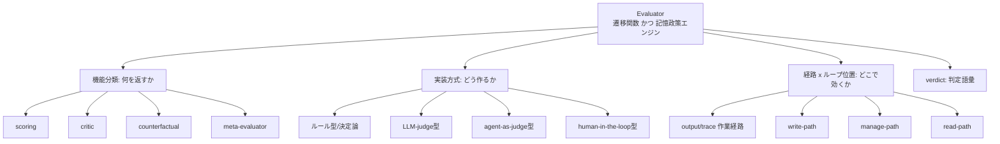

# Evaluator の定義と分類

本セクションは、ハーネスに Evaluator を実装する前に確定すべき**用語と設計空間の地図**を与える。レイヤへの配置手順や擬似コード・閾値調整の具体は本設計の後続章に委ね、ここでは「何を Evaluator と呼び、どの軸で分類し、どんな判定語彙を返すか」を固定する。

## 厳密定義

Evaluator とは、**ある時点の出力・状態・軌跡・記憶更新候補に対して、継続/停止/採用/棄却/修正方向を決める判定器**である（03章）。単なる採点器ではなく、二つの顔を持つ点が本質である。第一に**ループの遷移関数**であり、判定が「No」を返すこと自体が次ターンへの指令になる（03章）。第二に**長期記憶の政策エンジン**であり、記憶を評価するだけでなく、その生態系（昇格・保留・却下・忘却）を制御する（05章）。

型として書くと、Evaluator は次の写像である。

```
Evaluator(subject, context, rubric) -> Verdict
  subject  ∈ { 出力, 状態, 軌跡(trace), 記憶更新候補 }
  context  = 目標 / 制約 / 予算 / 参照根拠
  rubric   = 判定基準（決定論条件 or ルーブリック）
  Verdict  ∈ { continue|stop, pass/fail+score, critique+directive,
               promote|hold|reject|merge|supersede }
```

この役割は学術・実務で用語が統一されておらず、以下は同じ役割の別名である（05章）。設計時はこの対応表で語を正規化する。

| 別名 | 主な文脈 | 主な subject | 典型 verdict | ニュアンス |
|---|---|---|---|---|
| grader | Anthropic eval / OpenAI graders | 出力・trace | pass/fail + score | 性能の一側面を採点。task ごとに複数持ちうる（03章/05章） |
| judge (LLM-as-a-Judge) | MT-Bench 系 | 出力・出力ペア | score / pairwise 勝者 | ルーブリック評価。位置・冗長性・自己優遇バイアスを持つ（03章） |
| verifier | grading logic / TrustMem | 出力・記憶遷移 | pass/fail・coverage/preservation/faithfulness | 正しさ/整合性の検証。記憶遷移 verifier は write-path の代表（05章） |
| critic | Self-Refine 系 | 出力・軌跡 | critique + next-directive | 「何が悪いか/次に何を直すか」を返す（03章） |
| reward model | RL 文脈 | 軌跡・行動 | scalar reward | 方策学習の信号。Goodhart・報酬ハッキングの対象（03章） |
| policy gate | security-guidance / auto mode | 行動・記憶更新 | allow/block・promote/hold/reject | 実行/保存の可否ゲート（05章/03章） |

共通する核は「出力だけでなく、記憶更新そのものを査定する」ことである（05章）。以降の分類軸はこの一つの判定器を、機能・実装方式・経路・語彙の 4 面から切る。

## 二つの直交軸: 機能 × 実装方式

設計空間の骨格は、**「何を返すか（機能分類）」と「どう作るか（実装方式）」が直交する**点にある。ある Evaluator は〔機能 × 実装方式 × 経路〕の三つ組で特定される。たとえば scoring はユニットテスト（ルール型）でも G-Eval スコア（LLM-judge 型）でも実装できる。この直交性を混同すると、「厳密さが欲しい（実装方式の要求）」と「批評が欲しい（機能の要求）」を取り違える。



### 機能分類（03章）

| 機能型 | 入力 | 出力 | 主な使いどころ | 代表手法 |
|---|---|---|---|---|
| scoring | 単一の出力/状態 | 数値スコア or pass/fail | 合否ゲート、閾値判定、回帰検出 | 決定論チェック、G-Eval |
| critic | 出力 + 目的 | 欠陥指摘 + 次の修正方向 | 反復改善の駆動、次ターン指令の生成 | Self-Refine、Reflexion |
| counterfactual | 2 つ以上の候補/方策 | 勝者 or 比較評価 | 候補選択、A/B、方策比較 | MT-Bench pairwise、Tree of Thoughts |
| meta-evaluator | evaluator の判定群 | 信頼性/バイアス指標 | judge drift 検出、rubric 調整 | human-agreement、bias score |

pairwise 比較は直接採点より人間判断に整合しやすい（03章）ため、counterfactual を「候補選択器」として使うと生成の多様化と選抜を分離できる。meta-evaluator は他の三型と階層が異なり、**Evaluator 自身を subject に取る**。judge は「置けば終わり」ではなく自身の評価が要る（03章）ため、これはメタループの中核になる（詳細は本設計のメタ評価セクションへ）。

### 実装方式分類（05章/03章）

実装は「どの基盤で判定を作るか」であり、コスト・再現性・誤魔化し耐性が段違いに変わる。Claude Code 上の対応も併記する（仕様に触れる主張には確信度を付す）。

| 実装方式 | 定義 | Claude Code での対応（確信度） |
|---|---|---|
| ルール型(決定論) | exact match / schema / policy / test / lint | Stop hook の script 判定・PreToolUse block（確認済み: 02章/03章） |
| LLM-judge型 | ルーブリックに基づくモデル評価 | prompt hook・`/goal` の evaluator（既定は Haiku 系 small fast model、tool 不可、transcript 上の証拠のみで判定）（確認済み: 02章） |
| agent-as-judge型 | ツール/コマンド/ファイルを見て実地検証 | `type: "agent"` hook（ツール/コマンド/ファイルで実地検証可能・確認済み: 02章/03章。ターン数上限値は未確認・要実機確認、00章参照） |
| human-in-the-loop型 | 人間承認点を明示的に埋め込む | permissions / auto mode の承認点（高確度: 02章）。汎用 HITL 例は LangGraph interrupts・Codex review queue（03章） |

同一モデルによる自己評価（Self-Refine 的）は実装が最も軽いが、自己正当化・過大評価の危険がある（03章）。`/goal` が作業モデルと別の小型モデルで判定するのは、この自己優遇を避ける fresh-judge 設計である（02章/03章）。meta-evaluator は「実装方式」ではなく上の四方式のいずれでも実装できる**役割**であり、四方式と直交する点に注意する。

## 三経路 × ループ位置

Evaluator が「どこで効くか」は、**作業経路**と**記憶の三経路**に分かれる。作業経路（output/trace evaluator）はループ工学の中心で、出力・軌跡・環境結果を見て継続/停止を決める（03章）。記憶側は write / manage / read の三経路に evaluator を置く二重審査型設計を取る（05章）。なお write/manage/read は Claude Code の公式機構ではなく 05章が提示する**設計枠組み**であり、micro/meso/macro/meta の層も 02章の**分析上の定義**である。したがって以下の経路×位置対応は**分析上の対応**として読む。

| 経路 | 判定対象 | 典型 verdict | ループ位置の主対応 | 出典 |
|---|---|---|---|---|
| output/trace（作業経路） | 出力・軌跡・環境結果 | continue/stop、pass/fail+score | micro（ツール結果）/ meso（ターン）/ macro（`/goal`・セッション） | 03章/02章 |
| write-path | 保存候補記憶 | promote/hold/reject/merge/supersede | micro〜meso（イベント直後） | 05章 |
| manage-path | 既存記憶の集合 | 統合/要約/忘却/削除 | macro（background consolidation・dreaming） | 05章/04章 |
| read-path | 検索ヒット | relevance+freshness+policy で再ランク | micro（検索時） | 05章 |
| meta | evaluator 自身 | 信頼性/バイアス指標 → rubric 更新 | meta | 03章/05章 |

write/manage/read の閾値・API・データモデルは記憶側設計に属するため、詳細は [../05-long-term-memory-and-evaluators.md](../05-long-term-memory-and-evaluators.md) および本設計の記憶政策セクションへ委ねる。経路のループ位置への割り付け手順は本設計 02章（レイヤ配置、`./02-*.md`）へ委ねる。

## verdict の語彙体系

verdict は**機械可読な列挙**でなければならない。ループがそれで分岐し、critique の次指令が次ターンの入力になるからだ（03章）。役割別に四系統へ整理する。

```
Verdict =
  | Loop     { continue | stop, reason }                     // 遷移制御（02/03章）
  | Score    { pass: bool, score: float, metrics }           // 合否 + 採点（03章）
  | Critique { defects: [...], next_directive }              // 批評 + 次指令（03章）
  | MemoryOp { promote|hold|reject|merge|supersede, target } // 記憶政策（05章）
```

各トークンが駆動する下流状態は次の通り。continue は verdict.reason を指令化して次ターンを起動し、stop は停止/報告/引き渡しへ移る。pass はゲート通過、fail は差し戻し（score を保持すれば回帰検出に使える）。critique は Maker へ next_directive を返す。記憶系では promote=書込、hold=quarantine/review queue、reject=discard、merge=既存 item へ統合、supersede=旧 item を tombstone 化して新 item で置換（05章のフロー図と対応）。coverage/preservation/faithfulness/usefulness/risk のような多軸スコアは、Score/MemoryOp の内訳（metrics）として持たせる（05章）。verdict を自由文でなくこの列挙へ落とすことが、ループの自動分岐と監査可能性の前提になる。

## 方式選定の指針

4 方式を、コスト・再現性・柔軟性・誤魔化されにくさ・レイテンシで比較する。

| 方式 | コスト | 再現性 | 柔軟性 | 誤魔化されにくさ | レイテンシ |
|---|---|---|---|---|---|
| ルール型(決定論) | 極小 | 最高 | 低（定義済み条件のみ） | 高（客観基準。ただし条件外は素通り） | 最小 |
| LLM-judge型 | 中 | 中（温度・位置バイアス） | 高 | 中（自己優遇・冗長性で操作されうる） | 中 |
| agent-as-judge型 | 高 | 中〜低 | 最高（実地検証可） | 高（証拠に直接当たる） | 大 |
| human-in-the-loop | 最高（人件） | 人依存 | 最高 | 最高（最終権威） | 最大（非同期） |

選定は次の優先順位が実務的である。

1. **証拠が transcript / environment に落ちるものはルール型を最優先**する。最も安く、最も誤魔化されにくい（05章）。`/goal` の条件も「npm test が exit 0」のように transcript 上で実証可能な形へ翻訳する（02章）。
2. **ルール化できない品質は LLM-judge**で見る。ただし作業モデルと分離した fresh/別モデルにして自己優遇を断つ（03章）。
3. **実地検証が要る箇所だけ agent-as-judge**を節目で使う。高コスト・高レイテンシなので高頻度化しない（05章）。
4. **破壊的・不可逆・高機微な採用/削除は human-in-the-loop**を最終ゲートに置く（05章）。
5. 単独ではなく**合成**する。security-guidance が示すように、高頻度・低コストの粗い検査と、低頻度・高コストの深い検査を層で分ける（03章）。

「誤魔化されにくさ」は Evaluator 設計の一級の関心事である。単一指標だけを最適化させると reward hacking（metric monoculture）を招く（03章）。Maker と Checker を必ず分離し、採点経路を作業側から触れないようにすること、judge 自体を meta-evaluator で監査することが、閉ループでの採点甘化を防ぐ歯止めになる（03章/05章）。具体的な多層構成とレイヤ割り付けは本設計 02章（レイヤ配置、`./02-*.md`）、実装方式ごとの擬似コード・閾値・設定は本設計 03章（実装方式、`./03-*.md`）と 06章（実装・運用、`./06-*.md`）へ続く。
