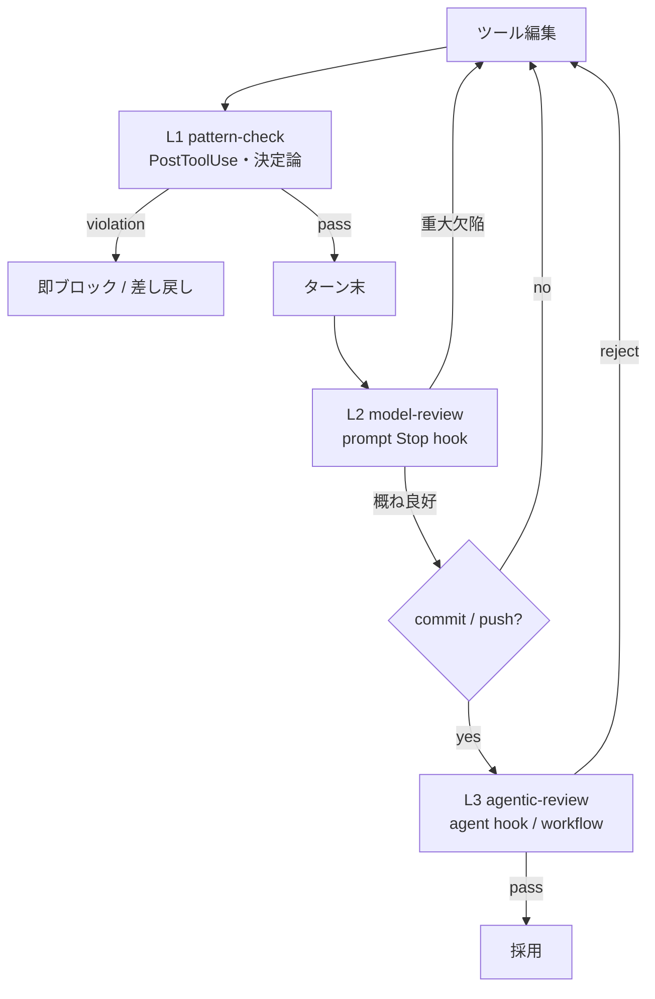

# ハーネスにおけるレイヤリングと配置

結論から言うと、Evaluator は「1か所に置く採点部品」ではなく、**ループ階層の各層に別種の判定器を配置し、cheap-frequent → expensive-rare のカスケードで束ねた多層構造**として設計する。ユーザーの中心問い「どのレイヤーでどう扱うか」への答えは、層ごとに *(証拠・ブロック権・同期性・制御主体)* を変えて Evaluator を分散配置することにある。単一の万能 judge を置くと、安すぎて素通りするか、高すぎてコストが暴走するかのどちらかになる。

## ループ階層と Evaluator 種別の対応

02章は micro / meso / macro / meta の4階層、03章は inner-tool / session-turn / schedule-event / parallel-agent / meta の5層にループを分解する（いずれも Anthropic 公式命名ではなく**分析上の定義**）(02章/03章)。Evaluator 配置の観点で両者を統合すると、次の4層が扱いやすい。

| 層 | 判定単位 | 主に置く Evaluator 種別 | 証拠（何を見るか） | ブロック権 | 同期性 | 頻度×コスト |
|---|---|---|---|---|---|---|
| **L1 micro** | 単一ツール呼び出し | 決定論 verifier / policy gate | tool の引数・生出力（exit code, diff, match パターン） | deny/allow（実行前後） | 同期必須 | 高頻度・低コスト |
| **L2 meso** | 1ターン末 | scoring / critic judge（tool-less） | transcript に surface された証拠のみ | soft（継続・guidance 追記） | 同期 | 中頻度・中コスト |
| **L3 macro** | セッション/workflow/並列 | agentic verifier / Maker–Checker / 多票・敵対 | environment outcome（test exit, git 状態, 実ファイル） | 停止・採用/棄却 | 同期 or 非同期 | 低頻度・高コスト |
| **L4 meta** | run 横断 | meta-evaluator | 複数 trial 集計（成功率, no-progress 率, judge 一致率） | —（ガバナンス） | オフライン非同期 | 最低頻度・設計コスト |

Evaluator の細かな種別分類（scoring/critic/counterfactual/meta、および grader/judge/verifier/critic/reward model の異名関係と内部実装）は別セクションに譲り、ここでは「**どの種別をどの層に置くか**」に絞る(03章)。

## Claude Code サーフェスへの写像

各層は既存の Claude Code サーフェスへ次のように対応する。仕様に関わる主張には確信度を付す。いずれも 02章/03章 が公式 docs を引用したものであり、**最終確定は検証レーンの結果と整合させる前提**とする。

| 層 | Claude Code サーフェス | 役割 | 確信度 |
|---|---|---|---|
| L1 | PreToolUse / PostToolUse hook（決定論） | 実行前の deny、実行後の形式・安全チェック・追記 | 確認済み(02章/03章) |
| L2 | prompt Stop hook / `/goal`（tool-less・小型高速モデル・transcript 証拠のみ） | ターン末の完了判定。未達理由を次ターン guidance に返す | 確認済み。`/goal` は session-scoped な prompt Stop hook のラッパーで、独立にファイル/コマンドを読まない。既定評価モデルは Haiku 系(02章/03章) |
| L3 | agent Stop hook（ツール可・複数 tool-use turns） | 実ファイル/コマンドを見に行く高コスト検証 | 確認済み（capability）。ターン数上限値（「最大 50 tool-use turns」等）は未確認・要実機確認（00章参照） |
| L3 | subagent / fresh-context reviewer | Maker–Checker 分離。独立コンテキストで査読し要約を返す | 確認済み(02章/03章) |
| L3 | dynamic workflow | script が複数案を生成・相互検証する多票/敵対検証。計画がコード化され再実行・監査可能 | 確認済み。ただし experimental・evolving な機能を含む(02章) |
| 保険 | Agent SDK `max_turns` / `max_budget_usd` | 層をまたぐプログラム的な暴走停止（第2停止条件） | 確認済み(02章/03章) |

なお `/loop`（時間駆動）は Evaluator そのものではなく **L3 の非同期トリガ**であり、監視条件（現象変化待ち）を担う。完了は「provably complete だから次 wakeup を予約しない」で表現する（確認済み・02章）。

## 制御権の階層と配置の一致

03章は並列面を「**次遷移を誰が決めるか**」で分ける。subagent は親エージェント、agent team は lead、dynamic workflow は script が次実行を決める(03章)。Evaluator の verdict は次遷移を決める主体に届かなければ遷移関数として機能しないため、**Evaluator は制御権を持つ主体と同じ層（か直上）に置く**。

- 軽い委譲レビュー: subagent が critique を返し、親が統合して次遷移を決める。reviewer 自身は停止権を持たない。
- 協調タスク: lead が Evaluator 結果を集約して共有 task list を更新する。
- 多票・敵対・監査可能性が要る: Evaluator を **script（workflow）層へ上げ**、判定を変数として分岐に使う。turn-by-turn の言語判断より再実行・監査に強い(02章)。

## カスケードを背骨に据える

層配置の背骨は cheap-frequent → expensive-rare のカスケードである。Claude Code の security-guidance plugin がこの3層を実装している(03章): 各編集時の pattern-check（L1・決定論・ブロック可）→ ターン末の model-review（L2・prompt hook）→ commit/push 時の agentic-review（L3・agent hook）。**頻度・粒度・コスト・ブロック権を層ごとに分ける**のが要点で、高頻度の層ほど安く決定論寄りにする。



同じ3層を Claude Code の hook schema で表すと次のようになる（03章の documented hook shape に準拠。PostToolUse の `matcher`/`command` キーは公式 docs で最終確認する）。

```json
{
  "hooks": {
    "PostToolUse": [
      { "matcher": "Edit|Write",
        "hooks": [{ "type": "command", "command": "./scripts/pattern-check.sh" }] }
    ],
    "Stop": [
      { "hooks": [{ "type": "prompt",
        "prompt": "完了か判定。未完なら {\"ok\":false,\"reason\":\"残作業を1文\"}、完了なら {\"ok\":true}。" }] },
      { "hooks": [{ "type": "agent", "timeout": 120,
        "prompt": "テストを実行し失敗を要約。合否を {\"ok\":bool,\"reason\":\"...\"} で返す。" }] }
    ]
  }
}
```

## 独自ハーネス（自前ループ / Agent SDK）への写像

同じ概念は自前ミドルウェア層へそのまま移せる。振り分けの原則は「**ブロックが要る判定は同期層、記録・追記でよい判定は非同期層**」で、これは設計上の選択として保持する。なお「Claude Code の async command hook が `additionalContext` を次ターンに返せる一方で動作をブロックする権限を失う」という機構は未確認の分析上の整理であり、公式 docs が明記するのは「`async: true` の hook はバックグラウンドで非ブロック実行される」までである（2026-07-04 再確認）。非同期 hook の結果を Claude に届ける文書化された機構としては `asyncRewake`（exit code 2 で Claude を起こし、stderr／stdout を system reminder として提示）がある（00章の注意書き参照）。

```python
class Harness:
    async def run(self, goal):
        for turn in range(self.max_turns):            # L3 保険: turn cap
            if self.spend > self.max_budget: break    # L3 保険: budget cap
            action = self.agent.propose()
            if not self.pre_gate(action):             # L1 pre: deny(同期・不可逆操作の前)
                self.agent.deny(action); continue
            result = self.exec(action)
            self.post_gate(result)                    # L1 post: 形式/安全チェック・注記(同期)
            verdict = self.turn_gate(transcript)      # L2: 完了/品質 judge(同期・soft)
            self.memory_gate(candidate_updates)       # 記憶更新候補の Evaluator → 記憶セクション
            if verdict.done:
                if self.session_gate(env_outcome):    # L3: 受入検証(別モデル/fresh-context)
                    return "accepted"
                # 未達なら verdict.reason を次ターン guidance へ渡す
```

- **pre/post middleware = L1**（ツール境界）。pre は deny 権を持つ同期ゲート、post は形式・安全チェックと注記。
- **turn-end gate = L2**。transcript 証拠での完了/品質判定。soft block（理由を次ターンへ）に留める。
- **session-end gate = L3**。environment outcome での受入検証。Maker–Checker のため別モデル/fresh-context に置く（→検証レーンセクション）。
- **memory hooks = 記憶更新候補への政策 Evaluator**。何を保存/棄却/統合するかを判定する（→記憶セクション、05章由来）。
- **budget/turn cap = 層をまたぐ保険**。Agent SDK なら `max_turns` / `max_budget_usd` に相当。

## 各層の設計判断（掘り下げ）

- **証拠の粒度**: L1 は生の副作用（exit code・diff・match パターン）、L2 は transcript に載った証拠のみ（tool-less judge の制約。ゆえに「テスト緑」「`git status` clean」など Claude 自身が transcript に残せる終状態へ翻訳する・確認済み02章）、L3 は environment outcome を独立に再取得、L4 は複数 trial の集計。
- **ブロックか追記か**: 不可逆操作の直前（L1 pre）と受入判定（L3）だけが「止める」権限を持つべき。L2 は原則追記（guidance）に留め、停止判定を軽い judge に丸投げしない。
- **同期か非同期か**: ブロックが要る判定は同期。監視・記録・二次分析は非同期（`/loop`・workflow background・async command hook）に置く。非同期にブロック必須の安全判定を置くと素通りする。
- **停止不能の回避**: L2/L3 のブロック判定は連続8回で上書きされるとの整理があるが、これは未確認・要実機確認（公式 hooks docs に連続ブロック上限の記述なし。00章の注意書き参照）。この数値に依存せず、ブロック層とは別に、必ず turn/budget/no-progress cap を別層に置く。
- **compaction 越えの証拠保全**: compaction 後に再注入されるのは system prompt・project-root CLAUDE.md・auto memory・invoked skills のみで、path-scoped rules や nested CLAUDE.md は再読込まで失われる（確認済み・03章）。L3 の長期判定が依存する証拠は、外部アーティファクト（progress file 等）へ逃がす。

## 配置のアンチパターン

- **コスト逆転**: 高コスト判定（agent review）を L1 の毎編集に置く → トークン暴走。頻度が高い層ほど安く。
- **素通り**: ブロック必須の安全判定を非同期層/L4 に置く。
- **単層依存**: L2 の `/goal` だけで済ませ、tool-less の証拠制約で深い検証が抜ける → L3 の agentic verifier を併置する。
- **自己採点**: Maker と Checker を同一コンテキストで兼ねる → fresh-context/別モデルへ分離する（→検証レーンセクション。LLM-judge の position/verbosity/self-enhancement バイアスも同セクションで扱う）。
- **メタ欠落**: L4 を持たず rubric/stop 条件が腐り、no-progress ループに気づけない。

全サーフェスを1枚に束ねた統合写像表は概要（overview）セクションに置く。本セクションは各層内の設計判断に集中した。
