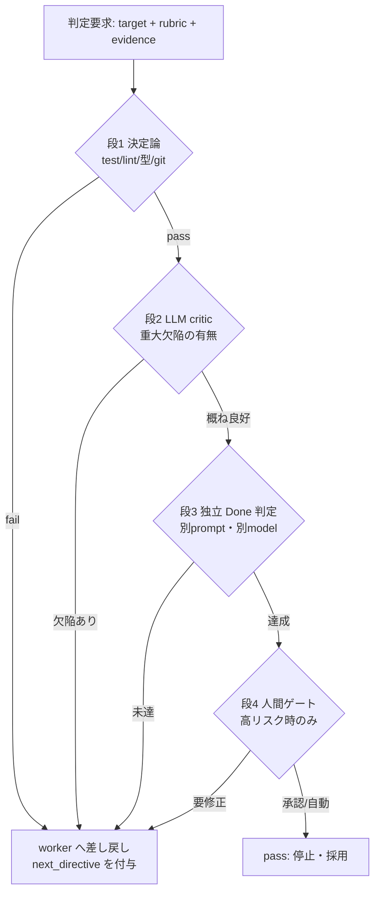

# 実装パターンとインターフェース契約

Evaluator を「採点器」ではなく **ループの遷移関数** として実装するなら、まず固定すべきは判定器の入出力契約である。契約が曖昧なままプロンプトを磨いても、継続/停止/採用/棄却の分岐が transcript 上で再現できず、ハーネスは「賢い無駄働き」に陥る (03章)。本セクションは、判定器そのものの実装契約・証拠モデル・合成の仕方・最小テンプレに絞る。判定器をハーネスの micro/macro/meta のどこで発火させるかという配線論は総論セクションに、記憶更新候補に対する採否ポリシーの詳細は長期記憶セクションに、judge 自身のバイアス監査・メタ評価は信頼性セクションに委ねる (01章/04章/05章)。

## Evaluator インターフェース契約

判定器は「対象・rubric・利用可能な証拠」を受け取り、「verdict・理由・次ターン指令・スコア・証拠参照」を返す純関数として定義する。以下は言語中立の型（本設計の定義であり、Claude Code の公式 API ではない）。

```typescript
// 対象は4種。単なる出力だけでなく、状態・軌跡・記憶更新候補も判定できる (03章/05章)
type EvalTarget =
  | { kind: "output";           content: string }                                   // 生成物そのもの
  | { kind: "state";            snapshot: StateRef }                                 // 環境・作業状態
  | { kind: "trajectory";       transcript: TurnRef[] }                              // ここまでの軌跡
  | { kind: "memory_candidate"; op: "add" | "update" | "delete"; record: MemRef }   // 記憶の更新候補

// rubric は「測定可能な終状態 / 証明方法 / 制約」の3点で書く (03章 Goal-first)
type Rubric = { end_state: string; proof: string; constraints: string[] }

// 証拠は決定論と観測を分離。完了は transcript か environment outcome 上で実証可能にする (02章/03章)
type Evidence = {
  deterministic: DetResult[]   // exit code / diff / lint / 型チェック / git status
  observed: string[]           // 会話に surfaced された観測（/goal 型評価器はこれしか見られない）
  external?: OutcomeRef[]      // 外部 outcome への参照（URL 200・DB 行数・成果物 mtime 等）
}

type Verdict = {
  status: "pass" | "fail" | "revise" | "escalate"
  reason: string               // なぜその判定か（1〜3文）
  next_directive?: string      // fail/revise 時に worker へ渡す次ターンの明示指令
  score?: number               // 0..1（任意。比較・トレンド監視用）
  evidence_refs: string[]      // 判定根拠へのポインタ（trace id / path / テスト名）
}

interface Evaluator {
  evaluate(target: EvalTarget, rubric: Rubric, evidence: Evidence): Verdict
}
```

`status` を4値にするのが実装上の要点である。`pass`（停止・採用）/`fail`（同一方針で再試行）/`revise`（方針転換を指示）/`escalate`（人間または上位ループへ委譲）を分けると、後述の no-progress cap と人間ゲートが自然に接続する。`reason` と `evidence_refs` を必須にすることで、「なぜ止めた/続けたか」が後から追える operation ledger になる (05章)。

## 証拠モデル: 完了は「証明」に落とす

最重要の制約は、**判定は証拠の上でしか行えない**という点である。Claude Code の `/goal` 評価器は毎ターン後に小型高速モデルで判定するが、**ツールを呼べず、会話に現れた証拠だけで yes/no を返す**（確認済み・02章/03章）。したがって「レビューを片付ける」ではなく「`npm test` が exit 0、`git status` が clean」のように、worker 自身が transcript に痕跡を残せる条件へ翻訳しなければならない (03章 Goal-first)。決定論的 outcome を第一級に置き、LLM 判断は決定論で割り切れない残差にだけ使う。

| 証拠クラス | 取得方法 | 信頼度 | 適する判定 |
|---|---|---|---|
| 決定論チェック | test exit code / lint / 型 / `git status --porcelain` / diff 境界 | 最高（再現可能） | 完了・回帰・境界逸脱 |
| environment outcome | HTTP 200 / DB 行数 / 生成物 mtime / migration 済み | 高（外部実測） | デプロイ・副作用の実在 |
| 会話内観測 | transcript に載ったコマンド出力・ログ | 中（自己申告混入） | tool-less 評価器（`/goal`）の唯一の入力 |
| LLM critic 判断 | 別モデルの批評 | 低〜中（バイアスあり） | 設計妥当性・可読性など非機械的品質 |

ツールを使える判定器（Claude Code の `type:"agent"` hook はツール/コマンド/ファイルで実地検証できる・確認済み・03章。ターン数上限値は未確認・要実機確認、00章参照）なら決定論チェックを判定器側で自走できる。tool-less な判定器（`type:"prompt"` hook / `/goal`）を使うなら、決定論的証拠を **worker 側で先に生成して会話に載せる**設計が前提になる。

## 合成カスケード: 安い決定論から高い人間まで

単一の判定器に全部を負わせない。決定論チェック → LLM critic → 独立 Done 判定 →（必要なら）human の多段で、**高頻度・低コストの粗い検査**と**低頻度・高コストの深い検査**を分離する (03章)。Claude Code の security-guidance plugin が「各編集時の pattern check / 各ターン終了時の model review / commit・push 時の agentic review」の三層を回すのは、この合成の実例である（確認済み・03章）。



| 段 | 判定器 | 主入力 | 合格ゲート | fail 時の差し戻し先 | コスト/頻度 |
|---|---|---|---|---|---|
| 1 | 決定論チェック | test/lint/型/git | exit 0 かつ diff が制約境界内 | 失敗テスト名を `next_directive` に | 低 / 毎ターン |
| 2 | LLM critic | diff + 観測 | 重大欠陥なし（何を直すかを返す） | 欠陥要約を `next_directive` に | 中 / 毎ターン |
| 3 | 独立 Done 判定 | rubric + evidence_refs | `end_state` が証拠上で実証済み | 未達理由を `next_directive` に | 中 / 節目 |
| 4 | 人間ゲート | verdict + evidence_refs | 承認（`escalate` を消費） | 修正指示 | 高 / 高リスク操作のみ |

段の順序は「安い順・厳しい順」に固定する。決定論で落ちるものを LLM に回すのはコストの無駄であり、LLM critic を通ったものだけを Done 判定に載せると judge の負荷と誤判定が減る。各段は独立に差し替え可能にしておく（同じ worker でも段構成を変えると運用特性が変わる・02章）。

## Maker–Checker 分離（自己採点の禁止）

作業者本人に「終わりましたか」を聞くと、早期終了と自己弁護が起きる (03章)。実装ループと評価ループは **別 prompt・別 model・別 agent** に分ける。`/goal` が作業モデルとは別の小型モデルで判定するのは、このソフトウェア工学版である（確認済み・02章）。reviewer には **diff と acceptance criteria（= rubric）だけ**を見せ、実装者の思考過程・弁明・改善履歴は渡さない。判定材料を成果物と目的に限定することで、判定が「作った理由への同意」に流れるのを防ぐ (03章)。最低ラインでも「決定論チェックを判定器側で再実行し、worker の自己申告を鵜呑みにしない」ことは守る。

## verdict → 次ターン指令への変換

`/goal` の評価器が未達時に理由を次ターンのガイダンスとして返す構造は、**評価が「No」を返すこと自体が次の指令になる**という設計の核心である（確認済み・02章）。判定器の実装では、`fail`/`revise` のとき必ず `next_directive` を生成し、それを次ターンの入力へ注入する。良い `next_directive` は「何が未達か」ではなく「次に何をどの順で試すか」を1つ示す。例: reason=「`test_login.py` が2件失敗」→ next_directive=「まず `test_login.py::test_expiry` の期限計算を修正し、`npm test -- test/auth` を再実行して結果を会話に残せ」。曖昧な「改善して」ではなく、証拠に接続した具体指令にする。

## 構造化出力で verdict を機械可読にする

verdict をパーサ頼みで正規表現抽出すると壊れる。schema 第一で受け取る（01章 Structured Outputs）。Claude の Structured Outputs は `output_config.format`（`type: "json_schema"`）で指定する（確認済み・2026-07-04 に現行 Anthropic API docs のリクエスト例と照合。旧ベータの `output_format` パラメータは `output_config.format` へ移設され、移行期間中のみ動作）。

```json
{
  "output_config": {
    "format": {
      "type": "json_schema",
      "name": "evaluator_verdict",
      "schema": {
        "type": "object",
        "properties": {
          "status":        { "type": "string", "enum": ["pass", "fail", "revise", "escalate"] },
          "reason":        { "type": "string" },
          "next_directive":{ "type": "string" },
          "score":         { "type": "number", "minimum": 0, "maximum": 1 },
          "evidence_refs": { "type": "array", "items": { "type": "string" } }
        },
        "required": ["status", "reason", "evidence_refs"]
      }
    }
  }
}
```

※ 上記 JSON のフィールド名（`output_config.format` / `type: "json_schema"` / `schema`）は現行 Anthropic API docs のリクエスト例と一致することを確認済み（2026-07-04）。なお tool 入力側を schema で厳格化する場合は各 tool 定義に `strict: true` を付ける（strict tools は1リクエスト最大20個などの複雑性制限あり）。

`status` を enum に固定し `reason`/`evidence_refs` を required にするだけで、ループ側は分岐と監査を型で扱える。`score` は任意にしておき、収束トレンドや oscillation 監視の補助指標として使う（主判定は `status`）。

## rubric 記法とアンチパターン回避

rubric は必ず3点で書く（03章 Goal-first）。**measurable end state**（1つの終状態）/**proof**（どう証明するか）/**constraints**（守る制約・触れない範囲・予算・安全境界）。この3点が揃わない rubric は判定器を盲目にする。

- 曖昧 done を避ける: 「いい感じに」「必要なら止まって」は proof に落ちず誤停止する。end_state を単一の可観測状態に固定する。
- evaluator blindness を避ける: 判定器が見られない根拠（tool-less 評価器に対する「実際に動くこと」等）を proof に書かない。tool-less なら会話に載る証拠へ、tool 付きなら実行コマンドへ翻訳する (02章)。
- metric monoculture を避ける: 単一スコアだけを最適化させると reward hacking を招く (03章)。決定論ゲート＋critic＋Done 判定の複数軸で合否を取り、`score` 単独では止めない。

```text
# rubric 記法テンプレ
end_state:   src/auth 配下の failing test がゼロで、npm test -- test/auth が exit 0
proof:       直近ターンの transcript に `npm test -- test/auth` の出力（0 failed）があること
constraints: src/auth と test/auth 以外を変更しない / 20 ターンで停止 / 新規依存を追加しない
```

## 最小テンプレ3種

以下は 02章/03章のサンプルを実務化した最小構成。hook が Claude Code ランタイムへ返す継続/停止の契約は `{"ok": bool, "reason": ...}` であり（03章の hook 戻り値例）、`ok:false` のとき `reason` がそのまま次ターンのガイダンスになる（`/goal` の未達理由が次ターン指令になる挙動と同じ・02章）。前掲の4値 `Verdict` は本設計の内部型で、hook 境界では `pass→ok:true` / `fail`・`revise`・`escalate→ok:false`（`escalate` は加えて人間通知）へ写像する。hook 設定の JSON スキーマは調査時点の Claude Code docs に沿った形なので、実装時は最新の公式 docs で戻り値仕様を確認すること（README の注意事項に従う）。

### (1) prompt 型 Stop hook（軽量・tool-less）

会話に載った証拠だけで完了判定する。決定論的証拠は worker 側で先に生成しておく前提（確認済み・03章）。

```json
{
  "hooks": {
    "Stop": [
      {
        "hooks": [
          {
            "type": "prompt",
            "prompt": "rubric（end_state/proof/constraints）に対し、直近 transcript に proof の証拠が出ているか判定せよ。証拠が会話に無ければ完了扱いしない。未達なら {\"ok\": false, \"reason\": \"未達点と次に試す1手を1文で\"}、達成なら {\"ok\": true} を返す。"
          }
        ]
      }
    ]
  }
}
```

### (2) agent 型 Stop hook（tool-enabled・決定論を自走）

判定器がテスト・git を自分で実行できる（ツール可・確認済み・03章。ターン数上限値「最大 50 tool-use turns」は未確認・要実機確認、00章参照）。

```json
{
  "hooks": {
    "Stop": [
      {
        "hooks": [
          {
            "type": "agent",
            "prompt": "`npm test -- test/auth` と `git status --porcelain` を実行。全 pass かつ auth 以外の変更が無ければ {\"ok\": true}、それ以外は {\"ok\": false, \"reason\": \"失敗内容と次の1手\"} を返せ。",
            "timeout": 120
          }
        ]
      }
    ]
  }
}
```

### (3) Agent SDK ループ + no-progress cap（擬似コード）

Claude Code の内側ループを worker として使い、外側で Maker–Checker・決定論優先・verdict→指令・no-progress/turn cap をまとめる。`max_turns`/`max_budget_usd` はハード上限として併用する（確認済み・02章）。

```python
def run_eval_loop(rubric, worker, evaluator, cap=30, no_progress_limit=2):
    turns, stale, prev_sig = 0, 0, None
    while turns < cap:                              # 保険条件: turn cap
        result = worker.step(rubric)               # 内側ループ1ターン（証拠を残す前提）
        evidence = collect_evidence(result)        # 決定論チェックを第一級で先に集める
        v = evaluator.evaluate(                     # Maker と分離: 別prompt/別model/別agent
            target={"kind": "trajectory", "transcript": result.transcript},
            rubric=rubric,
            evidence=evidence,
        )
        turns += 1
        if v.status == "pass":
            return v                               # 停止・採用
        if v.status == "escalate":
            return request_human(v)                # 人間介入点

        sig = progress_signature(result)           # 変更ファイル集合 + テスト結果のハッシュ
        stale = stale + 1 if sig == prev_sig else 0
        prev_sig = sig
        if stale >= no_progress_limit:             # サイレント空回りを止める
            return escalate("no progress", v)

        worker.inject(v.next_directive)            # verdict の理由を次ターンの明示指令に変換
    return escalate("turn cap reached", v)         # 収束しないときの第2停止条件
```

このループの要点は3つに収束する。**決定論を先に集めること・Maker と Checker が別個体であること・verdict が次ターンの入力になること**。加えて no-progress cap と turn cap で、暴走とサイレント早期終了の両方を止める（Claude Code の Stop hook が連続8回ブロックで上書きされるという整理は未確認・要実機確認であり、この数値に依存しない設計にする。00章の注意書き参照）。これらの型を高品質・安価・壊れにくく組めるかが、判定器実装の全てである (03章)。
