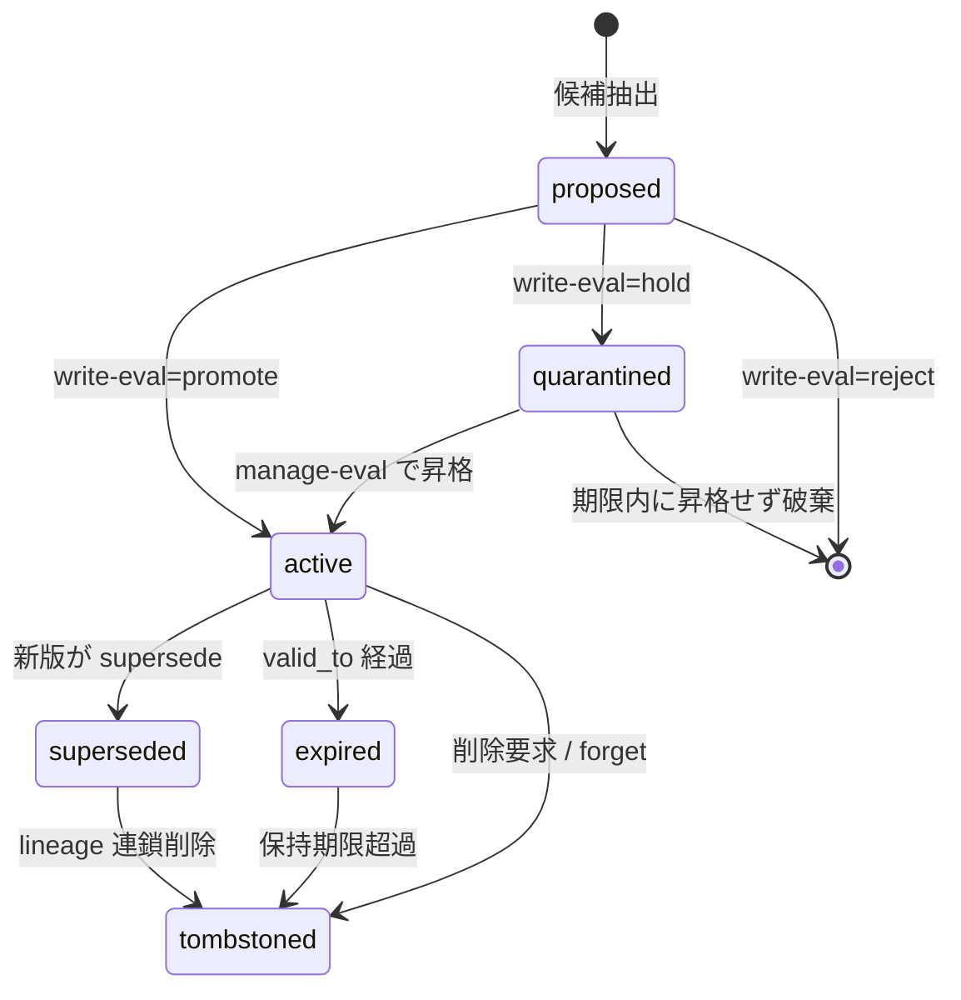

# 長期記憶パスの Evaluator

## このセクションの結論

長期記憶の Evaluator は「保存するか否か」を採点する器ではなく、**どの根拠で更新し、どの根拠で再利用し、何を忘れるか**を決める政策エンジンです(05章)。長期記憶の品質はストレージ単体では決まらず、write–manage–read の各局面に査定を挟む二重審査型アーキテクチャが要る、というのが最新研究の合意点でした(05章)。本セクションは、その三パスに置く Evaluator を、判断基準・閾値・擬似コード・Claude Code のファイルベース memory への噛ませ方まで具体化します。Evaluator の 4 実装方式（ルール型 / LLM judge / agent-as-judge / HITL）やループ遷移関数としての一般論は本パッケージの評価器コア設計・ループ設計セクションに譲り（メタ評価はこの 4 方式と直交する役割です）、ここでは**記憶固有の判断則**に集中します。

作業定義として、write-path evaluator は保存候補を、manage-path evaluator は既存記憶の再編を、read-path evaluator は検索結果を査定します。三者は同じメタデータ集合を入力に取り、`EVAL_RECORD` として観測結果を残し、その集計が閾値・重みの調整に還る(05章の参照アーキテクチャに準拠)。

**比例性の注意**: ファイルベースの単一ユーザー `MEMORY.md`（本リポジトリの構成）に対しては最小経路のみが妥当です = 第一級メタデータ数個 ＋ write ゲート1つ ＋ read 再ランクで足ります。10 エンティティの ER・dreaming・source-lineage の tombstone・control plane 化は中期／長期の大規模システム向けであり、少数の `MEMORY.md` エントリに全機構を作り込まないこと。以下の詳細設計は「必要になったとき参照する上限側の地図」として読み、初手は最小経路から入ります。

## 記憶アイテムの第一級メタデータ（評価の共通入力）

三パスの Evaluator はすべて `MEMORY_ITEM` のメタデータを判断材料にします。05章の ER 図に基づき、以下を**第一級フィールド**（本文と同格に保存・索引する属性）として持たせます。これが無いと Evaluator は relevance しか見られず、freshness・矛盾・権限・時間有効性を判断できません。

| フィールド | 意味 | 既定 / 導出 | 主に効くパス |
|---|---|---|---|
| `provenance`(source_id, trust_level) | 出所と信頼度 | 抽出元から継承 | write（grounding 判定） |
| `salience` | 重要度・再利用価値 | 初期は抽出信頼度、参照で強化 | write / manage |
| `freshness` | 鮮度（時間減衰） | `valid_from` からの減衰関数 | read / manage |
| `contradiction_risk` | 既存記憶との矛盾度 | 近傍照合で算出 | write / read |
| `sensitivity` | 機微度 | 分類器 or ルール | read（hard gate）/ 削除 |
| `scope_id` | 所属（user/agent/session/org） | 書き込み文脈 | 全パス（hard gate） |
| `valid_from` / `valid_to` | 時間有効期間（durative） | 抽出 or 明示 | read / manage（expire） |
| `status` | ライフサイクル状態 | 下図の状態機械 | 全パス |
| `memory_type` | 意味/エピソード/手続き/時間/機微 | 分類 | 型別評価則の切替 |

`status` は append-only ではなく状態機械で管理します。良い長期記憶は追記専用ではなく、更新・再統合・削除・保留を伴うためです(05章)。物理削除でなく状態遷移にすることで監査証跡（`MEMORY_VERSION`）を残せます。



## write-path evaluator

保存候補に対し `promote / hold(quarantine) / reject / merge / supersede` のいずれかを返します(05章)。判断は「新規性・根拠・矛盾」の三軸を基礎に、TrustMem の遷移三軸（coverage・preservation・faithfulness）を統合の安全弁として重ねます(05章)。

```python
def evaluate_write(cand, neighbors):
    novelty   = 1 - max_similarity(cand, neighbors)        # 既存にない情報か
    grounding = trust(cand.provenance) * citability(cand)  # 出所信頼×引用可能性
    conflict  = max_contradiction(cand, neighbors)          # 既存との矛盾
    # TrustMem 3軸（統合/上書き時のみ効かせる, 05章）
    coverage     = covered_ratio(cand, neighbors)   # 既存を包含できるか
    preservation = retained_ratio(cand, neighbors)  # 有用情報を失わないか
    faithfulness = source_consistency(cand)         # 出所に忠実か

    if novelty < LOW and same_entity(cand, neighbors):
        return "merge" if preservation >= P_MIN else "hold"
    if conflict > HIGH and cand.freshness > neighbor.freshness and grounding >= G_MIN:
        return "supersede" if faithfulness >= F_MIN else "hold"
    if grounding < G_MIN or unverifiable(cand):
        return "hold"                    # quarantine 行き
    if novelty < NOISE or meaningless(cand):
        return "reject"
    score = w_n*novelty + w_g*grounding - w_c*conflict
    return "promote" if score >= promote_threshold(cand.scope) else "hold"
```

決定表にすると次の通りです。`preservation` が低い統合（既存の有用情報を捨てる merge/supersede）は、たとえスコアが高くても却下側に倒すのが要点です(05章 TrustMem)。

| 主条件 | 判定 | 理由 |
|---|---|---|
| 新規性高・根拠強・矛盾低 | **promote** | 素直に採用 |
| 新規性低・同一エンティティ・preservation 十分 | **merge** | 重複統合 |
| 矛盾高・候補が新鮮・根拠強・faithfulness 十分 | **supersede** | 版更新（旧版は superseded に） |
| 根拠薄 / 未検証 | **hold** | quarantine で保留 |
| ほぼ重複 / 無意味 | **reject** | 破棄 |

**閾値の考え方**: `promote_threshold` は false promotion（誤って本採用する）のコストで決めます。個人スコープは緩め、共有・組織スコープと機微記憶は閾値を上げ、`require_human` を付す(05章の高リスク昇格に human approval)。閾値は固定値でなく、後段の Outcome Evaluator が回収する false promotion rate / merge correctness を見て調整する対象です(05章の更新品質指標)。

**compaction bulk ingest を write-path の起点にする**: ハーネスは compaction の瞬間に会話を外部記憶へ送ります（Cloudflare は compaction 時 bulk ingest、Anthropic は compaction・structured note-taking を中核に置く, 04章）。この一括流入を無審査で本採用すると poisoning と stale の温床になるため、bulk 時は `promote_threshold` を一段引き上げ、多くを quarantine に落として manage-path（dreaming）へ昇格判断を先送りするのが安全です。

## manage-path evaluator

consolidation・dreaming・reflection を回す背景処理のゲートで、統合 / 要約 / 忘却 / 期限切れ / 削除を判定します(05章/04章)。ここでも遷移を TrustMem 三軸で採点し、preservation の低い再編を止めます(05章)。

**dreaming は原典を上書きしない**が絶対原則です(04章)。Karpathy の LLM Wiki パターンは raw sources を不変の真実源に置き、LLM が保守するのは wiki 層だけと分離しました。OpenAI・Anthropic・Letta が dreaming を導入しても原典ログ・レビュー可能サマリー・セッションログを残すのは、この原則が暗黙に必要だからです(04章)。したがって manage-path Evaluator の役割は「dreaming の出力を**新規の派生記憶として promote**すること」であって、原典（SOURCE / エピソード原ログ）の tombstone は別の human/policy ゲートに回します。

**忘却の判定**は「古いが重要な記憶を消しすぎない balance」が肝で(05章)、単純な時間切れでは落としません。

```
forget_score = staleness · (1 − salience) · (1 − authority) · (1 − contradiction_persistence)
→ forget_score ≥ forget_threshold なら tombstone（物理削除でなく status 遷移）
```

`valid_to` 経過は expire、更新済みなのに参照され続ける古い記憶（Memora の FAMA / stale reuse, 05章）は forget を優先します。指標としては stale reuse rate と contradiction persistence rate を回収して閾値を調整します(05章の忘却品質)。

## read-path evaluator

検索は relevance だけでは不十分で、freshness・authority・policy fitness を加えた再ランクが必要です(05章)。`RETRIEVAL_HIT` の `final_score` は次の合成を基本形にします。

```
final_score = w_r·relevance + w_f·freshness + w_a·authority
            + w_p·policy_fit − w_c·contradiction_risk
```

重み `w` は `task_type` で可変にします。事実質問は authority / freshness を重く、ブレストや発想支援は relevance を重くします。加えて**ハードゲート**を先に適用し、スコア計算前に候補を除外します。

```python
def read_rank(hits, ctx):
    kept = []
    for h in hits:
        if h.status in {"superseded", "tombstoned", "quarantined", "expired"}:
            continue                                  # 非表示状態は除外
        if h.scope_id != ctx.scope and not shared(h): continue   # スコープ不一致
        if h.sensitivity > SENS_MAX and not ctx.high_priv: continue  # 機微は高権限のみ
        h.final = (W.r*h.relevance + W.f*freshness(h, ctx.now)
                   + W.a*h.authority + W.p*policy_fit(h, ctx)
                   - W.c*h.contradiction_risk)
        kept.append(h)
    return sorted(kept, key=lambda x: x.final, reverse=True)[:ctx.k]
```

quarantine 状態を通常検索から隠すことが、poisoning された候補が本採用前に使われるのを防ぐ実質的な防御になります(05章)。

## 記憶型ごとの評価則とユーザー 5 分類のマッピング

記憶型ごとに write 閾値・forget 則・read 重みを変えるべきで、ユーザーの 5 分類（普遍知識 / 雑学 / 意思決定プロセス / 抽象概念 / イベント）は次のように評価則へ対応します(04章/05章)。

| 記憶型 | ユーザー分類 | write 判定の要点 | forget 則 | read 重みの傾向 |
|---|---|---|---|---|
| 意味(reference) | 普遍知識・抽象概念 | grounding 重視、supersede で版管理 | ほぼ不忘、陳腐化のみ | authority 高 |
| 意味(auxiliary) | 雑学 | 低 salience、promote 閾値高め・寒冷層へ | stale で積極 forget | relevance 依存・freshness 低 |
| エピソード | イベント | 時間・主体・因果を保持、原則 append | 要約後に原ログを圧縮/期限 | freshness・時間近接 |
| 手続き | 意思決定プロセス | decision trace（試行と失敗理由）を保持 | supersede 中心（新方針で旧を非 active） | policy_fit・authority 高 |
| 時間(temporal) | （横断属性） | `valid_from/to` 必須、durative | `valid_to` 経過で expire | 時点整合を hard gate |
| 機微(sensitive) | （横断属性） | sensitivity 付与→enclave、human 承認 | 削除要求を最優先 | 高権限 retrieval のみ |

補足すると、抽象概念は平坦なベクトルより概念ノードと関係を持つ symbolic / graph 表現が扱いやすく(04章/05章)、意思決定プロセスは最終結論ではなく「どう判断したか」を runbook / decision log として残す価値があります(04章)。雑学は主層でなく「低頻度検索向けの寒冷層」に置き、read で freshness 重みをほぼ 0 にするのが合理的です(04章)。

## Claude Code のファイルベース memory への噛ませ方

**確認済み**: 本プロジェクトでも `~/.claude/projects/<project>/memory/` に `MEMORY.md`（Memory Index）が実在し、1 件 1 ファイル・索引参照でオンデマンドに読む方式が採られています（本セッションのシステムコンテキストで実在を確認）。**高確度（資料記載・公式一次未確認）**: 資料 04章は Claude Code の memory tool をファイルベースで create/read/update/delete でき、`MEMORY.md` を起点に必要な情報だけを読む設計だと記述しています(04章)。

この索引方式に三パスの Evaluator を次のように噛ませます（hook 連携の具体イベント名は**未確認**で、以下は設計案）。

- **write-path**: memory ファイルへ書く直前に `evaluate_write` を通し、`promote` のみ `memory/` 直下に実ファイル化、`hold` は `memory/_quarantine/` に隔離、`reject` は書かない。実装は `.claude/settings.json` の hook（Write 系ツールのフック点）で memory 配下への書き込みを捕捉する形が素直です。
- **read-path**: `MEMORY.md` の索引エントリに `freshness / authority / status / scope` を frontmatter で持たせ、本文をオンデマンドに読む前に `read_rank` で並べ替える。オンデマンド読み込み（04章記載）と `final_score` 上位のみ読む方針は相性が良く、コンテキスト予算の節約にもなります。
- **manage-path**: 別プロセス（cron / background）で dreaming を回し、統合結果を新規ファイルとして promote、原典（会話ログ）は上書きせず保持。

設定例（分析上の設計案。パスはチルダ / 相対表記に限定）:

```yaml
memory_evaluator:
  write:
    promote_threshold: 0.62
    quarantine_dir: "~/.claude/projects/<project>/memory/_quarantine/"
    scope_overrides:
      shared: { promote_threshold: 0.80, require_human: true }
  read:
    weights: { relevance: 0.45, freshness: 0.20, authority: 0.25, policy: 0.10 }
    hard_gates: [scope_mismatch, superseded, tombstoned, quarantined, expired]
  forget:
    forget_threshold: 0.70
    tombstone_not_delete: true
```

## poisoning と削除権に対する Evaluator の役割

memory poisoning は永続記憶ゆえの攻撃面で、一回の注入が将来の複数セッションへ持続的に効きます(05章 OWASP / MINJA / AgentPoison 等)。**write-path Evaluator が第一防衛線**です。低 trust の provenance、既存 authority 記憶との急な矛盾、根拠なき方針転換は promote せず quarantine に落とす——特に compaction bulk ingest 時にこのゲートが効きます(05章)。

削除権（GDPR、および OpenAI Memory FAQ の「完全に消すには summary だけでなく関連チャット・ファイル・接続アプリなど出所すべてから削除が必要」, 04章/05章）に対しては、memory item 単体の削除では不十分です。Evaluator / manage-path が `SOURCE → MEMORY_ITEM → MEMORY_VERSION` の **source lineage** を辿り(05章 ER 図)、要約・concept card・グラフエッジといった派生記憶まで連鎖 tombstone します。dreaming 由来の派生にも lineage タグを付け、原典削除時に芋づる式に無効化できるようにします(04章 dreaming は原典と分離)。高リスク削除・共有スコープの昇格には human approval を要求します(05章)。

poisoning 検知アルゴリズムの詳細・監査ログ・法務要件など**汎用の安全ガバナンス**は本パッケージの安全/ガバナンスセクションに委ね、本セクションは記憶固有の「write-gate による第一防衛」と「lineage 連鎖削除」に限定します。

---

まとめると、長期記憶パスの Evaluator は、メタデータを第一級化した上で、write で採否と版管理、manage で再編と忘却、read で再ランクを担い、Claude Code のファイルベース memory では compaction を write の起点に、`MEMORY.md` 索引を read の対象にして噛ませます。「保存された更新と評価された再利用」こそが記憶品質の本体である、という 05章の結論を、記憶固有の判断則として実装に落としたものが本設計です。
