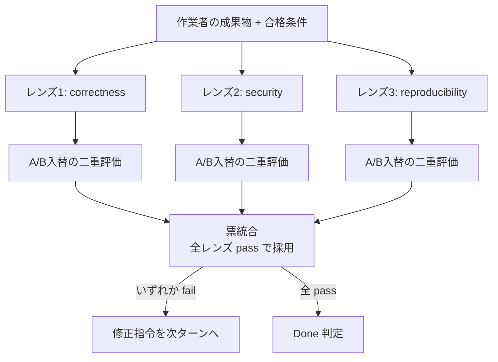

# 信頼性とメタ評価（judge を評価する）

## このセクションの主張

Evaluator を置けば品質が保証される、というのは誤りである。judge 自身がバイアスを持ち、時間とともに壊れ（drift）、報酬ハッキングの標的になる。ハーネスの信頼性は、判定器を導入したかではなく、**判定器を継続的に点検する層（メタ評価）を常設できるか**で決まる。(03章) が繰り返す通り、Evaluator は「置けば終わり」ではなく Evaluator 自身の評価が必要であり、これがループ工学におけるメタループの中心課題である。本セクションは主に [../03-loop-engineering-deep-dive.md](../03-loop-engineering-deep-dive.md) と [../05-long-term-memory-and-evaluators.md](../05-long-term-memory-and-evaluators.md)、補助として [../02-loop-engineering-claude-code.md](../02-loop-engineering-claude-code.md) を根拠とする。Evaluator の入出力スキーマそのものはインターフェースを扱う別セクションに、記憶の write/manage/read への judge 組み込みは記憶政策を扱う別セクションに委ね、ここでは「judge が信頼できるか」だけを扱う。

## LLM-judge の三大バイアスと緩和策

MT-Bench と Chatbot Arena は、強い judge が人間判断と 80% 以上で整合しうる一方、系統的なバイアスを持つことを示した (03章)。ハーネスに LLM judge を組み込む前に、以下を既定の緩和策として実装する。

| バイアス | 症状 | 緩和策（実装レベル） |
|---|---|---|
| position bias | A/B 比較で提示順の先（または後）を不当に優遇 | 同一ペアを**順序反転して2回**評価し、両方向で同じ勝者のときだけ採用。不一致は tie（引き分け）として人間か上位judgeへ委譲 |
| verbosity bias | 長く冗長な出力を高く採点 | rubric に「長さ・語彙量を評価軸にしない」を明記。必要ならトークン長で正規化、または簡潔さを独立軸で加点 |
| self-enhancement bias | judge が自分（同一モデル）の出力を優遇 | **作業モデルと別モデル/別プロバイダ**を judge に据える。最低でも別コンテキストの fresh judge にする |

総則は二つ。第一に、**絶対スコア採点より pairwise ranking を優先**する。直接採点より対比較のほうが人間判断に整合しやすい (03章)。第二に、**rubric を固定**し実行ごとに変えない。rubric の揺れは inter-run consistency を直接壊す。

```python
def robust_pairwise(judge, task, out_a, out_b, rubric):
    # position bias 対策: A/B を入れ替えて二重評価し、票が一致したときだけ確定
    v1 = judge(task, first=out_a, second=out_b, rubric=rubric)   # A,B の順
    v2 = judge(task, first=out_b, second=out_a, rubric=rubric)   # B,A の順
    if v1.winner == v2.winner:
        return v1.winner            # 順序に依存しない頑健な勝者
    return "tie"                    # バイアス疑い → 上位judge / 人間へエスカレーション
```

## 自己承認の禁止（fresh-context reviewer）

作業者本人に「終わったか」を聞く設計は、早期終了と自己弁護を招く (03章/02章)。判定は必ず作業者と分離する。Claude Code では、`type:"agent"` の Stop hook、verification subagent、dynamic workflow の cross-check として実装できる（02章/03章、確認済み）。`/goal` の評価器も作業モデルとは別の小型高速モデルで走り、ツールを呼ばず transcript 上の証拠だけで判定する（02章、公式 docs 由来で確認済み）ため、構造的に自己承認を避けている。

設計上の要点は、reviewer に渡す情報を絞ることである。**diff と acceptance criteria（合格条件）だけを見せ、「今回の狙い」や改善履歴は渡さない**。狙いを渡すと judge が作業者の意図に同調し、批判性が落ちる。これは本ハーネスの運用規律（anti-sycophancy における self-approve 禁止、自己改善ループにおける「改善履歴を知らない別個体に成果物と目的だけを見せて判定させる／生成役と検証役を別個体にする」原則）と同型であり、信頼性設計として一貫させる。

## meta-evaluator: judge の定期点検

judge が壊れていないかは、放置すれば分からない。**gold set**（人間が確定ラベルを付けた少数の検証セット、数十件で足りる）を用意し、定期的に judge へ流して以下を再計測する。監視軸は judge reliability の中核論点 (03章) と evaluator 品質行 (05章) に対応する。

| 指標 | 何を測るか | 測り方 | 合格ラインの考え方 |
|---|---|---|---|
| human agreement | 人間ラベルとの一致率 | gold set への判定を人間ラベルと突合 | タスク重要度で設定（例: 高リスク判定は 0.9+、境界判定は 0.8+） |
| inter-run consistency | 同一入力の再現性 | 同じ入力を N 回判定し多数決からの逸脱率 | temperature 由来のばらつき検出。逸脱が閾値超なら temperature を下げるか多数決化 |
| calibration | 確信度と実正答率の対応 | 確信度ビンごとの実正答率（ECE） | 過信（高確信で外す）を特に警戒 |
| false accept / false reject | 見逃し / 過検出 | gold の合否と judge 判定の混同行列 | false accept（不良を通す）を false reject より重く扱う |
| drift | 上記の時系列劣化 | 各指標を日次/週次で記録し変化点検出 | モデル更新・プロンプト変更・入力分布シフトで発生。ベースライン割れでアラート |

この点検自体を時間駆動ループ（`/loop` や scheduled task）に載せ、閾値割れを検知したら judge を rubric 再調整または降格（LLM 判定から決定論チェックの補助へ格下げ）する。記憶更新を査定する judge については、TrustMem 型に coverage・preservation・faithfulness を transition 単位で採点し、false promotion rate を meta 指標として回収するのが有効 (05章)。

## 敵対的検証 / perspective-diverse verify

単一 judge を N 回回す多数決は、同一モデルの共通バイアスを打ち消せない。信頼性を上げるには、**異なるレンズ（観点）の懐疑者を並べて多票化**する。correctness（仕様適合）、security（脆弱性・機微情報）、reproducibility（再現性・環境非依存）を別プロンプト・別コンテキストで走らせ、票を統合する。これは Workflow の verify ステージ相当の構図であり、GAN 的な生成／検証分離 (03章) と multi-agent review / devil's advocate (02章) の実務形である。定量的な発見（欠落件数・回帰・スコア差）は、別レーンの懐疑エージェントで敵対的に反証してから確定させる運用規律とも一致する。



統合規則は「多数決」より「**全レンズ合格で採用、一つでも fail なら差し戻し**」を既定にする。安全側に倒すことで false accept を抑える。各レンズ内部では前述の A/B 入替を併用し、位置バイアスと観点バイアスを二重に潰す。

## Goodhart / reward hacking への防御

閉ループでは、実力を上げるより**採点を甘くするほうが速く点が伸びる**。指標を上げること自体が目的化すると指標が壊れる（Goodhart の法則）。(03章) はこれを metric monoculture アンチパターンとして挙げる。防御は四点。

- **採点経路の封印**: rubric・合格ライン・評価スクリプト・judge プロンプトを、作業者（被改善対象）が書き換えられない領域に置く。判定を緩める方向の改変は構造的に禁止する。
- **指標多様化**: 単一スコアに収束させず、直交する複数指標（正確性・安全性・コスト・再現性）を併記する。単一指標最適化は reward hacking を誘発する。
- **点数でなく目的達成で収束**: スコアが頭打ちでも目的未達なら継続、スコアが伸びても代理指標のハックなら失敗と判定する。数値メトリクスの収束を停止条件の唯一根拠にしない。
- **no-regression チェック**: 改善はマージ後の統合状態で再ベンチし、既存タスクの退行が無いことを確認してから採用する。見かけのスコア上昇（易しいケースへの過学習）を弾く。

これらは judge を「甘くして通す」経路を塞ぐための構造的歯止めであり、meta-evaluator の点検（前節）と対で機能する。

## コスト最適: 決定論を土台に、LLM judge は境界のみ

Anthropic の harness 論は、evaluator が**タスクをモデル単独の信頼境界を越えるときに価値を持ち、易しい領域では過剰なオーバーヘッドになりうる**と述べる (02章/03章)。これを配置判断の明示的な閾値として運用する。

- **土台は決定論チェック**: テスト・lint・型・contract test・regex・policy engine は、誤魔化されにくく安価で再現性が高い。まずこれで pass/fail を確定させ、白黒つく領域に LLM judge を投入しない。
- **LLM judge は境界領域だけ**: 決定論で判定できない意味的品質・設計妥当性・文章トーンなど、真に信頼境界を越える判断にのみ限定投入する。
- **頻度でコストを分離**: 高頻度・低コストの粗い検査（各編集の pattern check）、中頻度の model review（各ターン終了時）、低頻度・高コストの深い検査（commit/push 時の agentic review）を使い分ける。security-guidance plugin の三層構成がこの典型である (03章、確認済み)。

```python
def route_check(claim):
    # 決定論で白黒つくなら judge を使わない（安価・頑健・再現的）
    if has_deterministic_oracle(claim):        # test/lint/type/contract/regex
        return run_deterministic(claim)
    # 信頼境界を越える判断だけ LLM judge へ（頻度に応じた重さで）
    if crosses_confidence_boundary(claim):     # 意味的品質・設計妥当性など
        return llm_judge(claim, tier=pick_tier_by_frequency(claim))
    # 境界でも自明でもないなら judge を省略し、必要時に人間へ委譲
    return defer_or_skip(claim)
```

判定器を増やすほど信頼性が上がるわけではない。**決定論で足りる所は決定論で確定し、LLM judge の投入を「境界のみ・頻度に応じた粒度」に絞る**ことが、信頼性とコストを同時に満たす配置の原則である。

## Evaluator 自体の評価指標（まとめ）

judge を本番投入する前・運用中に測る指標セットを、ハーネスの一級メトリクスとして常設する。軸は evaluator 品質行 (05章) を基礎に、バイアスとコストを加えたものである。

| 指標 | 対象 | 閾値/運用の考え方 |
|---|---|---|
| human agreement | 人間ラベルとの一致 | 高リスク judge ほど高く要求。gold set で定点観測 |
| inter-run consistency | 同一入力の判定安定性 | 低いなら temperature 低減・多数決化・rubric 明確化 |
| calibration error (ECE) | 確信度の正しさ | 過信を優先的に矯正 |
| false accept rate | 不良を通す率 | 最重要。安全側に統合規則を倒す |
| false reject rate | 良品を弾く率 | 高すぎると throughput を殺すためバランス |
| bias score | position/verbosity/self-enh | A/B 入替の不一致率などで定量化 |
| cost per judgment | 1判定のトークン/レイテンシ | 境界のみ投入で最小化 |
| drift | 上記の時系列変化 | 変化点で rubric 再調整または降格 |

結論として、judge は「作った時点で正しい」のではなく、「**継続的に点検される限りにおいて信頼できる**」。メタ評価（gold set 点検・A/B 入替・観点多票化・採点経路の封印・no-regression）を常設できないなら、その LLM judge は本判定に据えず、決定論チェックの補助に留めるべきである。これがハーネスの信頼性設計の最終線である。
