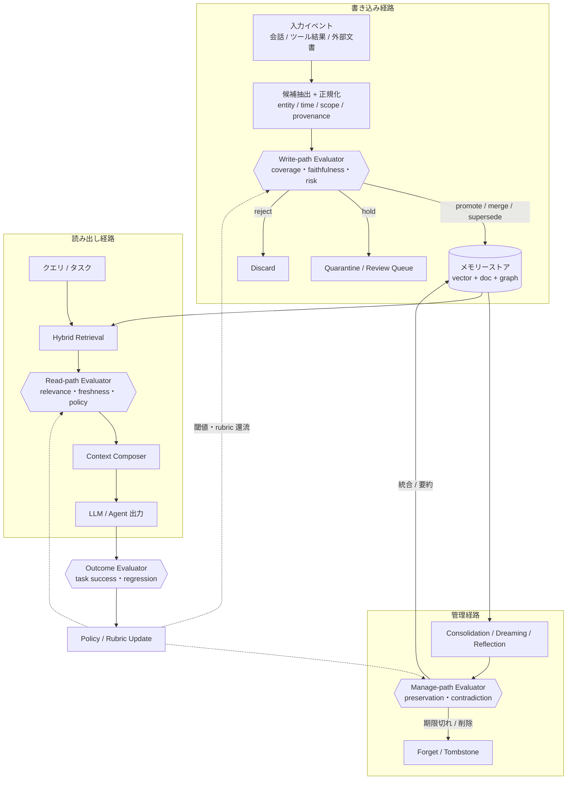
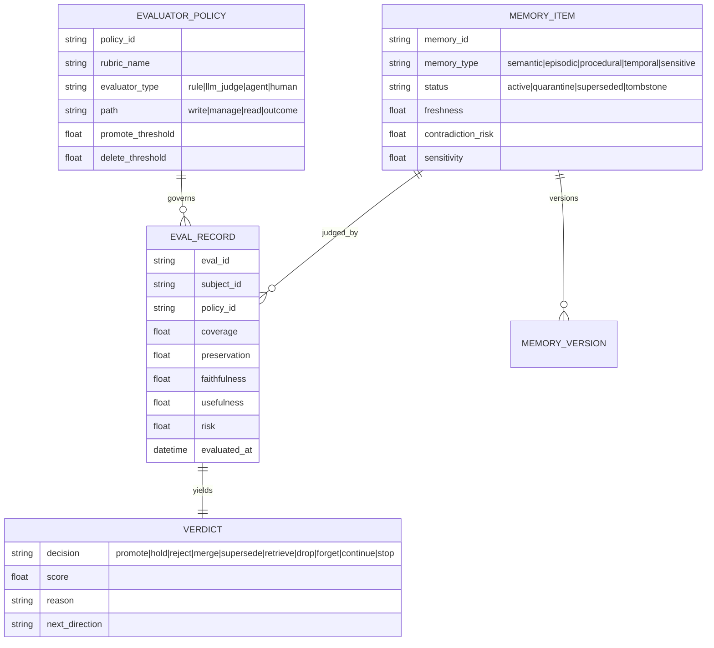

# 参照実装（Claude Code ネイティブ / 独自ハーネス）

本セクションは Evaluator を「出力・状態・軌跡・記憶更新候補に対し継続/停止/採用/棄却/修正方向を決める判定器」として二系統に落とし込む。系統A は Claude Code のネイティブ機能（hooks・`/goal`・subagent・dynamic workflow）だけで組む最小構成、系統B は Agent SDK もしくは自前ループで Evaluator を明示的な部品として握る構成である。両系統は排他ではなく、**in-proc（関数呼び出し）から独立 control plane サービスへ**という発展軸の両端に位置する。データモデルや記憶政策そのものは本設計の別次元に譲り、ここでは実装とレイヤー配置に集中する。

## 参照アーキテクチャ（Evaluator 中心）

(05章) のフロー図を、4つの Evaluator を第一級ノードとして再構成する。要点は、write / manage / read / outcome の各経路に**同じ Verdict 契約を返す評価点**が置かれ、outcome 評価が閾値・rubric を3つの経路へ還流させる閉ループになっていることである。



この図の実装上の含意は、**4つの評価点を別々のコードとして書かず、一つの `Evaluator` 抽象の4インスタンスとして書く**ことにある。そうすれば rubric・閾値・監査ログの取り回しが統一でき、後述の control plane 化も評価点ごとに段階適用できる。write/read 双方に評価を置き、記憶項目に provenance / freshness / contradiction / sensitivity を持たせる根拠は (05章) を参照。

## データモデル（実装向け）

(05章) のフル ER（10エンティティ）から、Evaluator 実装に最小限必要な断面を抜き出す。中心は `EVALUATOR_POLICY`（採点基準と閾値）、`EVAL_RECORD`（採点結果）、`VERDICT`（遷移決定）、`MEMORY_ITEM`（審査対象と状態）である。



`evaluator_type`（実装様式: rule / llm_judge / agent / human）と `path`（評価が走る経路）を直交させることで、「write 経路の決定論ルール」「outcome 経路の LLM judge」のような組み合わせを policy 行として列挙できる。メタ評価は実装様式ではなく上の 4 方式のいずれでも実装できる直交する役割であり、`path="outcome"` もしくは別フラグ（`is_meta` 等）で表す。EVAL_RECORD の5軸（coverage / preservation / faithfulness / usefulness / risk）は TrustMem 系の transition-level 指標を実運用スキーマに落としたものである (05章)。

## Evaluator インターフェース

全評価点を単一契約に揃えるため、`evaluate(subject, context) -> Verdict` を中核にする。`subject` は採点対象の4種別（出力 / 状態 / 軌跡 / 記憶更新候補）を包む。

言語中立の擬似定義:

```
Decision := promote | hold | reject | merge | supersede   # write / manage
          | retrieve | drop                                # read
          | forget                                         # manage
          | continue | stop                                # loop / outcome

Verdict  := { decision: Decision, score: float[0,1], reason: string,
              next_direction: string?, scores: map<string,float> }

Subject  := Output | State | Trajectory | MemoryCandidate
Evaluator := (subject: Subject, ctx: EvalContext) -> Verdict
```

Python 型断面（系統B と言語を揃える）:

```python
from typing import Literal, Protocol
from dataclasses import dataclass, field

Decision = Literal["promote", "hold", "reject", "merge", "supersede",
                   "retrieve", "drop", "forget", "continue", "stop"]

@dataclass(frozen=True)
class Verdict:
    decision: Decision
    score: float                              # 0..1
    reason: str
    next_direction: str | None = None         # 「未達なら次に何を直すか」
    scores: dict[str, float] = field(default_factory=dict)

class Evaluator(Protocol):
    policy_id: str
    path: Literal["write", "manage", "read", "outcome"]
    def evaluate(self, subject: object, ctx: object) -> Verdict: ...
```

`next_direction` が重要で、Evaluator は「採点器」であると同時に**ループの遷移関数**である。No 判定はそれ自体が次ターンへの指令になるため、理由と修正方向を構造化して返す (03章)。

## 系統A: Claude Code ネイティブ実装

### hooks による多層 Evaluator

`.claude/settings.json` の hooks で頻度×コストの異なる3層を重ねる。security-guidance プラグインの「編集時 pattern check / ターン終了時 model review / commit 時 agentic review」の三層に対応する (03章)。

```json
{
  "hooks": {
    "PreToolUse": [
      { "matcher": "Edit|Write",
        "hooks": [{ "type": "command",
          "command": ".claude/evaluators/secret-scan.sh" }] }
    ],
    "Stop": [
      { "hooks": [{ "type": "prompt",
          "prompt": "完了条件を満たすか transcript の証拠のみで判定。未完なら {\"decision\":\"continue\",\"reason\":\"残作業を1文\"}、完了なら {\"decision\":\"stop\"} を返せ。" }] },
      { "hooks": [{ "type": "agent",
          "prompt": "npm test を実行し、失敗や auth 外の差分があれば {\"decision\":\"continue\",\"reason\":\"...\"}、無ければ {\"decision\":\"stop\"}。",
          "timeout": 120 }] }
    ]
  }
}
```

各層の役割分担: PreToolUse の `command` hook は**決定論・高頻度・block 可**（危険操作を実行前に遮断）、Stop の `prompt` hook は**単発 LLM 評価でツールを呼べない**、Stop の `agent` hook は**実コマンドを走らせる重い検証**である（03章、確認済み。ターン数上限値「最大50 tool-use turns」は未確認・要実機確認、00章参照）。停止不能ループを避けるため、Stop hook が連続8回ブロックで上書きされるという整理は未確認・要実機確認とし（公式 hooks docs に連続ブロック上限の記述なし。00章参照）、この数値に依存せず turn/budget/no-progress cap を別レイヤーに必ず置く。非同期 `command` hook は安全ゲートには使わない（「同期＝ブロック可／非同期＝記録専用」の配置原則。なお「additionalContext を次ターンへ返せるがブロック権限を失う」という I/F は未確認の分析上の整理で、docs 記載は「`async: true` ＝非ブロック実行」まで・2026-07-04 再確認。非同期からの通知が要る場合は文書化された `asyncRewake`（exit code 2 で wake・stderr／stdout を system reminder 提示）を使う。00章参照）。

### `/goal` の条件文設計

`/goal` は prompt-based Stop hook のセッション限定ラッパーで、各ターン終了時に小型高速モデル（既定 Haiku 系）が**会話に現れた証拠だけ**で完了を判定する（02章/03章、確認済み）。評価器は独立にファイルやコマンドを読まないため、条件は transcript 上で実証可能な形に翻訳する。

```bash
/goal src/auth 配下の failing test を全て修正する。
完了条件（各ターン後に fresh evaluator が transcript の証拠で判定）:
- `npm test -- test/auth` が exit 0（実行ログを会話に残す）
- `git status` が clean で src/auth と test/auth 以外に差分がない
制約: 既存の公開 API シグネチャを変更しない。
保険: 20 ターンで停止。
```

良い条件文の骨子は (03章) の goal-first design に一致する。第一に**単一の measurable end state**、第二に**「どう証明するか」の明記**、第三に**守るべき制約**、第四に**保険条件（turn/budget cap）**である。条件本文は最大4,000文字。trust dialog を受諾した workspace でのみ動作し（evaluator が hooks システムの一部のため）、`disableAllHooks` / `allowManagedHooksOnly` 下では使えない（02章、確認済み。trusted workspace 要件も 2026-07-04 に公式 `/goal` docs の Requirements 節で確認済み）。

### subagent reviewer と dynamic workflow 多票

Maker-Checker 分離として、reviewer subagent を fresh context で起動し、**diff と acceptance criteria だけ**を渡す（作業者に自己採点させない）(02章/03章)。さらに判定を頑健にしたい局面では dynamic workflow で複数の独立 evaluator を並列起動し、多票で決める。LLM judge のバイアス対策として (03章)、A/B 入替の複数票一致を採るのが安全である。dynamic workflow は再実行可能な artifact に計画を移せる反面、同時16 agent・総計1,000 agent/run の制約がある（02章、確認済み）。

## 系統B: 独自ハーネス（Agent SDK / 自前ループ）

(03章) の manager–worker–evaluator サンプルを、カスケード評価（**安い順に評価して早期決着で打ち切る**）と三重 cap、OTel span で拡張する。

```python
from claude_agent_sdk import query, ClaudeAgentOptions
from opentelemetry import trace

tracer = trace.get_tracer("harness.evaluator")
CAP = dict(max_turns=30, max_budget_usd=5.0, no_progress_limit=2)

def evaluate(subject, ctx) -> Verdict:
    with tracer.start_as_current_span("eval.deterministic") as sp:
        v = deterministic_check(subject)        # unit test / lint / schema / regex
        sp.set_attribute("verdict.decision", v.decision)
        if v.decision in ("reject", "continue"):
            return v                            # 決定論で落ちれば LLM を呼ばない
    with tracer.start_as_current_span("eval.llm_critic"):
        c = llm_critic(subject, ctx)            # 別モデルの critic（何を直すか）
        if c.decision == "continue":
            return c
    with tracer.start_as_current_span("eval.independent_done"):
        return independent_done(subject, ctx)   # 改善履歴を渡さない blind judge

def run_loop(goal: str, options: ClaudeAgentOptions):
    state = LoopState(goal=goal)
    for _ in range(CAP["max_turns"]):
        with tracer.start_as_current_span("loop.turn") as sp:
            report = worker_step(state, options)     # Agent SDK の内側ループ 1 単位
            v = evaluate(report, state.context())
            state.record(v)
            sp.set_attribute("turn.decision", v.decision)
            if v.decision == "stop":
                break
            if state.no_progress_streak >= CAP["no_progress_limit"]:
                break                                # no-progress cap
            if state.budget_usd >= CAP["max_budget_usd"]:
                break                                # budget cap
            state.next_direction = v.next_direction  # verdict を次ターンの指令に
    return state
```

設計上のポイントは4つ。**(1) カスケード**は決定論 → LLM critic → 独立判定の順で頻度×コストを階層化する。**(2) blind judge** の `independent_done` には改善履歴を渡さず成果物と目的だけを見せ、self-approve を避ける（fresh-context reviewer の思想、02章/03章）。**(3) 三重 cap**（max_turns / max_budget_usd / no-progress）を保険条件として必ず置く。`worker_step` の Agent SDK 内側ループにも同じ上限を設定する（02章、確認済み）。**(4) OTel span** で turn / tool / hook / token / cost を記録する（環境変数 `CLAUDE_CODE_ENABLE_TELEMETRY=1` と `OTEL_*_EXPORTER=otlp`、02章、確認済み）。read-only tool は並列・state-changing tool は逐次という規律も局所安定に効く（02章）。

## Evaluator の control plane サービス化

上記 `evaluate()` は最初は in-proc（同一プロセスの関数呼び出し）でよい。監査・スケール・複数ハーネス共有の要件が出た段階で、(05章) の API 5系統を Evaluator 中心に読み替えて独立サービスへ切り出す。

| エンドポイント | 経路 | 主入力 | 返す Verdict.decision |
|---|---|---|---|
| `POST /memory/evaluate-write` | write | 候補 + provenance + confidence | promote / hold / reject / merge / supersede |
| `POST /memory/retrieve` | read | query + scope + time_range | read-eval 後の ranked hits |
| `POST /memory/consolidate` | manage | scope / trigger | 統合・要約結果 |
| `POST /memory/forget` | manage | memory_id / retention policy | forget（tombstone） |
| `POST /eval/outcome` | outcome | trace_id + environment outcome | continue / stop + policy delta |

全 evaluator が同じ `Verdict` 契約を返すため、in-proc から RPC への置換は境界が安定している。(01章) の `LLMAdapter` と同様に `Evaluator` を interface 境界として切れば、ローカル関数とリモートサービスを差し替えられる。各呼び出しは `trace_id` で observability と audit trail に接続し、記憶の採否・削除・stale 防止の履歴を回収する（05章）。

## 段階導入ロードマップ

(05章) のロードマップに、系統A/B の実装面を対応づける。

| 段階 | Evaluator | 記憶 | Claude Code / ハーネス面 |
|---|---|---|---|
| 短期 | 決定論チェック + prompt Stop hook / `/goal` | vector DB に provenance / time / scope / freshness を付与 | `.claude/settings.json` の hooks、`/goal` 条件文 |
| 中期 | Maker-Checker（agent Stop / reviewer subagent）+ write-path evaluator + メタデータ審査 | semantic / episodic / procedural を分離、event graph を部分導入、FAMA 的 stale 指標 | dynamic workflow 多票、Agent SDK カスケード + 三重 cap |
| 長期 | meta-evaluator + consolidation/dreaming + control plane 化 | reconsolidation / learned forgetting / policy substrate | 独立 Evaluator サービス + OTel 監査 |

短期は「vector DB に4メタデータを足し、write evaluator を1つ挟むだけ」でも大きく改善する。中期で審査と記憶種別を分離し、長期で evaluator を static judge から meta-evaluator 付きの policy substrate へ進化させる (05章)。**比例性の原則**: ファイルベースの単一ユーザー `MEMORY.md` 構成では短期の最小経路（第一級メタデータ数個＋ write ゲート1つ＋ read 再ランク）で足り、10 エンティティ ER・dreaming・source-lineage tombstone・control plane 化は中期／長期の大規模システムでのみ導入する（04章）。

## Evaluator の回帰スイート

Evaluator は「置けば終わり」ではない。judge 自身が position / verbosity / self-enhancement bias を持つため (03章)、evaluator 自体を評価対象にする meta-eval が要る。回帰スイートは (02章/03章) の evals 分解に従い、**task / trial / grader / transcript / outcome を明確に分離**する。

- **task**: 自社の代表タスク定義（バグ修正・記憶更新・検索など）。
- **trial**: 同一タスクの複数試行（temperature ばらつきを1回の成功で誤判定しない）。
- **grader**: Evaluator を複層で当て、environment outcome で採点する（transcript の自己申告で採点しない）。
- **outcome / transcript**: 実行結果とトレースを resource 条件ごと固定して保存する。

測る指標は経路別に分ける。write/manage 経路は write precision / recall・false promotion rate・merge correctness、read 経路は Recall@k / nDCG（freshness・scope 制約込み）、evaluator 品質は human agreement・inter-run consistency・false accept/reject、ループ運用は no-progress rate・regression rate である（05章 / 02章）。これらをデータセット + grader + レポートとして捨てずに残せば、モデル更新時は「回すだけ」で再評価でき、移行コストが下がる。grader には系統B の `evaluate()` をそのまま再利用でき、in-proc → control plane の発展と資産を共有できる。
